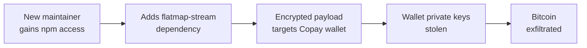

# Lab 6.8: Case Study. event-stream / ua-parser-js

  Understand: ~8 min | Analyze: ~8 min | Lessons: ~10 min | Detect: ~4 min
  Intermediate
  Prerequisites: <a href="../../tier-1/1.6-phantom-dependencies/">Lab 1.6</a>

Two npm incidents that define the dominant supply chain attack vectors. In November 2018, `event-stream` (2M weekly downloads) was discovered with a targeted cryptocurrency-stealing backdoor. A new contributor offered to maintain the abandoned package, gained publish access, then added a dependency containing obfuscated malicious code targeting the Copay Bitcoin wallet. In October 2021, `ua-parser-js` (8M weekly downloads) was hijacked via account compromise. Three malicious versions installed crypto miners and credential stealers on every machine that ran `npm install`. Social engineering maintainer takeover vs. direct account compromise.

### Attack Flow

## Environment

| Component | Path | Description |
|-----------|------|-------------|
| Package Analysis | `/app/event-stream/` | Reconstructed event-stream and flatmap-stream packages |
| Account Takeover | `/app/ua-parser/` | Analysis of the ua-parser-js account compromise |
| Detection Tools | `/app/detection/` | Scripts for detecting maintainer takeover and malicious updates |
| npm Registry | `npm-registry:4873` | Local Verdaccio registry with attack reconstructions |

  Overview
  ›
  <a href="understand/" class="phase-step upcoming">Understand</a>
  ›
  <a href="analyze/" class="phase-step upcoming">Analyze</a>
  ›
  <a href="lessons/" class="phase-step upcoming">Lessons</a>
  ›
  <a href="detect/" class="phase-step upcoming">Detect</a>

!!! tip "Related Labs"
    - **Prerequisite:** [1.6 Phantom Dependencies](../../tier-1/1.6-phantom-dependencies/index.md) — Phantom dependencies explain how event-stream was used implicitly
    - **See also:** [1.2 Dependency Confusion](../../tier-1/1.2-dependency-confusion/index.md) — Both attacks exploit trust in the package ecosystem
    - **See also:** [0.1 How Version Control Works](../../tier-0/0.1-version-control/index.md) — The attacker gained maintainer access through social engineering
    - **See also:** [6.5 Case Study: xz-utils (CVE-2024-3094)](../6.5-case-study-xz-utils/index.md) — xz-utils used the same social engineering maintainer takeover pattern
