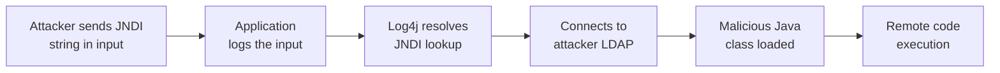

# Lab 6.9: Case Study. Log4Shell (CVE-2021-44228)

  Understand: ~10 min | Analyze: ~10 min | Lessons: ~10 min | Detect: ~5 min
  Advanced
  Prerequisites: <a href="../../tier-1/1.1-dependency-resolution/">Lab 1.1</a>

On December 9, 2021, CVE-2021-44228 was publicly disclosed. By December 10, mass exploitation was underway worldwide. Every security team scrambled to answer: "Do we use Log4j?" Most could not answer quickly because Log4j was a **transitive dependency** buried levels deep. Your application uses Spring Boot, which uses spring-boot-starter-logging, which pulls in log4j-core. The developer never typed "log4j" in their `pom.xml`. A single transitive dependency in a logging library gave attackers unauthenticated RCE on any Java application that logged user-controlled input. CVSS 10.0, affecting an estimated 93% of enterprise cloud environments.

### Attack Flow

## Environment

| Component | Path | Description |
|-----------|------|-------------|
| Vulnerable App | `/app/` | Spring Boot application with transitive Log4j dependency |
| Dependency Analysis | `/app/dependency-tree.txt` | Maven dependency tree showing the Log4j path |
| SBOM | `/app/sbom.json` | CycloneDX SBOM revealing transitive dependencies |
| Detection Tools | `/app/detection/` | Network indicators and detection scripts |

  Overview
  ›
  <a href="understand/" class="phase-step upcoming">Understand</a>
  ›
  <a href="analyze/" class="phase-step upcoming">Analyze</a>
  ›
  <a href="lessons/" class="phase-step upcoming">Lessons</a>
  ›
  <a href="detect/" class="phase-step upcoming">Detect</a>

!!! tip "Related Labs"
    - **Prerequisite:** [1.1 How Dependency Resolution Works](../../tier-1/1.1-dependency-resolution/index.md) — Dependency resolution explains how Log4j propagated everywhere
    - **See also:** [1.6 Phantom Dependencies](../../tier-1/1.6-phantom-dependencies/index.md) — Log4j was a phantom transitive dependency in most affected projects
    - **See also:** [4.1 What SBOMs Actually Contain](../../tier-4/4.1-sbom-contents/index.md) — SBOMs would have revealed Log4j in dependency trees
    - **See also:** [6.10 Case Study: Equifax Breach](../6.10-case-study-equifax/index.md) — Equifax also involved a known vulnerability in a dependency
