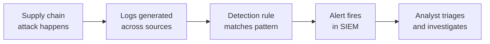

# Lab 7.1: Building Detection Rules for Supply Chain Attacks

  Phase 1 ~10 min | Phase 2 ~15 min | Phase 3 ~15 min | Phase 4 ~5 min
  Advanced
  Prerequisites: <a href="../../tier-1/1.1-dependency-resolution.md">Lab 1.1</a>, <a href="../../tier-1/1.2-dependency-confusion/">Lab 1.2</a>, <a href="../../tier-1/1.3-typosquatting.md">Lab 1.3</a>, <a href="../../tier-1/1.4-lockfile-injection.md">Lab 1.4</a>, <a href="../../tier-1/1.5-manifest-confusion.md">Lab 1.5</a>, <a href="../../tier-1/1.6-phantom-dependencies.md">Lab 1.6</a>

  Overview
  ›
  <a href="understand/" class="phase-step upcoming">Understand</a>
  ›
  <a href="investigate/" class="phase-step upcoming">Investigate</a>
  ›
  <a href="validate/" class="phase-step upcoming">Validate</a>
  ›
  <a href="improve/" class="phase-step upcoming">Improve</a>

You completed Tier 1. You know how the attacks work. Now put yourself in the SOC analyst's chair: detect them after the fact, from log telemetry, before the attacker finishes exfiltrating.

### Attack Flow

