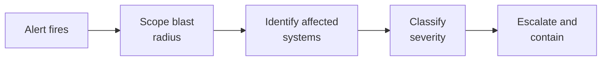

# Lab 7.2: Supply Chain Incident Triage

  Phase 1 ~5 min | Phase 2 ~15 min | Phase 3 ~10 min | Phase 4 ~10 min
  Advanced
  Prerequisites: <a href="../../tier-1/1.2-dependency-confusion/">Lab 1.2</a>, <a href="../7.1-detection-rules/">Lab 7.1</a>

  Overview
  ›
  <a href="understand/" class="phase-step upcoming">Understand</a>
  ›
  <a href="investigate/" class="phase-step upcoming">Investigate</a>
  ›
  <a href="validate/" class="phase-step upcoming">Validate</a>
  ›
  <a href="improve/" class="phase-step upcoming">Improve</a>

It is 14:47 on a Tuesday. Your pager fires:

> **[CRITICAL] Detection Rule 7100001: Internal package `internal-utils@99.0.0` installed in CI pipeline `build-api-service` 3 hours ago. Source: public PyPI.**

You are the on-call SOC analyst. Three hours have passed since the malicious package was installed. Every minute you spend investigating is a minute the attacker has to deepen their access.

### Attack Flow

!!! tip "Related Labs"
    - **Prerequisite:** [7.1 Building Detection Rules](../7.1-detection-rules/index.md) — Detection rules trigger the incidents you triage here
    - **Next:** [7.3 Incident Response Playbook](../7.3-ir-playbook/index.md) — IR playbooks formalize the triage process into response procedures
    - **See also:** [6.7 Case Study: Codecov Bash Uploader](../../tier-6/6.7-case-study-codecov/index.md) — Codecov is a real-world triage scenario for CI supply chain breaches
    - **See also:** [6.10 Case Study: Equifax Breach](../../tier-6/6.10-case-study-equifax/index.md) — Equifax shows consequences of poor incident triage
