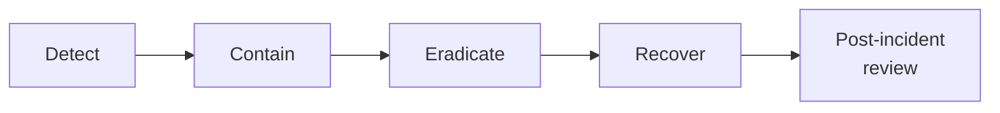

# Lab 7.3: Incident Response Playbook

<div class="lab-meta">
  <span>Phase 1 ~10 min | Phase 2 ~15 min | Phase 3 ~10 min | Phase 4 ~10 min</span>
  <span class="difficulty advanced">Advanced</span>
  <span>Prerequisites: <a href="../7.2-incident-triage/">Lab 7.2</a></span>
</div>

In [Lab 7.2](7.2-incident-triage/), you triaged a dependency confusion incident as a one-off exercise. In a real organization, you need a playbook: a repeatable, tested procedure that any analyst can follow at 3 AM when the pager fires.

---

## Connect to the Workstation

```bash
./weaklink shell
```

---

### Attack Flow



---

???+ info "Phase 1: UNDERSTAND. The NIST SP 800-61 Framework"

    **Goal:** Learn the IR lifecycle phases as they apply to supply chain compromises.

### Step 1: The IR lifecycle

NIST SP 800-61 Rev. 2 defines six phases. See the [full document](https://csrc.nist.gov/publications/detail/sp/800-61/rev-2/final) for details.

```
┌─────────────┐    ┌─────────────┐    ┌──────────────┐
│ PREPARATION │───>│  DETECTION  │───>│ CONTAINMENT  │
│             │    │  & ANALYSIS │    │              │
└─────────────┘    └─────────────┘    └──────┬───────┘
                                             │
┌─────────────┐    ┌─────────────┐    ┌──────▼───────┐
│   LESSONS   │<───│  RECOVERY   │<───│ ERADICATION  │
│   LEARNED   │    │             │    │              │
└─────────────┘    └─────────────┘    └──────────────┘
```

### Step 2: Supply chain-specific considerations

| Phase | Supply Chain IR Specifics |
|-------|--------------------------|
| **Preparation** | Package manager hardening, CI secrets inventory, artifact signing |
| **Detection** | Proxy logs showing public registry fetches for internal names, EDR process trees from pip/npm |
| **Containment** | Quarantine CI runners, block malicious package, halt deployments |
| **Eradication** | Remove compromised packages, fix pip/npm config, rotate ALL exposed secrets |
| **Recovery** | Rebuild artifacts from verified source, redeploy, verify integrity |
| **Lessons Learned** | Update detection rules, harden CI config, implement provenance |

### Step 3: Decision tree for supply chain incidents

```
Alert: Suspicious package activity detected
│
├─ Is the package name in our internal namespace?
│  ├─ YES → Was it fetched from a public registry?
│  │        ├─ YES → CONFIRMED dependency confusion. SEV-1. Go to Containment.
│  │        └─ NO  → Verify registry source. Likely false positive.
│  └─ NO  → Is the package name a known typosquat?
│           ├─ YES → CONFIRMED typosquatting. SEV-2. Go to Containment.
│           └─ NO  → Is setup.py spawning suspicious processes?
│                    ├─ YES → PROBABLE malicious package. SEV-2. Investigate.
│                    └─ NO  → Log and monitor. Close as informational.
```

---

???+ warning "Phase 2: INVESTIGATE. Build the Playbook"

    **Goal:** Create a step-by-step IR playbook for "compromised dependency detected in CI."

### Step 1: Define roles

| Role | Responsibility |
|------|---------------|
| **Incident Commander (IC)** | Coordinates response, makes decisions, communicates status |
| **SOC Analyst** | Detection, initial triage, log analysis |
| **Platform Engineer** | CI/CD systems, package registries, artifact stores |
| **Application Owner** | Knows what secrets the pipeline uses, application behavior |
| **Communications Lead** | Internal/external messaging, legal coordination |

### Step 2: Playbook. Preparation phase

```markdown
PREPARATION CHECKLIST
=====================

[ ] CI secrets inventory exists and is current (last updated: ____)
[ ] Detection rules deployed (Lab 7.1)
[ ] Package manager hardening
    - --index-url (not --extra-index-url) in all pip configs
    - npm registry locked to corporate registry
    - --require-hashes enabled where possible
[ ] Artifact integrity
    - Container images signed with cosign
    - Build provenance generated (SLSA Level 2+)
[ ] Communication templates drafted
[ ] Tabletop exercise completed within last 6 months
```

### Step 3: Playbook. Detection and Analysis phase

```markdown
DETECTION & ANALYSIS
====================

TRIGGER: Alert from detection rule OR analyst observation OR user report

STEP 1: Validate the alert (5 min SLA)
  - Pull raw log event. Confirm package name, version, source registry, CI runner.
  - Check FP allow-list. If confirmed false positive: close, update allow-list.

STEP 2: Classify severity (5 min SLA)
  SEV-1: Malicious package installed + secrets exfiltrated OR compromised artifact in prod
  SEV-2: Malicious package installed, no confirmed exfil OR compromised artifact in staging only
  SEV-3: Suspicious package detected, not yet installed

STEP 3: Scope the blast radius (15 min SLA)
  - Proxy logs: which CI runners downloaded the package?
  - CI logs: which pipelines ran during the compromise window?
  - Secret manager: what secrets were accessible?
  - Artifact registry: what artifacts were built?
  - Deployment logs: were compromised artifacts deployed?

STEP 4: Analyze the malicious package (15 min SLA)
  - Download without execution: pip download --no-deps --no-build-isolation
  - Document: What does it do? Exfil? Backdoor? Persistence?
  - Identify C2 infrastructure

STEP 5: Open incident channel
  - Create Slack channel: #incident-YYYY-NNNN
  - Page IC, Platform Engineer, Application Owner(s)
```

### Step 4: Playbook. Containment phase

```markdown
CONTAINMENT (execute in parallel)
=================================

IMMEDIATE (0-15 min):
  [ ] Block attacker C2 domain/IP at firewall and DNS
  [ ] Remove malicious package from pip/npm cache on all CI runners
  [ ] Halt all deployments (freeze the pipeline)
  [ ] If compromised artifact in production: initiate rollback

SHORT-TERM (15-60 min):
  [ ] Rotate ALL secrets accessible to affected pipelines
  [ ] Quarantine compromised artifacts in registry (do not delete -- forensics)
  [ ] Isolate affected CI runners for forensic analysis
  [ ] Revoke any tokens/sessions that may have been forged with stolen keys
```

### Step 5: Playbook. Eradication phase

```markdown
ERADICATION
===========

ROOT CAUSE REMEDIATION:
  [ ] Fix package manager configuration
  [ ] Add --require-hashes to all requirements files
  [ ] Claim internal package names on public registries
  [ ] Rebuild affected CI runners from clean images

ARTIFACT REMEDIATION:
  [ ] Rebuild ALL artifacts from the compromise window using clean CI
  [ ] Verify rebuilt artifacts with diffoscope or similar
  [ ] Re-sign rebuilt artifacts

VERIFICATION:
  [ ] Re-run detection rules against post-fix CI logs
  [ ] Verify all rotated secrets are working
  [ ] Confirm rollback is stable
```

### Step 6: Playbook. Recovery and Lessons Learned

```markdown
RECOVERY
========
  [ ] Resume deployments with clean artifacts
  [ ] Monitor 24-48 hours for signs of persistent access
  [ ] Audit cloud provider logs for unauthorized API calls during compromise window
  [ ] If customer data exposure confirmed: engage legal

LESSONS LEARNED (schedule within 5 business days)
==================================================
  AGENDA:
  1. Timeline review
  2. What worked well
  3. What did not work / gaps identified
  4. Detection improvements
  5. Prevention improvements
  6. Action items with owners and due dates
```

---

!!! success "Checkpoint"
    You should have a complete playbook covering Preparation, Detection, Containment, Eradication, Recovery, and Lessons Learned. Walk through the Lab 7.2 scenario mentally and verify every step is covered.

---

???+ success "Phase 3: VALIDATE. Walk Through the Lab 7.2 Scenario"

    **Goal:** Apply the playbook to the dependency confusion incident from [Lab 7.2](7.2-incident-triage/).

### Step 1: Trace the incident through the playbook

| Playbook Step | Lab 7.2 Action | Covered? |
|---------------|----------------|----------|
| Validate alert | Confirmed `internal-utils@99.0.0` from public PyPI | Yes |
| Classify severity | SEV-1: secrets exfiltrated + prod deployment | Yes |
| Scope blast radius | 3 runners, 3 pipelines, 8 secrets, 1 prod deploy | Yes |
| Analyze package | setup.py exfiltrates env vars to attacker C2 | Yes |
| Block C2 | Block `collect.attacker.com` at firewall | Yes |
| Rotate secrets | All 8 credentials rotated | Yes |
| Quarantine artifacts | 3 container images quarantined | Yes |
| Rollback production | api-service rolled back to v2.14.2 | Yes |
| Fix root cause | pip config changed to --index-url | Yes |
| Rebuild artifacts | Clean rebuild from verified source | Yes |

### Step 2: Identify gaps

| Gap | Improvement |
|-----|-------------|
| No pre-built forensic image | Pre-stage a sandboxed analysis VM for package forensics |
| Secret inventory was stale | Automate CI secrets inventory with monthly refresh |
| No deployment freeze automation | Create a "kill switch" that freezes all deployments via API |
| Rollback required manual approval | Pre-approve emergency rollbacks for SEV-1 incidents |

---

??? tip "Phase 4: IMPROVE. Tabletop Exercise"

    **Goal:** Stress-test the playbook with edge cases.

### Scenario A: The attacker published the package 6 months ago

The compromise window is not 3 hours but 6 months. Every build for 6 months is potentially compromised. Secrets may have been rotated since, but the attacker may have used the old ones. Cloud provider logs may not retain beyond 90 days.

### Scenario B: The attacker used the stolen GH_TOKEN to add a backdoor

During the 3-hour window, the attacker pushed a commit adding a subtle backdoor (hardcoded admin credentials). This is a secondary compromise that extends beyond CI.

### Scenario C: The malicious package does not exfiltrate. it backdoors

Instead of exfiltrating secrets, the package modifies its `authenticate()` function to accept a hardcoded password. No C2 traffic, no EDR alerts. Detection requires code review or runtime authentication anomaly monitoring.

### Final verification

```bash
weaklink verify 7.3
```

---

## What You Learned

- A playbook turns ad-hoc response into a repeatable process. Without one, quality depends entirely on who is on-call.
- Decision trees reduce triage time. Clear classification prevents analysts from under- or over-escalating.
- Tabletop exercises reveal gaps. Edge cases like long compromise windows, secondary compromise, and non-exfiltrating malware break simple playbooks.

## Further Reading

- [NIST SP 800-61 Rev. 2: Computer Security Incident Handling Guide](https://csrc.nist.gov/publications/detail/sp/800-61/rev-2/final)
- [SANS Incident Handler's Handbook](https://www.sans.org/white-papers/33901/)
- [Google SRE Book: Managing Incidents](https://sre.google/sre-book/managing-incidents/)
