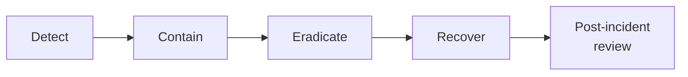

# Lab 7.3: Incident Response Playbook

<div class="lab-meta">
  <span>~45 minutes</span>
  <span class="difficulty advanced">Advanced</span>
  <span>Prerequisites: <a href="7.2-incident-triage.md">Lab 7.2</a></span>
</div>

In [Lab 7.2](7.2-incident-triage.md), you triaged a dependency confusion incident as a one-off exercise. In a real organization, you cannot depend on individual analyst heroics every time a supply chain compromise happens. You need a playbook. a repeatable, tested procedure that any analyst can follow at 3 AM when the pager fires.

This lab guides you through building a supply chain incident response playbook based on the NIST SP 800-61 framework. You will structure the playbook, walk it through the [Lab 7.2](7.2-incident-triage.md) scenario, and stress-test it with a tabletop exercise.

---

## Connect to the Workstation

```bash
./weaklink shell
```

---

### Attack Flow



---

???+ info "Phase 1: UNDERSTAND. The NIST SP 800-61 Framework"

    **Goal:** Learn the IR lifecycle phases and how they apply to supply chain compromises specifically.

### Step 1: The IR lifecycle

NIST SP 800-61 Rev. 2 defines six phases of incident response. For supply chain incidents, each phase has specific considerations:

```
┌─────────────┐    ┌─────────────┐    ┌──────────────┐
│ PREPARATION │───>│  DETECTION  │───>│ CONTAINMENT  │
│             │    │  & ANALYSIS │    │              │
└─────────────┘    └─────────────┘    └──────┬───────┘
                                             │
┌─────────────┐    ┌─────────────┐    ┌──────▼───────┐
│   LESSONS   │<───│  RECOVERY   │<───│ ERADICATION  │
│   LEARNED   │    │             │    │              │
└─────────────┘    └─────────────┘    └──────────────┘
```

### Step 2: Supply chain-specific considerations per phase

| Phase | General IR | Supply Chain IR Specifics |
|-------|-----------|--------------------------|
| **Preparation** | IR team, tools, contacts | Package manager hardening, CI secrets inventory, artifact signing |
| **Detection** | SIEM alerts, user reports | Proxy logs showing public registry fetches for internal names, EDR process trees from pip/npm |
| **Containment** | Isolate affected hosts | Quarantine CI runners, block malicious package, halt deployments |
| **Eradication** | Remove malware, patch | Remove compromised packages, fix pip/npm config, rotate ALL exposed secrets |
| **Recovery** | Restore systems | Rebuild artifacts from verified source, redeploy, verify integrity |
| **Lessons Learned** | Post-incident review | Update detection rules, harden CI config, implement provenance |

### Step 3: Decision tree for supply chain incidents

Not every supply chain alert is a confirmed incident. The playbook needs a decision tree:

```
Alert: Suspicious package activity detected
│
├─ Is the package name in our internal namespace?
│  ├─ YES → Was it fetched from a public registry?
│  │        ├─ YES → CONFIRMED dependency confusion. Escalate to SEV-1. Go to Containment.
│  │        └─ NO  → Verify registry source. Likely false positive.
│  └─ NO  → Is the package name a known typosquat?
│           ├─ YES → CONFIRMED typosquatting. Escalate to SEV-2. Go to Containment.
│           └─ NO  → Is setup.py spawning suspicious processes?
│                    ├─ YES → PROBABLE malicious package. Escalate to SEV-2. Investigate.
│                    └─ NO  → Log and monitor. Close as informational.
```

---

???+ warning "Phase 2: INVESTIGATE. Build the Playbook"

    **Goal:** Create a step-by-step IR playbook for "compromised dependency detected in CI" with role assignments, escalation criteria, and concrete actions.

### Step 1: Define roles

| Role | Responsibility | On-call contact |
|------|---------------|-----------------|
| **Incident Commander (IC)** | Coordinates response, makes decisions, communicates status | Security team lead |
| **SOC Analyst** | Detection, initial triage, log analysis | On-call SOC analyst |
| **Platform Engineer** | CI/CD systems, package registries, artifact stores | Platform on-call |
| **Application Owner** | Knows what secrets the pipeline uses, application behavior | Team lead of affected service |
| **Communications Lead** | Internal/external messaging, legal coordination | Security manager |

### Step 2: Playbook. Preparation phase

These actions must be completed BEFORE an incident occurs:

```markdown
PREPARATION CHECKLIST
=====================

[ ] CI secrets inventory exists and is current (last updated: ____)
    - Every pipeline's accessible secrets are documented
    - Secret rotation procedures are tested

[ ] Detection rules deployed ([Lab 7.1](7.1-detection-rules.md))
    - Dependency confusion rule (proxy logs)
    - Typosquatting watchlist rule (CI logs)
    - setup.py process tree rule (EDR)
    - Lockfile injection rule (Git audit)

[ ] Package manager hardening
    - --index-url (not --extra-index-url) in all pip configs
    - npm registry locked to corporate registry
    - --require-hashes enabled where possible

[ ] Artifact integrity
    - Container images signed with cosign
    - Build provenance generated (SLSA Level 2+)
    - Deployment policy requires signature verification

[ ] Communication templates drafted
    - Internal incident notification
    - Customer notification (if PII exposed)
    - Regulatory notification (if applicable)

[ ] Tabletop exercise completed within last 6 months
```

### Step 3: Playbook. Detection and Analysis phase

```markdown
DETECTION & ANALYSIS
====================

TRIGGER: Alert from detection rule OR analyst observation OR user report

STEP 1: Validate the alert (5 min SLA)
  - Pull the raw log event that triggered the alert
  - Confirm the package name, version, source registry, and CI runner
  - Check: Is this a known false positive? (Check the FP allow-list)
  - If confirmed malicious or unknown: proceed to Step 2
  - If confirmed false positive: close alert, update allow-list

STEP 2: Classify severity (5 min SLA)
  ┌──────────────────────────────────────────────────────────┐
  │ SEV-1: Malicious package installed + secrets exfiltrated │
  │        OR compromised artifact deployed to production    │
  │ SEV-2: Malicious package installed, no confirmed exfil   │
  │        OR compromised artifact in staging only           │
  │ SEV-3: Suspicious package detected, not yet installed    │
  │        OR typosquat with no confirmed execution          │
  └──────────────────────────────────────────────────────────┘

STEP 3: Scope the blast radius (15 min SLA)
  - Query proxy logs: which CI runners downloaded the package?
  - Query CI logs: which pipelines ran during the compromise window?
  - Query secret manager: what secrets were accessible to those pipelines?
  - Query artifact registry: what artifacts were built during the window?
  - Query deployment logs: were any compromised artifacts deployed?

STEP 4: Analyze the malicious package (15 min SLA)
  - Download without execution: pip download --no-deps --no-build-isolation
  - Extract and read setup.py / install scripts
  - Document: What does it do? Exfil? Backdoor? Persistence?
  - Identify C2 infrastructure (domains, IPs)

STEP 5: Open incident channel
  - Create Slack channel: #incident-YYYY-NNNN
  - Page Incident Commander
  - Page Platform Engineer and Application Owner(s)
  - Post initial situation report
```

### Step 4: Playbook. Containment phase

```markdown
CONTAINMENT (execute in parallel where possible)
=================================================

IMMEDIATE (0-15 min):
  [ ] Block attacker C2 domain/IP at firewall and DNS
  [ ] Remove malicious package from pip/npm cache on all CI runners
  [ ] Halt all deployments (freeze the deployment pipeline)
  [ ] If compromised artifact is in production: initiate rollback

SHORT-TERM (15-60 min):
  [ ] Rotate ALL secrets accessible to affected pipelines
      - AWS keys → IAM console, deactivate old key
      - API tokens → Regenerate in service dashboard
      - Database passwords → Rotate and update connection strings
      - Signing keys → Rotate (note: may invalidate active sessions)
  [ ] Quarantine compromised artifacts in registry (do not delete -- forensics)
  [ ] Isolate affected CI runners for forensic analysis
  [ ] Revoke any tokens/sessions that may have been forged with stolen keys
```

### Step 5: Playbook. Eradication phase

```markdown
ERADICATION
===========

ROOT CAUSE REMEDIATION:
  [ ] Fix package manager configuration
      - Replace --extra-index-url with --index-url (pip)
      - Lock npm registry to corporate registry
  [ ] Add --require-hashes to all requirements files
  [ ] Claim internal package names on public registries (namespace squatting defense)
  [ ] Rebuild affected CI runners from clean images

ARTIFACT REMEDIATION:
  [ ] Rebuild ALL artifacts from the compromise window using clean CI
  [ ] Verify rebuilt artifacts with diffoscope or similar
  [ ] Re-sign rebuilt artifacts
  [ ] Update deployment manifests to reference clean artifact versions

VERIFICATION:
  [ ] Re-run detection rules against post-fix CI logs -- confirm no more alerts
  [ ] Verify all rotated secrets are working in CI and production
  [ ] Confirm rollback is stable and no service degradation
```

### Step 6: Playbook. Recovery and Lessons Learned

```markdown
RECOVERY
========
  [ ] Resume deployments with clean artifacts
  [ ] Monitor for 24-48 hours for signs of persistent access
  [ ] Audit CloudTrail / cloud provider logs for unauthorized API calls
      during the compromise window using the exfiltrated credentials
  [ ] If customer data exposure confirmed: engage legal for notification

LESSONS LEARNED (schedule within 5 business days)
==================================================
  ATTENDEES: IC, SOC analyst, platform engineer, application owners,
             engineering leadership

  AGENDA:
  1. Timeline review (what happened, when)
  2. What worked well in the response
  3. What did not work / gaps identified
  4. Detection improvements (new rules, reduced latency)
  5. Prevention improvements (CI hardening, secret management)
  6. Action items with owners and due dates

  DELIVERABLE: Post-incident report (see template below)
```

---

???+ success "Phase 3: VALIDATE. Walk Through the [Lab 7.2](7.2-incident-triage.md) Scenario"

    **Goal:** Apply the playbook to the dependency confusion incident from [Lab 7.2](7.2-incident-triage.md) and verify every phase is covered.

### Step 1: Trace the [Lab 7.2](7.2-incident-triage.md) incident through the playbook

Walk through each step and check off whether the playbook covered it:

| Playbook Step | [Lab 7.2](7.2-incident-triage.md) Action | Covered? |
|---------------|---------------|----------|
| Validate alert | Confirmed `internal-utils@99.0.0` from public PyPI | Yes |
| Classify severity | SEV-1: secrets exfiltrated + prod deployment | Yes |
| Scope blast radius | 3 runners, 3 pipelines, 8 secrets, 1 prod deploy | Yes |
| Analyze package | setup.py exfiltrates env vars to attacker C2 | Yes |
| Block C2 | Block `collect.attacker.com` at firewall | Yes |
| Rotate secrets | All 8 credentials rotated | Yes |
| Quarantine artifacts | 3 container images quarantined | Yes |
| Rollback production | api-service rolled back to v2.14.2 | Yes |
| Fix root cause | pip config changed to --index-url | Yes |
| Rebuild artifacts | Clean rebuild from verified source | Yes |

### Step 2: Identify gaps in the playbook

Even with a thorough playbook, gaps will emerge during walkthroughs:

| Gap | Description | Improvement |
|-----|------------|-------------|
| No pre-built forensic image | Analyst had to manually download and extract the malicious package | Pre-stage a sandboxed analysis VM for package forensics |
| Secret inventory was stale | Took 20 minutes to identify all exposed secrets because the inventory was 3 months old | Automate CI secrets inventory with monthly refresh |
| No deployment freeze automation | Had to manually contact SRE to halt deployments | Create a "kill switch" that freezes all deployments via API |
| Rollback required manual approval | Production rollback required change board approval, adding 30 minutes | Pre-approve emergency rollbacks for SEV-1 incidents |

---

??? tip "Phase 4: IMPROVE. Post-Incident Report and Tabletop Exercise"

    **Goal:** Generate the post-incident report template and stress-test the playbook with edge cases.

### Step 1: Post-incident report template

```markdown
POST-INCIDENT REPORT
=====================

Incident ID:      INC-YYYY-NNNN
Severity:         SEV-X
Date:             YYYY-MM-DD
Duration:         X hours (compromise start to full containment)
Commander:        [Name]
Author:           [Name]
Status:           Closed / Monitoring

1. EXECUTIVE SUMMARY
   [2-3 sentences: what happened, what was the impact, is it resolved?]

2. TIMELINE
   [Chronological list of events from initial compromise to resolution]
   HH:MM - Event description
   HH:MM - Event description
   ...

3. ROOT CAUSE
   [Technical explanation of why the incident occurred]

4. IMPACT
   - Systems affected: [list]
   - Data exposed: [list]
   - Customer impact: [describe]
   - Financial impact: [estimate if known]

5. RESPONSE ACTIONS
   [What was done to contain, eradicate, and recover]

6. DETECTION ANALYSIS
   - Time to compromise: [when did the attack start]
   - Time to detect: [when did we find out]
   - Time to contain: [when was the bleeding stopped]
   - Detection method: [what rule/tool/person found it]

7. LESSONS LEARNED
   - What worked well: [list]
   - What needs improvement: [list]

8. ACTION ITEMS
   | # | Action | Owner | Due Date | Status |
   |---|--------|-------|----------|--------|
   | 1 | [action] | [name] | [date] | Open |
   | 2 | [action] | [name] | [date] | Open |
```

### Step 2: Tabletop exercise. Edge cases

Run through these scenarios with your team to stress-test the playbook:

**Scenario A: The attacker published the package 6 months ago.**
The `internal-utils@99.0.0` was published 6 months ago. CI has been installing it for months, but the detection rule was only deployed today. Your compromise window is not 3 hours. it is 6 months. How does this change your response?

- Blast radius: Every build for 6 months is potentially compromised
- Secret rotation: Secrets may have been rotated since, but the attacker may have used the old ones
- Artifact integrity: Hundreds of artifacts need to be audited
- Cloud provider logs: May not retain logs beyond 90 days

**Scenario B: The attacker used the stolen GH_TOKEN to add a backdoor.**
During the 3-hour window, the attacker used the exfiltrated `GH_TOKEN` to push a commit to the `auth-service` repository that adds a subtle backdoor (a new admin endpoint with hardcoded credentials). How do you detect this?

- Review all Git activity during the compromise window using the audit log
- Look for commits not associated with a PR or approved review
- Diff every commit made during the window against known-good state
- This is a secondary compromise. the incident is no longer just a CI issue

**Scenario C: The malicious package does not exfiltrate. it backdoors.**
Instead of exfiltrating secrets, the malicious `internal-utils@99.0.0` modifies its own `authenticate()` function to accept a hardcoded password alongside normal authentication. There is no C2 traffic. How do you detect this?

- No network indicators to detect
- EDR will not flag it (no suspicious child processes)
- Detection requires code review / behavioral analysis of the installed package
- Runtime detection: monitor for authentication anomalies (logins from unusual IPs)

### Step 3: Final verification

Run the verification from your host terminal:

```bash
weaklink verify 7.3
```

---

## What You Learned

1. **A playbook turns ad-hoc response into a repeatable process**. without one, incident response quality depends entirely on who is on-call.
2. **NIST SP 800-61 provides the structure**. Preparation, Detection, Containment, Eradication, Recovery, and Lessons Learned apply directly to supply chain incidents.
3. **Decision trees reduce triage time**. a clear classification framework prevents analysts from under- or over-escalating.
4. **Preparation is the most important phase**. CI secrets inventory, detection rules, package manager hardening, and tested communication templates must exist before the incident.
5. **Tabletop exercises reveal gaps**. edge cases like long compromise windows, secondary compromise, and non-exfiltrating malware break simple playbooks.

## Further Reading

- [NIST SP 800-61 Rev. 2: Computer Security Incident Handling Guide](https://csrc.nist.gov/publications/detail/sp/800-61/rev-2/final)
- [NIST SP 800-83: Guide to Malware Incident Prevention and Handling](https://csrc.nist.gov/publications/detail/sp/800-83/rev-1/final)
- [SANS Incident Handler's Handbook](https://www.sans.org/white-papers/33901/)
- [OpenSSF: Responding to Supply Chain Compromises](https://openssf.org/)
- [Google SRE Book: Managing Incidents](https://sre.google/sre-book/managing-incidents/)
