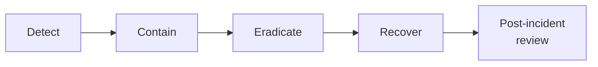

# Lab 7.3: Incident Response Playbook

  Understand: ~10 min | Investigate: ~15 min | Validate: ~10 min | Improve: ~10 min
  Advanced
  Prerequisites: <a href="../7.2-incident-triage/">Lab 7.2</a>

  Overview
  ›
  <a href="understand/" class="phase-step upcoming">Understand</a>
  ›
  <a href="investigate/" class="phase-step upcoming">Investigate</a>
  ›
  <a href="validate/" class="phase-step upcoming">Validate</a>
  ›
  <a href="improve/" class="phase-step upcoming">Improve</a>

In [Lab 7.2](../7.2-incident-triage/), you triaged a dependency confusion incident as a one-off exercise. In a real organization, you need a playbook: a repeatable, tested procedure that any analyst can follow at 3 AM when the pager fires.

### Attack Flow

