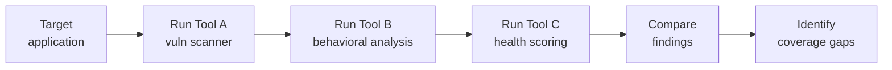

# Lab 7.4: Supply Chain Security Tool Evaluation

<div class="lab-meta">
  <span>Phase 1 ~10 min | Phase 2 ~15 min | Phase 3 ~10 min | Phase 4 ~5 min</span>
  <span class="difficulty intermediate">Intermediate</span>
  <span>Prerequisites: <a href="../../tier-1/1.1-dependency-resolution/">Lab 1.1</a></span>
</div>

The supply chain security tooling market has exploded. Which tools actually catch the attacks you practiced in Tier 1? Run every major tool against the same target project, then build a comparison matrix showing coverage, gaps, and cost.

---

## Connect to the Workstation

```bash
./weaklink shell
```

---

### Attack Flow



---

???+ info "Phase 1: UNDERSTAND. The Tool Landscape"

    **Goal:** Survey the tool landscape and understand what category each tool belongs to.

### Step 1: Tool categories

| Category | What It Does | Tools |
|----------|-------------|-------|
| **Vulnerability scanning** | Finds known CVEs in dependencies | Grype, Trivy, pip-audit, npm audit, Snyk |
| **Behavioral analysis** | Detects suspicious package behavior (network, file access, obfuscation) | Socket |
| **Dependency risk scoring** | Scores project health, maintainer trust, dependency hygiene | OpenSSF Scorecard, deps.dev |
| **SBOM & provenance** | Generates/validates SBOMs and build provenance | Syft, cosign, SLSA verifier |
| **Dependency graph analysis** | Maps and queries the dependency graph for anomalies | GUAC, deps.dev |
| **Automated updates** | Keeps dependencies current with automated PRs | Dependabot, Renovate |

### Step 2: Map tools to Tier 1 attack types

| Attack Type | Expected Detection By |
|-------------|----------------------|
| Dependency confusion | Socket (behavioral), Scorecard (config check) |
| Typosquatting | Socket (name analysis), deps.dev (popularity) |
| Lockfile injection | npm audit (integrity check), Socket (diff analysis) |
| Manifest confusion | Socket (metadata analysis) |
| Phantom dependencies | deps.dev (graph analysis), Scorecard (pinning check) |
| Known CVEs | Grype, Trivy, pip-audit, npm audit, Snyk |

---

???+ warning "Phase 2: INVESTIGATE. Run Each Tool Against the Target"

    **Goal:** Run every tool against the same target project and record findings and misses.

### Step 1: Set up the target project

```bash
ls /app/
# requirements.txt    -- contains dependency confusion risk (extra-index-url)
# package.json        -- contains typosquat dependency
# package-lock.json   -- contains injected lockfile entry
# Dockerfile          -- builds the application
```

### Step 2: Run vulnerability scanners

**pip-audit:**
```bash
cd /app
pip-audit -r requirements.txt --output-format json 2>&1 | head -50
```

**npm audit:**
```bash
cd /app
npm audit --json 2>&1 | head -50
```

**Grype:**
```bash
grype dir:/app --output table
```

**Trivy:**
```bash
trivy fs /app --security-checks vuln,secret,config --format table
```

### Step 3: Run behavioral analysis (Socket)

Key questions: Did it flag the typosquat? The install script? The lockfile injection?

### Step 4: Run project health scoring (OpenSSF Scorecard)

```bash
scorecard --local /app --format json 2>&1 | python3 -m json.tool | head -80
```

Key checks: `Pinned-Dependencies`, `Branch-Protection`, `Code-Review`, `Dangerous-Workflow`.

### Step 5: Query dependency intelligence (deps.dev)

```bash
curl -s "https://api.deps.dev/v3alpha/systems/pypi/packages/reqeusts" | python3 -m json.tool
```

Does deps.dev distinguish the typosquat from the real package?

---

???+ success "Checkpoint"
    You should have findings from at least 4 tools (pip-audit, npm audit, Grype/Trivy, Scorecard). Note which Tier 1 attacks each tool caught and which it missed.

---

???+ success "Phase 3: VALIDATE. Build the Comparison Matrix"

    **Goal:** Consolidate findings into a comparison matrix.

### Detection coverage matrix

| Attack Type | pip-audit | npm audit | Grype | Trivy | Snyk | Socket | Scorecard | deps.dev |
|-------------|:---------:|:---------:|:-----:|:-----:|:----:|:------:|:---------:|:--------:|
| Known CVEs | Yes | Yes | Yes | Yes | Yes | Partial | No | Yes |
| Dependency confusion | No | No | No | No | No | **Yes** | Partial | No |
| Typosquatting | No | No | No | No | Partial | **Yes** | No | Partial |
| Lockfile injection | No | Partial | No | No | No | **Yes** | No | No |
| Manifest confusion | No | No | No | No | No | **Yes** | No | No |
| Phantom dependencies | No | No | No | No | No | Partial | Partial | Partial |
| Malicious install scripts | No | No | No | No | No | **Yes** | No | No |
| Secrets in code | No | No | No | **Yes** | Partial | No | No | No |
| Dockerfile misconfig | No | No | No | **Yes** | Partial | No | No | No |

**Key insight:** Vulnerability scanners only catch *known CVEs*. They miss every Tier 1 attack type because those attacks use packages not in vulnerability databases.

### Operational comparison

| Tool | Cost | Integration Effort | False Positive Rate |
|------|------|--------------------|---------------------|
| pip-audit | Free (OSS) | Low | Low |
| npm audit | Free (built-in) | None | Medium |
| Grype | Free (OSS) | Low | Low-Medium |
| Trivy | Free (OSS) | Low | Low-Medium |
| Snyk | Freemium ($$$) | Medium | Low |
| Socket | Freemium ($$) | Medium | Medium |
| Scorecard | Free (OSS) | Low | Low |
| deps.dev | Free | Medium | Low |

---

??? tip "Phase 4: IMPROVE. Write the Recommendation"

    **Goal:** Produce a tiered adoption plan.

**Immediate (zero cost):** pip-audit/npm-audit in every CI pipeline, Dependabot on all repos, Scorecard weekly.

**Short-term (Month 1):** Trivy for container/secret/misconfig scanning. Socket for behavioral analysis.

**Medium-term (Quarter 1):** GUAC for dependency graph queries at scale. Scorecard + deps.dev dashboard.

### What tools cannot replace

1. **Hardened CI/CD configuration**. `--index-url` not `--extra-index-url`, pinned hashes, locked registries.
2. **SIEM detection rules**. the rules from [Lab 7.1](7.1-detection-rules/) catch what no scanner can.
3. **Incident response playbooks**. [Lab 7.3](7.3-ir-playbook/) is your response when tools fail.

### Final verification

```bash
weaklink verify 7.4
```

---

## What You Learned

- Vulnerability scanners only catch known CVEs. They miss every novel supply chain attack.
- Behavioral analysis (Socket) fills the biggest gap by detecting malicious behavior in packages not in vulnerability databases.
- Tools are not a substitute for hardened configuration. Fixing `--extra-index-url` eliminates dependency confusion entirely, which no scanning tool can claim.

## Further Reading

- [OpenSSF Scorecard](https://securityscorecards.dev/)
- [GUAC: Graph for Understanding Artifact Composition](https://guac.sh/)
- [Socket.dev](https://socket.dev/)
