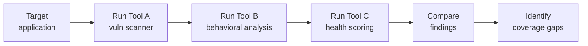

# Lab 7.4: Supply Chain Security Tool Evaluation

  Understand: ~10 min | Investigate: ~15 min | Validate: ~10 min | Improve: ~5 min
  Intermediate
  Prerequisites: <a href="../../tier-1/1.1-dependency-resolution/">Lab 1.1</a>

  Overview
  ›
  <a href="understand/" class="phase-step upcoming">Understand</a>
  ›
  <a href="investigate/" class="phase-step upcoming">Investigate</a>
  ›
  <a href="validate/" class="phase-step upcoming">Validate</a>
  ›
  <a href="improve/" class="phase-step upcoming">Improve</a>

The supply chain security tooling market has exploded. Which tools actually catch the attacks you practiced in Tier 1? Run every major tool against the same target project, then build a comparison matrix showing coverage, gaps, and cost.

### Attack Flow

!!! tip "Related Labs"
    - **Prerequisite:** [1.1 How Dependency Resolution Works](../../tier-1/1.1-dependency-resolution/index.md) — Understanding the threats tools need to address
    - **See also:** [4.1 What SBOMs Actually Contain](../../tier-4/4.1-sbom-contents/index.md) — SBOM tools are a primary category evaluated here
    - **See also:** [4.3 Signing Fundamentals](../../tier-4/4.3-signing-fundamentals/index.md) — Signing tools are another key evaluation target
    - **See also:** [8.5 Building a Supply Chain Security Program](../../tier-8/8.5-building-a-program/index.md) — Tool selection is part of building a security program
