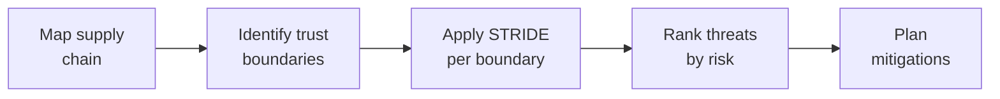

# Lab 7.5: Threat Modeling for Software Supply Chains

<div class="lab-meta">
  <span>Phase 1 ~10 min | Phase 2 ~15 min | Phase 3 ~15 min | Phase 4 ~5 min</span>
  <span class="difficulty advanced">Advanced</span>
  <span>Prerequisites: <a href="7.1-detection-rules.md">Lab 7.1</a></span>
</div>

Detection, triage, and tools are reactive. Threat modeling is proactive: systematically identify where your supply chain can be attacked before an attacker does. This lab applies STRIDE to supply chain trust boundaries and produces a prioritized remediation roadmap.

---

## Connect to the Workstation

```bash
./weaklink shell
```

---

### Attack Flow



---

???+ info "Phase 1: UNDERSTAND. Threat Modeling Frameworks"

    **Goal:** Learn STRIDE categories and trust boundaries in a supply chain context.

### Step 1: STRIDE framework

| Category | Question | Supply Chain Example |
|----------|----------|---------------------|
| **S**poofing | Can an attacker pretend to be a trusted entity? | Publish a package under a trusted maintainer's name (account takeover) |
| **T**ampering | Can an attacker modify data in transit or at rest? | Inject malicious code into a lockfile, modify a build artifact |
| **R**epudiation | Can an attacker deny their actions? | Push a malicious commit with a spoofed Git author |
| **I**nformation Disclosure | Can an attacker access data they shouldn't? | Exfiltrate CI secrets during pip install |
| **D**enial of Service | Can an attacker disrupt availability? | Publish a broken version of a critical dependency |
| **E**levation of Privilege | Can an attacker gain higher access? | Use stolen CI credentials to modify production infrastructure |

### Step 2: What is a trust boundary?

A trust boundary is a point where data or control crosses from one trust domain to another. In a supply chain context:

- Code moves between systems (developer laptop to Git, Git to CI, CI to registry)
- An identity assertion is made (author of a commit, publisher of a package)
- A package is fetched from an external source (public registry to your build)
- An artifact transitions between environments (staging to production)

---

???+ warning "Phase 2: INVESTIGATE. Map the Supply Chain"

    **Goal:** Map the complete supply chain for a sample application, marking every trust boundary.

### Step 1: The sample application

- **Language**: Python (backend), Node.js (frontend)
- **Source**: GitHub (private repository)
- **Build**: GitHub Actions CI/CD
- **Dependencies**: PyPI (Python), npm (Node.js)
- **Artifacts**: Docker container images
- **Registry**: GitHub Container Registry (ghcr.io)
- **Deployment**: Kubernetes cluster via ArgoCD

### Step 2: Trust boundary map

```
   Developer                         External Registries
   ┌─────────┐                       ┌──────────────────┐
   │ Laptop  │──── git push ────────>│  GitHub (source)  │
   │         │     [TB-1]            │                   │
   └─────────┘                       └────────┬──────────┘
                                              │
                                     [TB-2] PR merge trigger
                                              │
                                     ┌────────▼──────────┐
   ┌─────────────┐                   │  GitHub Actions    │
   │ Public PyPI  │<── pip install ──│  (CI runner)       │
   │             │     [TB-3]        │                    │
   └─────────────┘                   │  Secrets injected  │
   ┌─────────────┐                   │  [TB-4]            │
   │ Public npm   │<── npm install ──│                    │
   │             │     [TB-5]        └────────┬───────────┘
   └─────────────┘                            │
                                     [TB-6] docker push
                                              │
                                     ┌────────▼──────────┐
                                     │ GitHub Container   │
                                     │ Registry (ghcr.io) │
                                     └────────┬───────────┘
                                              │
                                     [TB-7] ArgoCD sync
                                              │
                                     ┌────────▼──────────┐
                                     │ Kubernetes         │
                                     │ (production)       │
                                     └────────────────────┘
```

### Step 3: Catalog trust boundaries

| ID | Trust Boundary | Data Crossing |
|----|---------------|---------------|
| TB-1 | Developer push | Source code, commits, signatures |
| TB-2 | CI trigger | Workflow definition, trigger event |
| TB-3 | Python dependency fetch | Python packages (.tar.gz, .whl) |
| TB-4 | Secret injection | API keys, tokens, credentials |
| TB-5 | Node.js dependency fetch | npm packages (.tgz) |
| TB-6 | Artifact publish | Docker images, tags |
| TB-7 | Deployment sync | Container images, manifests |

---

!!! success "Checkpoint"
    You should have 7 trust boundaries mapped. For each, you should be able to name what data crosses and in which direction. This map is the input to STRIDE analysis.

---

???+ success "Phase 3: VALIDATE. Apply STRIDE to Each Boundary"

    **Goal:** Systematically apply STRIDE to each trust boundary and identify concrete threats.

### Worked example: TB-1 (Developer push)

For each trust boundary, ask the six STRIDE questions: Can an attacker **S**poof identity? **T**amper with data? Act without **R**epudiation? Cause **I**nformation disclosure? Cause **D**enial of service? **E**levate privilege?

| Threat | STRIDE | Likelihood | Impact |
|--------|--------|:----------:|:------:|
| Spoofed commit author | S | Medium | High |
| Tampered lockfile | T | Medium | Critical |
| Unsigned commits | R | High | Medium |
| Credential leak in commit | I | Medium | Critical |

**Gaps:** No commit signing enforcement, no lockfile integrity validation in PR checks.

### Worked example: TB-3 (Python dependency fetch)

| Threat | STRIDE | Likelihood | Impact |
|--------|--------|:----------:|:------:|
| Dependency confusion | S | Medium | Critical |
| Typosquatting | S | Medium | High |
| Compromised maintainer | T | Low | Critical |
| Malicious setup.py | E | Medium | Critical |

**Gaps:** Using `--extra-index-url`, no hash verification, no behavioral analysis.

### Your turn: TB-4 (Secret injection)

Apply STRIDE to the secret injection boundary. Secrets (API keys, tokens, credentials) are injected into CI runner environments during builds. Think about:

- Who/what can access these secrets?
- Can a malicious dependency read them?
- Are secrets scoped to only the pipelines that need them?

| Threat | STRIDE | Likelihood | Impact |
|--------|--------|:----------:|:------:|
| ? | ? | ? | ? |
| ? | ? | ? | ? |

**Gaps:** ?

??? tip "Solution"
    | Threat | STRIDE | Likelihood | Impact |
    |--------|--------|:----------:|:------:|
    | Over-privileged secrets | E | High | Critical |
    | Secret exfiltration via malicious dep | I | Medium | Critical |
    | `pull_request_target` secret leak | I | Medium | Critical |

    **Gaps:** No least-privilege secret scoping, no OIDC-based short-lived credentials.

### Your turn: TB-6 (Artifact publish)

Apply STRIDE to the artifact publish boundary. Docker images are pushed to ghcr.io after a successful build. Think about:

- Can an attacker overwrite an existing image tag?
- Can anyone verify who built an artifact and from what source?

| Threat | STRIDE | Likelihood | Impact |
|--------|--------|:----------:|:------:|
| ? | ? | ? | ? |

**Gaps:** ?

??? tip "Solution"
    | Threat | STRIDE | Likelihood | Impact |
    |--------|--------|:----------:|:------:|
    | Tag mutability | T | Medium | Critical |
    | Missing provenance | R | High | High |

    **Gaps:** No image signing (cosign), no SLSA provenance, tags not immutable.

### Build the full STRIDE summary

Using the worked examples above and your own analysis of TB-4 and TB-6, fill in the remaining boundaries (TB-2, TB-5, TB-7) and complete the summary table. Count the number of threats per STRIDE category for each boundary.

| Trust Boundary | S | T | R | I | D | E | Total |
|---------------|:-:|:-:|:-:|:-:|:-:|:-:|:-----:|
| TB-1: Developer push | 1 | 1 | 1 | 1 | 0 | 0 | 4 |
| TB-2: CI trigger | ? | ? | ? | ? | ? | ? | ? |
| TB-3: Python deps | 2 | 1 | 0 | 0 | 0 | 1 | 4 |
| TB-4: Secret injection | ? | ? | ? | ? | ? | ? | ? |
| TB-5: Node.js deps | ? | ? | ? | ? | ? | ? | ? |
| TB-6: Artifact publish | ? | ? | ? | ? | ? | ? | ? |
| TB-7: Deployment sync | ? | ? | ? | ? | ? | ? | ? |
| **Total** | ? | ? | ? | ? | ? | ? | ? |

Which STRIDE category dominates? What does that tell you about supply chain attacks?

??? tip "Solution"
    | Trust Boundary | S | T | R | I | D | E | Total |
    |---------------|:-:|:-:|:-:|:-:|:-:|:-:|:-----:|
    | TB-1: Developer push | 1 | 1 | 1 | 1 | 0 | 0 | 4 |
    | TB-2: CI trigger | 0 | 1 | 0 | 0 | 1 | 1 | 3 |
    | TB-3: Python deps | 2 | 1 | 0 | 0 | 0 | 1 | 4 |
    | TB-4: Secret injection | 0 | 0 | 0 | 2 | 0 | 1 | 3 |
    | TB-5: Node.js deps | 2 | 1 | 0 | 0 | 0 | 1 | 4 |
    | TB-6: Artifact publish | 0 | 2 | 1 | 0 | 0 | 0 | 3 |
    | TB-7: Deployment sync | 1 | 1 | 0 | 0 | 1 | 0 | 3 |
    | **Total** | **6** | **7** | **2** | **3** | **2** | **4** | **24** |

    Tampering (T) and Spoofing (S) dominate. This matches reality: most real-world supply chain attacks involve impersonating a trusted source or modifying a trusted artifact.

---

??? tip "Phase 4: IMPROVE. Prioritize and Remediate"

    **Goal:** Rank threats by risk and map to controls from earlier labs.

### Risk ranking (top 5)

| Rank | Threat | Boundary | Existing Control |
|:----:|--------|----------|-----------------|
| 1 | Dependency confusion | TB-3 | Version pinning (partial) |
| 2 | Secret exfiltration via malicious package | TB-4 | None |
| 3 | Over-privileged CI secrets | TB-4 | None |
| 4 | Typosquatting | TB-3/TB-5 | None |
| 5 | Tampered lockfile | TB-1 | PR reviews (partial) |

### Remediation roadmap

| Timeline | Action | Addresses | Effort |
|----------|--------|-----------|--------|
| **Week 1** | Fix pip config: `--index-url` only | Dependency confusion | Low |
| **Week 1** | Scope CI secrets per workflow | Over-privileged secrets | Medium |
| **Week 2** | Add `--require-hashes` to all requirements files | Dep confusion, typosquatting | Medium |
| **Week 2** | Add lockfile diff check to PR CI | Lockfile injection | Low |
| **Month 1** | Adopt Socket for behavioral analysis | Typosquatting, malicious packages | Medium |
| **Month 1** | Implement image signing with cosign | Tag mutability, missing provenance | Medium |
| **Month 2** | Deploy SLSA Level 2 build provenance | Missing provenance | High |
| **Quarter 2** | Enforce commit signing | Unsigned commits | Medium |
| **Quarter 2** | Migrate CI to OIDC credentials | Secret exfiltration risk | High |

### Final verification

```bash
weaklink verify 7.5
```

---

## What You Learned

- STRIDE systematically identifies threats at trust boundaries. Applied to supply chains, it reveals 24+ distinct threats across 7 boundaries.
- Tampering and Spoofing dominate supply chain threats, matching real-world attack patterns.
- Prioritization via Risk = Likelihood x Impact prevents remediation paralysis.

## Further Reading

- [Microsoft STRIDE Threat Modeling](https://learn.microsoft.com/en-us/azure/security/develop/threat-modeling-tool-threats)
- [OWASP Threat Modeling](https://owasp.org/www-community/Threat_Modeling)
- [SLSA: Supply-chain Levels for Software Artifacts](https://slsa.dev/)
