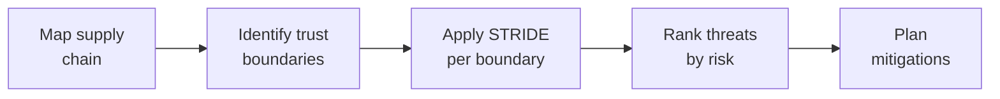

# Lab 7.5: Threat Modeling for Software Supply Chains

  Understand: ~10 min | Investigate: ~15 min | Validate: ~15 min | Improve: ~5 min
  Advanced
  Prerequisites: <a href="../7.1-detection-rules/">Lab 7.1</a>

  Overview
  ›
  <a href="understand/" class="phase-step upcoming">Understand</a>
  ›
  <a href="investigate/" class="phase-step upcoming">Investigate</a>
  ›
  <a href="validate/" class="phase-step upcoming">Validate</a>
  ›
  <a href="improve/" class="phase-step upcoming">Improve</a>

Detection, triage, and tools are reactive. Threat modeling is proactive: systematically identify where your supply chain can be attacked before an attacker does. This lab applies STRIDE to supply chain trust boundaries and produces a prioritized remediation roadmap.

### Attack Flow

