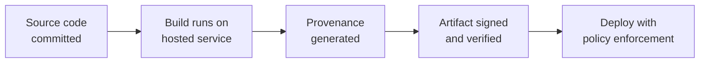

# Lab 8.1: SLSA Framework Deep Dive

<div class="lab-meta">
  <span>Phase 1 ~10 min | Phase 2 ~10 min | Phase 3 ~15 min | Phase 4 ~5 min</span>
  <span class="difficulty intermediate">Intermediate</span>
  <span>Prerequisites: <a href="../tier-4/4.4-attestation-slsa.md">Lab 4.4</a></span>
</div>

In [Lab 4.4](../tier-4/4.4-attestation-slsa.md), you generated and verified SLSA provenance. This lab goes deeper: assess a real project against SLSA requirements, create a concrete action plan to reach Level 3, and produce a self-assessment for auditors.

**Reference:** [SLSA v1.0 Specification](https://slsa.dev/spec/v1.0/)

---

## Connect to the Workstation

```bash
./weaklink shell
```

---

### Attack Flow



---

???+ info "Phase 1: UNDERSTAND. The SLSA Framework"

    **Goal:** Learn the SLSA levels, build track requirements, and what each level prevents.

### Step 1: SLSA levels overview

SLSA v1.0 defines a Build track with four levels. See [slsa.dev/spec/v1.0](https://slsa.dev/spec/v1.0/) for the full specification.

| Level | What It Means | Trust Assumption |
|:-----:|--------------|-----------------|
| **0** | No provenance | Trust everyone |
| **1** | Provenance exists (not tamper-resistant) | Trust the build service not to lie |
| **2** | Hosted build, authenticated provenance | Trust the hosted build service |
| **3** | Hardened builds, non-falsifiable provenance | Trust the build service infrastructure |

### Step 2: Provenance requirements per level

| Field | L1 | L2 | L3 |
|-------|:--:|:--:|:--:|
| Subject (artifact hash) | Required | Required | Required |
| Build type | Required | Required | Required |
| Source reference (repo + commit) | Required | Required | Required |
| Builder identity | Optional | Required | Required |
| Authenticated provenance | No | Yes (signed) | Yes (non-falsifiable) |
| Isolated build environment | No | No | Yes |
| Parameterless build | No | No | Yes |

### Step 3: What each level prevents

| Attack | L0 | L1 | L2 | L3 |
|--------|:--:|:--:|:--:|:--:|
| No provenance at all | Vulnerable | **Prevented** | Prevented | Prevented |
| Developer builds on laptop and uploads | Vulnerable | Vulnerable | **Prevented** | Prevented |
| CI admin falsifies provenance | Vulnerable | Vulnerable | Vulnerable | **Prevented** |
| Attacker compromises build script parameters | Vulnerable | Vulnerable | Vulnerable | **Prevented** |

---

???+ warning "Phase 2: ASSESS. Evaluate Current SLSA Level"

    **Goal:** Evaluate the sample application against SLSA requirements.

### Step 1: Audit the build process

```bash
cat /app/.github/workflows/build.yml
```

| Requirement | Status | Evidence |
|-------------|--------|----------|
| **Provenance generated** | ? | Does the workflow produce a provenance attestation? |
| **Provenance authenticated** | ? | Is it signed? By whom? |
| **Hosted build** | ? | GitHub Actions / Cloud Build / similar? |
| **Isolated build** | ? | Fresh, isolated environment per build? |
| **Parameterless** | ? | Can external users influence build parameters? |

### Step 2: Check for provenance generation

```bash
grep -r "slsa-framework\|cosign\|attestation\|provenance" /app/.github/workflows/ 2>/dev/null
grep -r "actions/attest-build-provenance" /app/.github/workflows/ 2>/dev/null
```

### Step 3: Determine current level

Typical project without SLSA investment:

| Requirement | Met? | Notes |
|-------------|------|-------|
| Provenance exists | No | No attestation step |
| Hosted build platform | Yes | GitHub Actions runners |
| Authenticated provenance | No | Nothing to authenticate |
| Isolated build | Partial | GitHub-hosted = ephemeral; self-hosted = not |
| Parameterless | No | `workflow_dispatch` accepts parameters |

**Current SLSA Level: 0**. Builds on a hosted platform but generates no provenance.

---

!!! success "Checkpoint"
    You should have a clear assessment of the project's current SLSA level with evidence for each requirement. This assessment is the input to the roadmap.

---

???+ success "Phase 3: PLAN. Roadmap to SLSA Level 3"

    **Goal:** Create a concrete action plan with CI/CD changes needed to reach SLSA Level 3.

### Reach Level 1: Generate provenance

```yaml
# .github/workflows/build.yml
jobs:
  build:
    runs-on: ubuntu-latest
    outputs:
      digest: ${{ steps.build.outputs.digest }}
    steps:
      - uses: actions/checkout@v4
      - name: Build artifact
        id: build
        run: |
          docker build -t myapp:${{ github.sha }} .
          DIGEST=$(docker inspect --format='{{index .RepoDigests 0}}' myapp:${{ github.sha }} | cut -d@ -f2)
          echo "digest=${DIGEST}" >> "$GITHUB_OUTPUT"

  provenance:
    needs: build
    permissions:
      actions: read
      id-token: write
      contents: read
    uses: slsa-framework/slsa-github-generator/.github/workflows/generator_container_slsa3.yml@v2.0.0
    with:
      image: ghcr.io/org/myapp
      digest: ${{ needs.build.outputs.digest }}
    secrets:
      registry-username: ${{ github.actor }}
      registry-password: ${{ secrets.GITHUB_TOKEN }}
```

### Reach Level 2: Authenticated provenance

The `slsa-github-generator` signs provenance via Sigstore OIDC automatically. Verify with:

```bash
slsa-verifier verify-image ghcr.io/org/myapp@sha256:abc123... \
  --source-uri github.com/org/repo \
  --builder-id https://github.com/slsa-framework/slsa-github-generator/.github/workflows/generator_container_slsa3.yml
```

### Reach Level 3: Hardened builds

| Requirement | How to Implement |
|-------------|-----------------|
| Isolated build | GitHub-hosted runners (ephemeral VMs) |
| Non-falsifiable provenance | `slsa-github-generator` in separate, isolated workflow |
| Parameterless build | Remove `workflow_dispatch` inputs |
| Hermetic build (best practice) | Pin all tools/deps to hashes; disable network during build |

### Implementation timeline

| Week | Milestone | SLSA Level |
|:----:|-----------|:----------:|
| 1 | Add `slsa-github-generator` to build workflow | Level 1 |
| 1 | Pin all GitHub Actions to commit SHAs | Level 2 prep |
| 2 | Verify provenance in staging deployment pipeline | Level 2 |
| 3 | Remove `workflow_dispatch` parameters, add `--require-hashes` | Level 3 prep |
| 4 | Deploy admission controller requiring SLSA verification | Level 3 |

---

??? tip "Phase 4: DOCUMENT. SLSA Self-Assessment"

    **Goal:** Complete a SLSA self-assessment template for auditors.

### Self-assessment template

```markdown
SLSA SELF-ASSESSMENT
====================

Project:          [Project name]
Repository:       [GitHub URL]
Assessment date:  [Date]
Current level:    [0 / 1 / 2 / 3]
Target level:     [1 / 2 / 3]

BUILD PLATFORM:      [GitHub Actions / GitLab CI / Cloud Build / other]
Runner type:         [Hosted / Self-hosted]
Runner lifecycle:    [Ephemeral / Persistent]

PROVENANCE:          [Generated: Y/N] [Format: in-toto/custom/none]
                     [Signed: Y/N (method)] [Stored: OCI/Rekor/other]

BUILD INTEGRITY:     [Isolated: Y/N] [Parameterless: Y/N] [Hermetic: Y/N]
                     [Deps pinned to hash: Y/Partial/N] [Actions pinned to SHA: Y/Partial/N]

GAP ANALYSIS
| Requirement | Current | Target | Remediation |
|-------------|---------|--------|-------------|

TIMELINE
| Date | Milestone | Owner |
|------|-----------|-------|
```

### Final verification

```bash
weaklink verify 8.1
```

---

## What You Learned

- SLSA is a maturity model. Each level progressively reduces trust assumptions in your build process.
- Level 1 is achievable in a day. Level 3 requires architectural changes (parameterless builds, hermetic deps, isolated runners).
- Provenance without verification is theater. Deployment policies must verify provenance before promoting artifacts.

## Further Reading

- [SLSA v1.0 Specification](https://slsa.dev/spec/v1.0/)
- [SLSA GitHub Generator](https://github.com/slsa-framework/slsa-github-generator)
- [Sigstore: Keyless Signing for Software Artifacts](https://www.sigstore.dev/)
