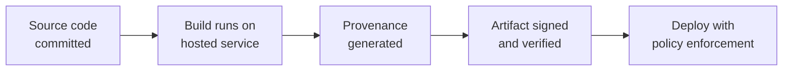

# Lab 8.1: SLSA Framework Deep Dive

  Understand: ~10 min | Assess: ~10 min | Plan: ~15 min | Document: ~5 min
  Intermediate
  Prerequisites: <a href="../../tier-4/4.4-attestation-slsa.md">Lab 4.4</a>

  Overview
  ›
  <a href="understand/" class="phase-step upcoming">Understand</a>
  ›
  <a href="assess/" class="phase-step upcoming">Assess</a>
  ›
  <a href="plan/" class="phase-step upcoming">Plan</a>
  ›
  <a href="document/" class="phase-step upcoming">Document</a>

In [Lab 4.4](../../tier-4/4.4-attestation-slsa.md), you generated and verified SLSA provenance. This lab goes deeper: assess a real project against SLSA requirements, create a concrete action plan to reach Level 3, and produce a self-assessment for auditors.

**Reference:** [SLSA v1.0 Specification](https://slsa.dev/spec/v1.0/)

### Attack Flow

