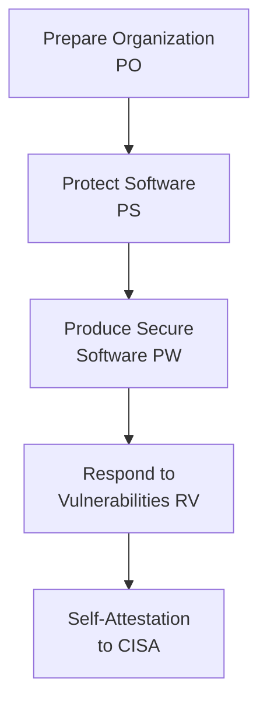

# Lab 8.2: SSDF / NIST SP 800-218 Mapping

<div class="lab-meta">
  <span>Phase 1 ~5 min | Phase 2 ~15 min | Phase 3 ~10 min | Phase 4 ~10 min</span>
  <span class="difficulty intermediate">Intermediate</span>
  <span>Prerequisites: <a href="../tier-4/4.1-sbom-contents.md">Lab 4.1</a></span>
</div>

The Secure Software Development Framework (SSDF), published as [NIST SP 800-218](https://csrc.nist.gov/publications/detail/sp/800-218/final), defines how organizations should develop secure software. Executive Order 14028 requires federal software suppliers to self-attest compliance. If your organization sells software to the US government, this is mandatory.

**Reference:** [NIST SP 800-218](https://csrc.nist.gov/publications/detail/sp/800-218/final) | [CISA Self-Attestation Form](https://www.cisa.gov/secure-software-attestation-form)

---

## Connect to the Workstation

```bash
./weaklink shell
```

---

### Attack Flow



---

???+ info "Phase 1: UNDERSTAND. The SSDF Framework"

    **Goal:** Learn the four practice areas and the supply chain-critical sub-practices.

### The four practice areas

| Practice Area | Code | Focus |
|--------------|------|-------|
| **Prepare the Organization** | PO | Governance, roles, training, tooling |
| **Protect the Software** | PS | Source code, build systems, artifact integrity |
| **Produce Well-Secured Software** | PW | Design, implementation, testing, vulnerability management |
| **Respond to Vulnerabilities** | RV | Monitoring, disclosure, remediation |

### Key sub-practices for supply chain security

| Task ID | Description | Supply Chain Relevance |
|---------|-------------|----------------------|
| **PO.3.1** | Specify tools and tool configuration | Defines required SCA, SAST, SBOM tools |
| **PS.2.1** | Protect all forms of code from tampering | Includes build scripts, CI configs, IaC |
| **PS.3.1** | Archive and protect each software release | Immutable artifacts, signed releases |
| **PW.4.1** | Acquire well-secured components | Dependency management, registry hardening |
| **PW.4.4** | Verify integrity of acquired components | Hash verification, signature checking, provenance |
| **RV.1.1** | Gather vulnerability information | Vulnerability monitoring (Dependabot, Grype) |
| **RV.3.3** | Provide SBOMs to software consumers | SBOM generation and distribution |

---

???+ warning "Phase 2: ASSESS. Map WeakLink Labs to SSDF"

    **Goal:** Map Tiers 1-5 defenses to SSDF practices and identify coverage gaps.

### Map Tier 1 (Package Security)

| Lab | Defense | SSDF Task | Status |
|-----|---------|-----------|--------|
| 1.2 Dependency Confusion | `--index-url`, `--require-hashes` | PW.4.4 | Preventive control |
| 1.3 Typosquatting | Lockfile pinning, review new deps | PW.4.1, PW.4.4 | Preventive control |
| 1.4 Lockfile Injection | Validate lockfile integrity in CI | PS.2.1 | Detective control |
| 1.6 Phantom Dependencies | Declare all dependencies explicitly | PW.4.1 | Preventive control |

### Map Tiers 2-5

| Lab | Defense | SSDF Task |
|-----|---------|-----------|
| 2.x CI/CD Security | Harden GitHub Actions workflows | PS.2.1 |
| 3.x Container Security | Image signing, digest pinning | PS.3.1, PW.4.4 |
| 4.1 SBOM Contents | Generate SBOMs | RV.3.3 |
| 4.4 SLSA Provenance | Build provenance attestations | PS.3.1, PW.4.4 |
| 5.x Runtime Security | Monitor deployed software | RV.1.1 |

### Coverage gaps

| SSDF Task | Gap |
|-----------|-----|
| PO.1.1 | No documented security policy |
| PO.2.1 | No supply chain security training program |
| PO.5.1 | No security gate criteria for deployments |
| PW.1.1 | No threat modeling during design phase |
| RV.2.1 | No vulnerability disclosure process |
| RV.3.4 | No defined patching timelines |

**Key finding:** Tiers 1-5 cover the technical controls well (PS and PW). Organizational practices (PO) and vulnerability response (RV) have significant gaps. This is typical: tools before governance.

---

!!! success "Checkpoint"
    You should have a mapping of at least 10 WeakLink Lab defenses to SSDF tasks, plus a list of uncovered gaps. The gaps should be concentrated in PO and RV practice areas.

---

???+ success "Phase 3: PLAN. Build the Compliance Roadmap"

    **Goal:** Phased roadmap with priorities, timelines, and owners.

### Phase 1. Quick wins (Days 1-30)

| Action | SSDF Task | Deliverable |
|--------|-----------|-------------|
| Publish vulnerability disclosure policy | RV.2.1 | SECURITY.md in all repos |
| Generate SBOMs in CI for all projects | RV.3.3 | CycloneDX SBOM per release |
| Add `--require-hashes` to Python projects | PW.4.4 | Updated requirements files |

### Phase 2. Foundation (Days 30-90)

| Action | SSDF Task | Deliverable |
|--------|-----------|-------------|
| Standardize SCA scanning in all CI | PO.3.1 | CI template with Grype/Trivy |
| Sign all container images with cosign | PS.3.1 | Signing workflow in CI |
| Define vulnerability remediation SLAs | RV.3.4 | SLA document (Critical: 48h, High: 7d, Medium: 30d) |

### Phase 3. Maturity (Days 90-180)

| Action | SSDF Task | Deliverable |
|--------|-----------|-------------|
| Implement SLSA Level 2 provenance | PS.3.1 | Provenance attestation in CI |
| Integrate threat modeling in design reviews | PW.1.1 | Threat model template + training |
| Launch developer security training | PO.2.1 | Training program |

---

??? tip "Phase 4: DOCUMENT. SSDF Self-Attestation"

    **Goal:** Produce an SSDF self-attestation form based on the CISA template.

### CISA self-attestation form

```markdown
SECURE SOFTWARE DEVELOPMENT ATTESTATION FORM
=============================================

Company:          [Organization name]
Software name:    [Product name]
Attestation date: [Date]

SECTION 1: SECURE SOFTWARE DEVELOPMENT PROCESS
[x] Separates and protects each environment involved in developing and building
[x] Employs automated tools to maintain trusted source code supply chains
[ ] Employs automated tools that check for security vulnerabilities
    [Gap: SCA scanning in 60% of repos. Remaining 40% lack automated scanning.]

SECTION 2: SOURCE CODE MANAGEMENT
[x] Maintains provenance of all code incorporated into the software
[ ] Employs automated tools to identify vulnerabilities in source code
    [Gap: No SAST tool deployed.]

SECTION 3: SECURE BUILD ENVIRONMENT
[x] Builds software in a dedicated, ephemeral build environment
[ ] Generates SLSA provenance for built artifacts
    [Gap: Planned for Phase 3 of compliance roadmap.]

SECTION 4: VULNERABILITY MANAGEMENT
[ ] Operates a vulnerability disclosure program [Gap: Planned for Phase 1.]
[x] Provides SBOMs to software consumers upon request
[ ] Has defined remediation timelines [Gap: Planned for Phase 2.]

ATTESTATION GAPS
| Gap | SSDF Task | Target Date |
|-----|-----------|-------------|
| SCA not in all repos | PO.3.1 | [Date] |
| No SLSA provenance | PS.3.1 | [Date] |
| No disclosure policy | RV.2.1 | [Date] |
| No remediation SLAs | RV.3.4 | [Date] |
```

### Guidance for honest attestation

1. Do not attest to what you have not verified.
2. Gaps are acceptable if documented with a Plan of Action & Milestones (POA&M).
3. The attestation is point-in-time. Update it when your posture changes.

### Final verification

```bash
weaklink verify 8.2
```

---

## What You Learned

- SSDF is not optional for federal suppliers. EO 14028 and CISA self-attestation make it a procurement requirement.
- Technical controls (Tiers 1-5) map well to PS and PW tasks. Organizational practices (PO) and vulnerability response (RV) are the biggest gaps.
- The self-attestation forces honesty about current state and creates accountability for closing gaps.

## Further Reading

- [NIST SP 800-218: Secure Software Development Framework](https://csrc.nist.gov/publications/detail/sp/800-218/final)
- [CISA Secure Software Development Attestation Form](https://www.cisa.gov/secure-software-attestation-form)
- [OMB M-22-18: Enhancing the Security of the Software Supply Chain](https://www.whitehouse.gov/wp-content/uploads/2022/09/M-22-18.pdf)
