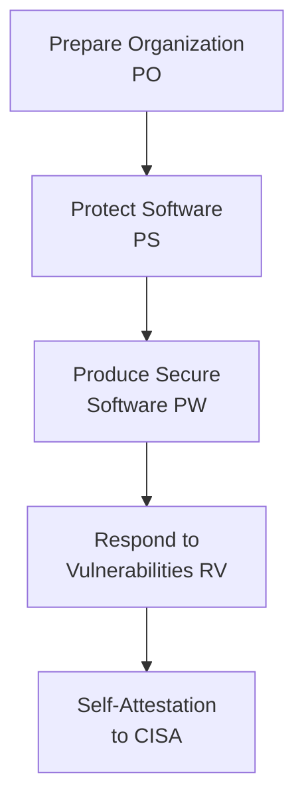

# Lab 8.2: SSDF / NIST SP 800-218 Mapping

  Phase 1 ~5 min | Phase 2 ~15 min | Phase 3 ~10 min | Phase 4 ~10 min
  Intermediate
  Prerequisites: <a href="../../tier-4/4.1-sbom-contents/">Lab 4.1</a>

  Overview
  ›
  <a href="understand/" class="phase-step upcoming">Understand</a>
  ›
  <a href="assess/" class="phase-step upcoming">Assess</a>
  ›
  <a href="plan/" class="phase-step upcoming">Plan</a>
  ›
  <a href="document/" class="phase-step upcoming">Document</a>

The Secure Software Development Framework (SSDF), published as [NIST SP 800-218](https://csrc.nist.gov/publications/detail/sp/800-218/final), defines how organizations should develop secure software. Executive Order 14028 requires federal software suppliers to self-attest compliance. If your organization sells software to the US government, this is mandatory.

**Reference:** [NIST SP 800-218](https://csrc.nist.gov/publications/detail/sp/800-218/final) | [CISA Self-Attestation Form](https://www.cisa.gov/secure-software-attestation-form)

### Attack Flow

!!! tip "Related Labs"
    - **Prerequisite:** [4.1 What SBOMs Actually Contain](../../tier-4/4.1-sbom-contents/index.md) — SBOM understanding is essential for SSDF compliance
    - **Next:** [8.3 Executive Order 14028 Compliance](../8.3-eo-14028/index.md) — EO 14028 mandates the SSDF practices covered here
    - **See also:** [8.1 SLSA Framework Deep Dive](../8.1-slsa-deep-dive/index.md) — SLSA and SSDF are complementary frameworks
    - **See also:** [8.6 OWASP SCVS Framework Assessment](../8.6-scvs-assessment/index.md) — OWASP SCVS provides another assessment framework
