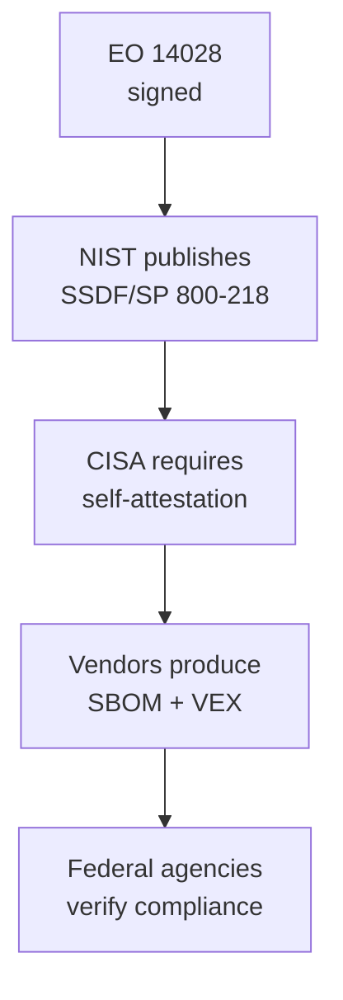

# Lab 8.3: Executive Order 14028 Compliance

<div class="lab-meta">
  <span>~35 minutes</span>
  <span class="difficulty intermediate">Intermediate</span>
  <span>Prerequisites: <a href="../tier-4/4.1-sbom-contents.md">Lab 4.1</a>, <a href="8.2-ssdf-nist.md">Lab 8.2</a></span>
</div>

On May 12, 2021, President Biden signed Executive Order 14028, "Improving the Nation's Cybersecurity." Section 4 specifically addresses software supply chain security and created a cascade of requirements that now affect every organization selling software to the US federal government. and increasingly, the private sector too.

EO 14028 is not a framework or a best practice. It is a directive with enforcement mechanisms. It mandates SBOMs, vulnerability disclosure, incident notification timelines, and secure development attestation. If you are a software vendor, these requirements are becoming table stakes.

This lab walks you through the specific EO 14028 requirements, evaluates a sample application against them, and produces the deliverables needed for compliance: a complete SBOM, a VEX document, and a compliance checklist.

---

## Connect to the Workstation

```bash
./weaklink shell
```

---

### Attack Flow



---

???+ info "Phase 1: UNDERSTAND. EO 14028 Requirements"

    **Goal:** Learn the specific requirements of EO 14028 Section 4 and the implementation guidance from NIST and CISA.

### Step 1: Timeline of EO 14028 implementation

EO 14028 set a cascade of deadlines, each producing new requirements:

| Date | Milestone | Requirement |
|------|-----------|-------------|
| May 2021 | EO 14028 signed | Directed NIST to publish guidelines within 1 year |
| Feb 2022 | NIST SP 800-218 published | Secure Software Development Framework (SSDF) |
| Sep 2022 | OMB M-22-18 published | Required self-attestation for federal software suppliers |
| Nov 2023 | CISA attestation form | Software producers must self-attest to SSDF compliance |
| 2024+ | Enforcement begins | Agencies required to collect attestations from suppliers |

### Step 2: The five key requirements

EO 14028 Section 4 establishes five core requirements for software vendors:

**Requirement 1: Software Bill of Materials (SBOM)**

> Software vendors must provide an SBOM for each product sold to the federal government.

- Format: SPDX or CycloneDX (per NTIA minimum elements)
- Content: All components, including open-source, third-party, and proprietary
- Delivery: Machine-readable, provided with each release
- Update frequency: New SBOM for each new version

**Requirement 2: Vulnerability Disclosure**

> Software vendors must maintain a vulnerability disclosure program.

- Published disclosure policy (SECURITY.md or equivalent)
- Process for receiving vulnerability reports from external researchers
- Commitment to timely acknowledgment and remediation

**Requirement 3: Incident Notification**

> Software vendors must notify federal customers of security incidents within defined timelines.

- Notification within 72 hours of confirmed incident affecting government customers
- Include: scope, impact assessment, remediation actions, and timeline
- Ongoing updates until resolution

**Requirement 4: Secure Development Attestation**

> Software vendors must self-attest to following the SSDF (NIST SP 800-218).

- Complete the CISA self-attestation form
- Demonstrate compliance with SSDF practices
- Document gaps with Plan of Action & Milestones (POA&M)
- (Covered in detail in [Lab 8.2](8.2-ssdf-nist.md))

**Requirement 5: Vulnerability Exploitability Exchange (VEX)**

> Software vendors should provide VEX documents to communicate the exploitability status of known vulnerabilities in their products.

- Format: CSAF, CycloneDX VEX, or OpenVEX
- Purpose: Tell consumers "Yes, our product includes component X with CVE-Y, but it is not exploitable in our product because..."
- Reduces false positive alert fatigue for consumers

### Step 3: NTIA SBOM minimum elements

The NTIA (now under CISA) defined the minimum elements an SBOM must contain:

| Element | Description | Example |
|---------|-------------|---------|
| Supplier name | Who provided the component | "Python Software Foundation" |
| Component name | Name of the dependency | "requests" |
| Component version | Exact version | "2.31.0" |
| Unique identifier | PURL or CPE | "pkg:pypi/requests@2.31.0" |
| Dependency relationship | How components relate | "requests DEPENDS_ON urllib3" |
| Author of SBOM | Who generated it | "ACME Corp build system" |
| Timestamp | When the SBOM was generated | "2026-04-01T12:00:00Z" |

**Reference:** [NTIA SBOM Minimum Elements](https://www.ntia.gov/sites/default/files/publications/sbom_minimum_elements_report_0.pdf)

---

???+ warning "Phase 2: ASSESS. Evaluate Against EO 14028"

    **Goal:** Evaluate the sample application against each EO 14028 requirement.

### Step 1: SBOM completeness assessment

Generate an SBOM and evaluate it against the NTIA minimum elements:

```bash
# Generate CycloneDX SBOM
cd /app
cyclonedx-py requirements requirements.txt -o sbom.json --format json

# Inspect the SBOM
python3 -m json.tool sbom.json | head -80
```

**Assessment checklist:**

| NTIA Element | Present? | Complete? | Notes |
|-------------|:--------:|:---------:|-------|
| Supplier name | ? | ? | Check if every component has a supplier |
| Component name | ? | ? | All deps should be listed |
| Component version | ? | ? | Exact versions, not ranges |
| Unique identifier (PURL) | ? | ? | PURLs enable cross-referencing with vulnerability databases |
| Dependency relationships | ? | ? | CycloneDX supports `dependsOn`; is it populated? |
| SBOM author | ? | ? | Who generated this? Automated or manual? |
| Timestamp | ? | ? | Is the SBOM generation date recorded? |

**Common gaps:**

- Transitive dependencies missing (tool only captured direct deps)
- System packages not included (libc, openssl from base image)
- No PURL identifiers (makes cross-referencing with VEX/VulnDB impossible)
- Supplier name missing for most components

### Step 2: VEX readiness assessment

A VEX document communicates whether known vulnerabilities are actually exploitable in your product:

| Question | Answer |
|----------|--------|
| Do you track CVEs in your dependencies? | (Dependabot/Grype/Trivy?) |
| Can you determine exploitability? | (Do you know which code paths use which dependencies?) |
| Do you publish VEX documents? | (Probably not. most organizations don't yet) |
| What format would you use? | (OpenVEX is the simplest to start with) |

### Step 3: Vulnerability disclosure readiness

| Question | Answer |
|----------|--------|
| Is there a SECURITY.md in your repositories? | |
| Is there a published vulnerability disclosure policy? | |
| Is there a process for receiving and triaging external reports? | |
| Is there a commitment to response timeline? (e.g., acknowledge within 48h) | |
| Is there a bug bounty program? | (Not required, but demonstrates maturity) |

### Step 4: Incident notification readiness

| Question | Answer |
|----------|--------|
| Is there an incident response playbook? | ([Lab 7.3](../tier-7/7.3-ir-playbook.md)) |
| Does the playbook include customer notification? | |
| Can you notify within the 72-hour requirement? | |
| Do you have contact information for federal customers' security teams? | |
| Is there a template for incident notifications? | |

### Step 5: Compliance scorecard

| Requirement | Status | Readiness |
|-------------|--------|:---------:|
| SBOM generation | Partial. CycloneDX generated but incomplete | 60% |
| SBOM delivery mechanism | Not implemented. no automated delivery | 20% |
| VEX documents | Not implemented | 0% |
| Vulnerability disclosure policy | Not published | 10% |
| Incident notification process | Playbook exists ([Lab 7.3](../tier-7/7.3-ir-playbook.md)) but no federal-specific procedures | 40% |
| SSDF self-attestation | Draft from [Lab 8.2](8.2-ssdf-nist.md) | 50% |

---

???+ success "Phase 3: PLAN. Build the Compliance Checklist"

    **Goal:** Create a compliance checklist with specific deliverables and timelines.

### Step 1: SBOM compliance checklist

| # | Action | Deliverable | Timeline |
|:-:|--------|-------------|:--------:|
| 1 | Add SBOM generation to CI for all projects | CI workflow step | Week 1 |
| 2 | Validate SBOM against NTIA minimum elements | Validation script in CI | Week 1 |
| 3 | Include transitive dependencies in SBOM | Use `--include-transitive` or equivalent | Week 2 |
| 4 | Add PURL identifiers to all components | Tool configuration | Week 2 |
| 5 | Include container base image components in SBOM | Use Syft for container SBOM | Week 3 |
| 6 | Automate SBOM delivery with each release | Attach SBOM as release artifact | Week 3 |
| 7 | Store SBOMs in a queryable database | Dependency-Track or GUAC | Month 2 |

**SBOM validation in CI:**

```yaml
- name: Generate SBOM
  run: |
    cyclonedx-py requirements requirements.txt -o sbom.json --format json

- name: Validate SBOM minimum elements
  run: |
    python3 -c "
    import json, sys
    sbom = json.load(open('sbom.json'))
    errors = []
    if 'metadata' not in sbom:
        errors.append('Missing metadata (timestamp, author)')
    if 'components' not in sbom or len(sbom['components']) == 0:
        errors.append('No components listed')
    for comp in sbom.get('components', []):
        if 'name' not in comp:
            errors.append(f'Component missing name')
        if 'version' not in comp:
            errors.append(f'Component {comp.get(\"name\", \"?\")} missing version')
        if 'purl' not in comp:
            errors.append(f'Component {comp.get(\"name\", \"?\")} missing PURL')
    if errors:
        for e in errors:
            print(f'FAIL: {e}', file=sys.stderr)
        sys.exit(1)
    print(f'PASS: SBOM contains {len(sbom[\"components\"])} components with required fields')
    "
```

### Step 2: VEX compliance checklist

| # | Action | Deliverable | Timeline |
|:-:|--------|-------------|:--------:|
| 1 | Choose VEX format (recommend OpenVEX) | Format decision | Week 1 |
| 2 | Inventory all known CVEs in current dependencies | CVE list from Grype/Trivy | Week 1 |
| 3 | Assess exploitability of each CVE | VEX status per CVE | Week 2-3 |
| 4 | Generate initial VEX document | OpenVEX JSON | Week 3 |
| 5 | Automate VEX generation in CI | CI workflow step | Month 2 |

**OpenVEX example:**

```json
{
  "@context": "https://openvex.dev/ns/v0.2.0",
  "@id": "https://example.com/vex/2026-04-01",
  "author": "ACME Corp Security Team",
  "timestamp": "2026-04-01T12:00:00Z",
  "statements": [
    {
      "vulnerability": {
        "@id": "https://nvd.nist.gov/vuln/detail/CVE-2024-12345"
      },
      "products": [
        {"@id": "pkg:docker/acme/webapp@v2.14.3"}
      ],
      "status": "not_affected",
      "justification": "vulnerable_code_not_in_execute_path",
      "statement": "The vulnerable function in urllib3 is not called by our application. We use requests with default configuration which does not trigger the affected code path."
    },
    {
      "vulnerability": {
        "@id": "https://nvd.nist.gov/vuln/detail/CVE-2024-67890"
      },
      "products": [
        {"@id": "pkg:docker/acme/webapp@v2.14.3"}
      ],
      "status": "affected",
      "action_statement": "Update to webapp v2.14.4 which upgrades the affected dependency.",
      "action_statement_timestamp": "2026-04-15T00:00:00Z"
    }
  ]
}
```

### Step 3: Vulnerability disclosure checklist

| # | Action | Deliverable | Timeline |
|:-:|--------|-------------|:--------:|
| 1 | Write vulnerability disclosure policy | Policy document | Week 1 |
| 2 | Publish SECURITY.md in all public repos | SECURITY.md file | Week 1 |
| 3 | Set up security@company.com alias | Email distribution list | Week 1 |
| 4 | Define response SLAs | SLA document | Week 2 |
| 5 | Train engineering team on triage process | Training session | Month 1 |

**SECURITY.md template:**

```markdown
# Security Policy

## Reporting a Vulnerability

If you discover a security vulnerability in this project, please report it
responsibly.

**Email:** security@example.com
**PGP Key:** [link to public key]

Please include:
- Description of the vulnerability
- Steps to reproduce
- Affected versions
- Potential impact

## Response Timeline

- **Acknowledgment:** Within 48 hours
- **Initial assessment:** Within 5 business days
- **Fix timeline:** Based on severity (Critical: 48h, High: 7d, Medium: 30d)

## Disclosure Policy

We follow coordinated disclosure. We ask that you:
- Do not publicly disclose the vulnerability until we have a fix
- Give us reasonable time to address the issue
- Do not exploit the vulnerability beyond what is necessary to demonstrate it
```

---

??? tip "Phase 4: DOCUMENT. Generate Compliance Deliverables"

    **Goal:** Produce a sample SBOM and VEX document that meet federal requirements.

### Step 1: Generate the SBOM

```bash
cd /app

# Generate a comprehensive CycloneDX SBOM
cyclonedx-py requirements requirements.txt \
  -o sbom-cyclonedx.json \
  --format json \
  --schema-version 1.5

# Also generate SPDX format (some agencies prefer it)
# syft dir:. -o spdx-json > sbom-spdx.json
```

### Step 2: Generate the VEX document

```bash
# Using vexctl (OpenVEX CLI)
vexctl create \
  --product="pkg:docker/acme/webapp@v2.14.3" \
  --vuln="CVE-2024-12345" \
  --status="not_affected" \
  --justification="vulnerable_code_not_in_execute_path" \
  > vex.json
```

### Step 3: Package deliverables

For each software release, the following deliverables should be provided to federal customers:

| Deliverable | Format | Delivery Method |
|-------------|--------|-----------------|
| SBOM | CycloneDX JSON (1.5+) | Attached to release, or API endpoint |
| VEX | OpenVEX JSON | Attached to release, updated as new CVEs emerge |
| SSDF self-attestation | PDF (signed) | Submitted via CISA portal |
| Vulnerability disclosure policy | Markdown / HTML | Published at well-known URL |
| Incident notification contact | Email / portal | Registered with customer agency |

### Step 4: Ongoing compliance

EO 14028 compliance is not a one-time activity:

| Activity | Frequency | Owner |
|----------|-----------|-------|
| SBOM generation | Every release | CI/CD (automated) |
| VEX document update | When new CVEs are published | Security team |
| SSDF self-attestation update | Annually or after significant changes | Security lead |
| Vulnerability disclosure triage | Ongoing | Security team |
| Incident notification drills | Quarterly | IR team |

### Step 5: Final verification

Run the verification from your host terminal:

```bash
weaklink verify 8.3
```

---

## What You Learned

1. **EO 14028 is a directive, not a suggestion**. federal software suppliers must comply with SBOM, VEX, SSDF attestation, vulnerability disclosure, and incident notification requirements.
2. **SBOMs must meet the NTIA minimum elements**. supplier name, component name, version, unique identifier, dependency relationships, author, and timestamp are all required.
3. **VEX reduces false positive fatigue**. it tells consumers which CVEs in your SBOM are actually exploitable in your product, which is a critical piece of context most SBOMs lack.
4. **Compliance is a set of deliverables**. SBOM, VEX, SSDF attestation, disclosure policy, and incident notification process are all concrete documents that must be produced and maintained.
5. **Private sector is converging on these requirements**. even outside federal procurement, large enterprises are beginning to require SBOMs and VEX documents from their software vendors.

## Further Reading

- [Executive Order 14028: Improving the Nation's Cybersecurity (Full Text)](https://www.whitehouse.gov/briefing-room/presidential-actions/2021/05/12/executive-order-on-improving-the-nations-cybersecurity/)
- [NIST SP 800-218: Secure Software Development Framework](https://csrc.nist.gov/publications/detail/sp/800-218/final)
- [NTIA SBOM Minimum Elements](https://www.ntia.gov/sites/default/files/publications/sbom_minimum_elements_report_0.pdf)
- [CISA Secure Software Development Attestation Form](https://www.cisa.gov/secure-software-attestation-form)
- [OpenVEX Specification](https://openvex.dev/)
- [CycloneDX VEX](https://cyclonedx.org/capabilities/vex/)
- [OMB M-22-18](https://www.whitehouse.gov/wp-content/uploads/2022/09/M-22-18.pdf)
