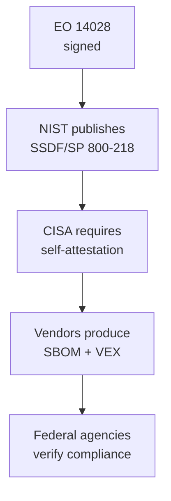

# Lab 8.3: Executive Order 14028 Compliance

<div class="lab-meta">
  <span>Phase 1 ~5 min | Phase 2 ~10 min | Phase 3 ~10 min | Phase 4 ~10 min</span>
  <span class="difficulty intermediate">Intermediate</span>
  <span>Prerequisites: <a href="../tier-4/4.1-sbom-contents.md">Lab 4.1</a>, <a href="8.2-ssdf-nist.md">Lab 8.2</a></span>
</div>

EO 14028 is a directive with enforcement mechanisms. It mandates SBOMs, vulnerability disclosure, incident notification timelines, and secure development attestation for every organization selling software to the US federal government.

**Reference:** [EO 14028 Full Text](https://www.whitehouse.gov/briefing-room/presidential-actions/2021/05/12/executive-order-on-improving-the-nations-cybersecurity/)

---

## Connect to the Workstation

```bash
./weaklink shell
```

---

### Attack Flow



---

???+ info "Phase 1: UNDERSTAND. EO 14028 Requirements"

    **Goal:** Learn the five specific requirements of EO 14028 Section 4.

### The five key requirements

**1. Software Bill of Materials (SBOM)**
SPDX or CycloneDX format, machine-readable, provided with each release, covering all components including open-source. Must meet [NTIA minimum elements](https://www.ntia.gov/sites/default/files/publications/sbom_minimum_elements_report_0.pdf).

**2. Vulnerability Disclosure**
Published disclosure policy, process for receiving external reports, commitment to timely remediation.

**3. Incident Notification**
Notify federal customers within 72 hours of confirmed incident. Include scope, impact, remediation actions, timeline.

**4. Secure Development Attestation**
Self-attest to SSDF compliance via [CISA attestation form](https://www.cisa.gov/secure-software-attestation-form). (Covered in [Lab 8.2](8.2-ssdf-nist.md).)

**5. Vulnerability Exploitability Exchange (VEX)**
Communicate exploitability status of known CVEs in your product. Formats: CSAF, CycloneDX VEX, or [OpenVEX](https://openvex.dev/).

### NTIA SBOM minimum elements

| Element | Example |
|---------|---------|
| Supplier name | "Python Software Foundation" |
| Component name | "requests" |
| Component version | "2.31.0" |
| Unique identifier | "pkg:pypi/requests@2.31.0" |
| Dependency relationship | "requests DEPENDS_ON urllib3" |
| Author of SBOM | "WeakLink Corp build system" |
| Timestamp | "2026-04-01T12:00:00Z" |

---

???+ warning "Phase 2: ASSESS. Evaluate Against EO 14028"

    **Goal:** Evaluate the sample application against each requirement.

### SBOM completeness

```bash
cd /app
syft dir:/app -o cyclonedx-json > sbom.json
python3 -m json.tool sbom.json | head -80
```

| NTIA Element | Present? | Complete? | Notes |
|-------------|:--------:|:---------:|-------|
| Supplier name | ? | ? | |
| Component name | ? | ? | |
| Component version | ? | ? | |
| Unique identifier (PURL) | ? | ? | |
| Dependency relationships | ? | ? | |
| SBOM author | ? | ? | |
| Timestamp | ? | ? | |

**Common gaps:** Transitive deps missing, system packages not included, no PURLs, supplier name missing.

### Compliance scorecard

| Requirement | Status | Readiness |
|-------------|--------|:---------:|
| SBOM generation | Partial (generated but incomplete) | 60% |
| SBOM delivery mechanism | Not implemented | 20% |
| VEX documents | Not implemented | 0% |
| Vulnerability disclosure policy | Not published | 10% |
| Incident notification process | Playbook exists ([Lab 7.3](../tier-7/7.3-ir-playbook.md)) | 40% |
| SSDF self-attestation | Draft from [Lab 8.2](8.2-ssdf-nist.md) | 50% |

---

???+ success "Checkpoint"
    You should have a compliance scorecard showing readiness percentage for each of the 5 EO 14028 requirements. Most projects score below 50% on first assessment.

---

???+ success "Phase 3: PLAN. Build the Compliance Checklist"

    **Goal:** Specific deliverables and timelines per requirement.

### SBOM compliance

| # | Action | Timeline |
|:-:|--------|:--------:|
| 1 | Add SBOM generation to CI | Week 1 |
| 2 | Validate SBOM against NTIA minimum elements in CI | Week 1 |
| 3 | Include transitive dependencies | Week 2 |
| 4 | Add PURL identifiers | Week 2 |
| 5 | Include container base image components (Syft) | Week 3 |
| 6 | Automate SBOM delivery with each release | Week 3 |

### VEX compliance

| # | Action | Timeline |
|:-:|--------|:--------:|
| 1 | Choose format (recommend OpenVEX) | Week 1 |
| 2 | Inventory known CVEs in current deps | Week 1 |
| 3 | Assess exploitability per CVE | Week 2-3 |
| 4 | Generate initial VEX document | Week 3 |

**OpenVEX example:**

```json
{
  "@context": "https://openvex.dev/ns/v0.2.0",
  "author": "WeakLink Corp Security Team",
  "timestamp": "2026-04-01T12:00:00Z",
  "statements": [
    {
      "vulnerability": {"@id": "https://nvd.nist.gov/vuln/detail/CVE-2024-12345"},
      "products": [{"@id": "pkg:docker/wl/webapp@v2.14.3"}],
      "status": "not_affected",
      "justification": "vulnerable_code_not_in_execute_path"
    }
  ]
}
```

### Vulnerability disclosure

Publish a `SECURITY.md` in all repos with: reporting email, PGP key link, response SLAs (Acknowledge: 48h, Critical fix: 48h, High: 7d, Medium: 30d).

---

??? tip "Phase 4: DOCUMENT. Generate Compliance Deliverables"

    **Goal:** Produce a sample SBOM and VEX that meet federal requirements.

### Package deliverables per release

| Deliverable | Format | Delivery Method |
|-------------|--------|-----------------|
| SBOM | CycloneDX JSON (1.5+) | Attached to release or API endpoint |
| VEX | OpenVEX JSON | Attached to release, updated as new CVEs emerge |
| SSDF self-attestation | PDF (signed) | Submitted via CISA portal |
| Vulnerability disclosure policy | Markdown / HTML | Published at well-known URL |

### Ongoing compliance

| Activity | Frequency |
|----------|-----------|
| SBOM generation | Every release (automated) |
| VEX update | When new CVEs are published |
| SSDF self-attestation update | Annually or after significant changes |
| Incident notification drills | Quarterly |

### Final verification

```bash
weaklink verify 8.3
```

---

## What You Learned

- EO 14028 is a directive, not a suggestion. Federal suppliers must comply with SBOM, VEX, SSDF attestation, vulnerability disclosure, and incident notification.
- VEX reduces false positive fatigue by telling consumers which CVEs in your SBOM are actually exploitable.
- Private sector is converging on these requirements. Large enterprises are beginning to require SBOMs and VEX from vendors.

## Further Reading

- [EO 14028 Full Text](https://www.whitehouse.gov/briefing-room/presidential-actions/2021/05/12/executive-order-on-improving-the-nations-cybersecurity/)
- [NTIA SBOM Minimum Elements](https://www.ntia.gov/sites/default/files/publications/sbom_minimum_elements_report_0.pdf)
- [OpenVEX Specification](https://openvex.dev/)
