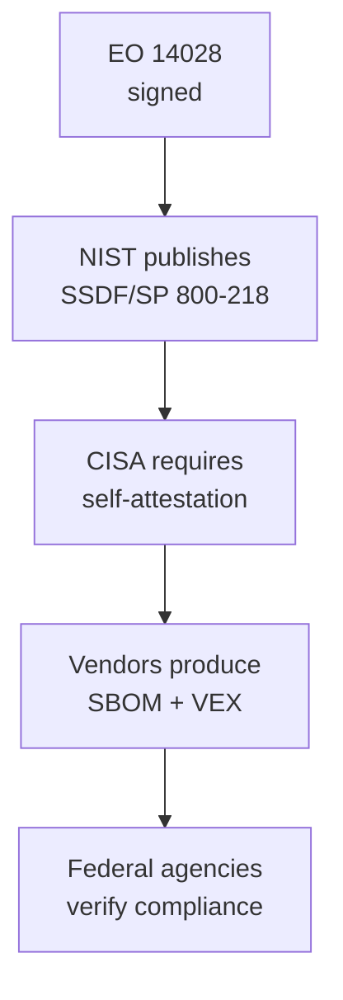

# Lab 8.3: Executive Order 14028 Compliance

  Phase 1 ~5 min | Phase 2 ~10 min | Phase 3 ~10 min | Phase 4 ~10 min
  Intermediate
  Prerequisites: <a href="../../tier-4/4.1-sbom-contents/">Lab 4.1</a>, <a href="../8.2-ssdf-nist/">Lab 8.2</a>

  Overview
  ›
  <a href="understand/" class="phase-step upcoming">Understand</a>
  ›
  <a href="assess/" class="phase-step upcoming">Assess</a>
  ›
  <a href="plan/" class="phase-step upcoming">Plan</a>
  ›
  <a href="document/" class="phase-step upcoming">Document</a>

EO 14028 is a directive with enforcement mechanisms. It mandates SBOMs, vulnerability disclosure, incident notification timelines, and secure development attestation for every organization selling software to the US federal government.

**Reference:** [EO 14028 Full Text](https://www.whitehouse.gov/briefing-room/presidential-actions/2021/05/12/executive-order-on-improving-the-nations-cybersecurity/)

### Attack Flow

