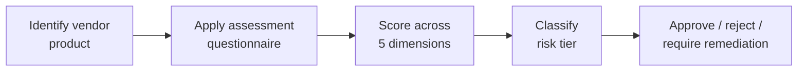

# Lab 8.4: Vendor Supply Chain Assessment

<div class="lab-meta">
  <span>~35 minutes</span>
  <span>Intermediate</span>
  <span>Prerequisites: <a href="8.1-slsa-deep-dive.md">Lab 8.1</a></span>
</div>

You have learned how to secure your own supply chain. Now flip the perspective: you are evaluating a third-party vendor's software before purchasing it or integrating it into your stack. Does the vendor sign their releases? Do they provide SBOMs? How fast do they patch known vulnerabilities? Can they prove their builds are not tampered with?

This lab teaches you to conduct a vendor supply chain security assessment. You will apply a structured questionnaire to a sample vendor product, score it across multiple dimensions, and produce a risk assessment report that could be presented to procurement or engineering leadership.

---

## Connect to the Workstation

```bash
./weaklink shell
```

### Workstation Terminal

Use the embedded terminal below, or open a separate terminal and run `./cli/weaklink shell`.

<div class="terminal-embed">
  <iframe src="http://localhost:7681" title="WeakLink Workstation Terminal"></iframe>
</div>

---

### Attack Flow



---

???+ info "Phase 1: UNDERSTAND. Vendor Assessment Fundamentals"

    **Goal:** Learn how to evaluate third-party vendor supply chain security posture, key questions, and red flags.

### Step 1: Why vendor assessment matters

Your supply chain security is only as strong as your weakest vendor. Even if your internal practices are excellent:

- A vendor's compromised build system can ship malware to your infrastructure
- A vendor without SBOMs leaves you blind to transitive vulnerabilities
- A vendor with slow patching leaves you exposed to known exploits
- A vendor without incident notification means you learn about breaches from the press

Real-world examples:

| Incident | Root Cause | Impact |
|----------|-----------|--------|
| SolarWinds (2020) | Vendor build system compromised | 18,000 customers received backdoored updates |
| Kaseya (2021) | Vendor software zero-day exploited | 1,500 businesses hit by ransomware via managed service provider |
| 3CX (2023) | Vendor's build pipeline compromised via dependency | Trojanized desktop app distributed to customers |
| Codecov (2021) | Vendor's Bash Uploader modified | Attackers exfiltrated CI secrets from Codecov customers |

### Step 2: Assessment dimensions

A complete vendor assessment covers five dimensions:

| Dimension | What You Are Evaluating |
|-----------|------------------------|
| **Build integrity** | Can the vendor prove their artifacts are built from reviewed source code? |
| **Dependency management** | Does the vendor track and manage their dependencies? |
| **Vulnerability response** | How fast does the vendor patch known vulnerabilities? |
| **Transparency** | Does the vendor provide SBOMs, provenance, and security documentation? |
| **Incident management** | Does the vendor have a process for detecting and communicating security incidents? |

### Step 3: Red flags vs. green flags

| Red Flag | Why It Matters |
|----------|---------------|
| No SBOM available | You cannot assess your exposure when a CVE drops |
| Binary releases with no build provenance | You are trusting the vendor's word that the binary matches the source |
| No vulnerability disclosure policy | External researchers have no way to report issues responsibly |
| Average patch time >30 days for critical CVEs | Your window of exposure is unacceptably long |
| No incident notification process | You will learn about breaches from the news |
| Self-hosted build infrastructure with no audit | SolarWinds-class risk |

| Green Flag | Why It Matters |
|------------|---------------|
| SLSA Level 2+ provenance on releases | Build integrity is cryptographically verifiable |
| CycloneDX/SPDX SBOM published with each release | You can track your exposure in real-time |
| Median patch time <7 days for critical CVEs | Vendor takes vulnerability response seriously |
| Published SECURITY.md with response SLAs | Mature vulnerability management |
| SOC 2 Type II or equivalent certification | Third-party validation of security controls |

---

???+ warning "Phase 2: ASSESS. Apply the Questionnaire"

    **Goal:** Apply a vendor assessment questionnaire against the WeakLink sample application as if it were a vendor product.

### Step 1: Vendor assessment questionnaire

For each question, gather evidence and assign a score:

- **3** = Fully meets requirement with evidence
- **2** = Partially meets requirement
- **1** = Minimal or no evidence
- **N/A** = Not applicable

#### Section A: Build Integrity

| # | Question | Score | Evidence |
|:-:|----------|:-----:|----------|
| A1 | Does the vendor use a hosted CI/CD platform for builds? | | |
| A2 | Are build artifacts signed (cosign, GPG, Sigstore)? | | |
| A3 | Is SLSA provenance generated for releases? If so, what level? | | |
| A4 | Can you verify the provenance independently? | | |
| A5 | Are build configurations version-controlled and reviewable? | | |
| A6 | Does the vendor use reproducible builds? | | |

#### Section B: Dependency Management

| # | Question | Score | Evidence |
|:-:|----------|:-----:|----------|
| B1 | Does the vendor pin dependencies to exact versions? | | |
| B2 | Does the vendor use hash verification for dependencies? | | |
| B3 | Does the vendor use lockfiles? | | |
| B4 | Are dependencies updated regularly? (Check commit history) | | |
| B5 | Does the vendor use automated dependency update tools (Dependabot, Renovate)? | | |
| B6 | Does the vendor evaluate new dependencies before adoption? | | |

#### Section C: Vulnerability Response

| # | Question | Score | Evidence |
|:-:|----------|:-----:|----------|
| C1 | Does the vendor have a published vulnerability disclosure policy? | | |
| C2 | What is the vendor's median time to patch critical vulnerabilities? | | |
| C3 | Does the vendor publish security advisories for their product? | | |
| C4 | Does the vendor run automated vulnerability scanning in CI? | | |
| C5 | Does the vendor have defined remediation SLAs? | | |

#### Section D: Transparency

| # | Question | Score | Evidence |
|:-:|----------|:-----:|----------|
| D1 | Does the vendor provide SBOMs with each release? | | |
| D2 | What format are the SBOMs? (CycloneDX, SPDX, other) | | |
| D3 | Do the SBOMs meet NTIA minimum elements? | | |
| D4 | Does the vendor provide VEX documents? | | |
| D5 | Is the vendor's source code auditable (open source or source-available)? | | |

#### Section E: Incident Management

| # | Question | Score | Evidence |
|:-:|----------|:-----:|----------|
| E1 | Does the vendor have a documented incident response process? | | |
| E2 | Does the vendor commit to notifying customers within a specific timeframe? | | |
| E3 | Has the vendor disclosed past incidents transparently? | | |
| E4 | Does the vendor have a SOC 2 Type II or equivalent certification? | | |

### Step 2: Gather evidence

For each question, check the following sources:

```bash
# Check for SECURITY.md
ls /app/SECURITY.md 2>/dev/null

# Check for SBOM in releases
ls /app/sbom* 2>/dev/null

# Check CI/CD configuration
cat /app/.github/workflows/build.yml 2>/dev/null

# Check dependency pinning
cat /app/requirements.txt
cat /app/package-lock.json | python3 -c "import json,sys; d=json.load(sys.stdin); print(f'Lockfile version: {d.get(\"lockfileVersion\", \"unknown\")}')" 2>/dev/null

# Check for signing configuration
grep -r "cosign\|sigstore\|gpg" /app/.github/ 2>/dev/null

# Check for automated dependency updates
ls /app/.github/dependabot.yml 2>/dev/null
```

### Step 3: Score the vendor

Based on evidence gathering, calculate scores per section:

| Section | Max Score | Actual Score | Percentage |
|---------|:---------:|:------------:|:----------:|
| A: Build Integrity | 18 | ? | ?% |
| B: Dependency Management | 18 | ? | ?% |
| C: Vulnerability Response | 15 | ? | ?% |
| D: Transparency | 15 | ? | ?% |
| E: Incident Management | 12 | ? | ?% |
| **Total** | **78** | **?** | **?%** |

---

???+ success "Phase 3: VALIDATE. Evaluate and Score"

    **Goal:** Interpret the scores, identify critical risks, and determine vendor risk tier.

### Step 1: Risk tier classification

| Score | Tier | Recommendation |
|:-----:|:----:|---------------|
| 80-100% | **Low Risk** | Approve for use. Standard monitoring. |
| 60-79% | **Medium Risk** | Approve with conditions. Require remediation plan from vendor. |
| 40-59% | **High Risk** | Approval requires risk acceptance from CISO. Increased monitoring. |
| <40% | **Critical Risk** | Do not approve. Seek alternatives. |

### Step 2: Identify critical findings

List findings that are immediate blockers regardless of overall score:

| Finding | Impact | Blocker? |
|---------|--------|:--------:|
| No artifact signing or provenance | Cannot verify integrity of any release | Yes |
| No SBOM available | Blind to transitive vulnerabilities | Conditional |
| No vulnerability disclosure policy | External researchers have no way to report | Yes |
| Average patch time >30 days for critical CVEs | Unacceptable exposure window | Yes |
| No incident notification commitment | May learn of breaches from press | Conditional |

### Step 3: Benchmark against alternatives

If the vendor scores poorly, compare against alternatives:

| Criteria | Vendor A (current) | Vendor B | Vendor C |
|----------|:-----------------:|:--------:|:--------:|
| SBOM available | No | Yes (CycloneDX) | Yes (SPDX) |
| SLSA level | 0 | 2 | 1 |
| Median patch time | 21 days | 5 days | 14 days |
| Disclosure policy | No | Yes | Yes |
| Price | $ | $$ | $ |

---

??? tip "Phase 4: DOCUMENT. Vendor Risk Assessment Report"

    **Goal:** Produce a vendor risk assessment report with findings, scores, and recommendations.

### Step 1: Report template

```markdown
VENDOR SUPPLY CHAIN SECURITY ASSESSMENT
=========================================

Assessment ID:    VSA-YYYY-NNNN
Vendor:           [Vendor name]
Product:          [Product name]
Version:          [Version assessed]
Assessment date:  [Date]
Assessor:         [Name, role]
Risk tier:        [Low / Medium / High / Critical]

EXECUTIVE SUMMARY
-----------------
[2-3 sentences: overall assessment, key risks, recommendation]

SCORING SUMMARY
---------------
| Section                  | Score | Rating |
|--------------------------|:-----:|:------:|
| Build Integrity          | X/18  | [Good/Fair/Poor] |
| Dependency Management    | X/18  | [Good/Fair/Poor] |
| Vulnerability Response   | X/15  | [Good/Fair/Poor] |
| Transparency             | X/15  | [Good/Fair/Poor] |
| Incident Management      | X/12  | [Good/Fair/Poor] |
| **Total**                | X/78  | **[Tier]** |

CRITICAL FINDINGS
-----------------
| # | Finding | Risk | Recommendation |
|:-:|---------|:----:|----------------|
| 1 | [finding] | [C/H/M/L] | [action] |
| 2 | [finding] | [C/H/M/L] | [action] |

DETAILED FINDINGS
-----------------

### Build Integrity
[Detailed narrative for each scored item]

### Dependency Management
[Detailed narrative for each scored item]

### Vulnerability Response
[Detailed narrative for each scored item]

### Transparency
[Detailed narrative for each scored item]

### Incident Management
[Detailed narrative for each scored item]

RECOMMENDATIONS
---------------
1. [Primary recommendation]
2. [Secondary recommendation]
3. [Tertiary recommendation]

CONDITIONS FOR APPROVAL (if Medium/High risk)
----------------------------------------------
If the vendor is approved despite identified risks, require:
- [ ] Vendor provides SBOM within [X] days
- [ ] Vendor publishes vulnerability disclosure policy within [X] days
- [ ] Vendor provides quarterly security posture updates
- [ ] Re-assessment in [6/12] months

ALTERNATIVES CONSIDERED
-----------------------
| Vendor | Score | Notes |
|--------|:-----:|-------|
| [alt1] | X/78  | [notes] |
| [alt2] | X/78  | [notes] |

APPROVAL
--------
| Role | Name | Decision | Date |
|------|------|----------|------|
| Security reviewer | | | |
| Engineering lead | | | |
| CISO (if High/Critical) | | | |
```

### Step 2: Ongoing vendor monitoring

The initial assessment is a point-in-time evaluation. Set up ongoing monitoring:

| Activity | Frequency | Tool/Method |
|----------|-----------|-------------|
| Check vendor release notes for security fixes | Each release | Manual / RSS |
| Re-run assessment questionnaire | Annually | Manual |
| Monitor vendor in breach databases | Ongoing | Automated (Have I Been Pwned API for domains) |
| Verify SBOMs for new versions | Each release | Automated in CI |
| Track vendor patch response time | Ongoing | Track time between CVE publication and vendor fix |

### Step 3: Final verification

Run the verification from your host terminal:

```bash
weaklink verify 8.4
```

---

## What You Learned

1. **Your supply chain security depends on your vendors**. SolarWinds, Kaseya, 3CX, and Codecov all demonstrated that a vendor compromise becomes your compromise.
2. **A structured questionnaire removes subjectivity**. scoring across build integrity, dependency management, vulnerability response, transparency, and incident management gives you a defensible evaluation.
3. **Red flags are blockers**. no artifact signing, no SBOM, no disclosure policy, or slow patching should block vendor approval regardless of other scores.
4. **Vendor assessment is a negotiation tool**. sharing the assessment results with the vendor creates leverage to request security improvements.
5. **Ongoing monitoring is as important as initial assessment**. a vendor's security posture changes over time. Re-assess regularly.

## Further Reading

- [NIST SP 800-161 Rev. 1: C-SCRM Practices](https://csrc.nist.gov/publications/detail/sp/800-161/rev-1/final)
- [OpenSSF Scorecard](https://securityscorecards.dev/). automated project health scoring
- [CISA ICT Supply Chain Risk Management](https://www.cisa.gov/supply-chain)
- [ISO 27036: Information Security for Supplier Relationships](https://www.iso.org/standard/82891.html)
- [OWASP Software Component Verification Standard](https://owasp.org/www-project-software-component-verification-standard/)
