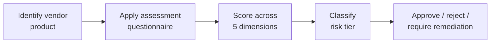

# Lab 8.4: Vendor Supply Chain Assessment

<div class="lab-meta">
  <span>Phase 1 ~5 min | Phase 2 ~15 min | Phase 3 ~10 min | Phase 4 ~5 min</span>
  <span class="difficulty intermediate">Intermediate</span>
  <span>Prerequisites: <a href="8.1-slsa-deep-dive.md">Lab 8.1</a></span>
</div>

You have secured your own supply chain. Now flip the perspective: evaluate a third-party vendor's software before purchasing or integrating it. Does the vendor sign releases? Provide SBOMs? Patch known CVEs within a week?

---

## Connect to the Workstation

```bash
./weaklink shell
```

---

### Attack Flow



---

???+ info "Phase 1: UNDERSTAND. Vendor Assessment Fundamentals"

    **Goal:** Learn the five assessment dimensions, red flags, and green flags.

### Assessment dimensions

| Dimension | What You Are Evaluating |
|-----------|------------------------|
| **Build integrity** | Can the vendor prove artifacts are built from reviewed source? |
| **Dependency management** | Does the vendor track and manage their dependencies? |
| **Vulnerability response** | How fast does the vendor patch known CVEs? |
| **Transparency** | Does the vendor provide SBOMs, provenance, and security docs? |
| **Incident management** | Does the vendor detect and communicate security incidents? |

### Red flags

| Red Flag | Why It Matters |
|----------|---------------|
| No SBOM available | Cannot assess exposure when a CVE drops |
| Binary releases with no provenance | Trusting vendor's word that binary matches source |
| No vulnerability disclosure policy | No way for researchers to report issues |
| Patch time >30 days for critical CVEs | Unacceptable exposure window |
| Self-hosted builds with no audit | SolarWinds-class risk |

---

???+ warning "Phase 2: ASSESS. Apply the Questionnaire"

    **Goal:** Apply the questionnaire against the sample application as a vendor product.

### Questionnaire

Score each question: **3** = Fully met with evidence, **2** = Partial, **1** = Minimal/none.

??? note "Section A: Build Integrity (6 questions)"
    | # | Question | Score | Evidence |
    |:-:|----------|:-----:|----------|
    | A1 | Hosted CI/CD platform? | | |
    | A2 | Artifacts signed (cosign, GPG, Sigstore)? | | |
    | A3 | SLSA provenance generated? What level? | | |
    | A4 | Provenance independently verifiable? | | |
    | A5 | Build configs version-controlled? | | |
    | A6 | Reproducible builds? | | |

??? note "Section B: Dependency Management (6 questions)"
    | # | Question | Score | Evidence |
    |:-:|----------|:-----:|----------|
    | B1 | Dependencies pinned to exact versions? | | |
    | B2 | Hash verification for dependencies? | | |
    | B3 | Lockfiles used? | | |
    | B4 | Dependencies updated regularly? | | |
    | B5 | Automated updates (Dependabot, Renovate)? | | |
    | B6 | New dependencies evaluated before adoption? | | |

??? note "Section C: Vulnerability Response (5 questions)"
    | # | Question | Score | Evidence |
    |:-:|----------|:-----:|----------|
    | C1 | Published vulnerability disclosure policy? | | |
    | C2 | Median time to patch critical CVEs? | | |
    | C3 | Security advisories published? | | |
    | C4 | Automated vulnerability scanning in CI? | | |
    | C5 | Defined remediation SLAs? | | |

??? note "Section D: Transparency (5 questions)"
    | # | Question | Score | Evidence |
    |:-:|----------|:-----:|----------|
    | D1 | SBOMs with each release? | | |
    | D2 | SBOM format (CycloneDX, SPDX)? | | |
    | D3 | SBOMs meet NTIA minimum elements? | | |
    | D4 | VEX documents provided? | | |
    | D5 | Source code auditable? | | |

??? note "Section E: Incident Management (4 questions)"
    | # | Question | Score | Evidence |
    |:-:|----------|:-----:|----------|
    | E1 | Documented IR process? | | |
    | E2 | Customer notification commitment? | | |
    | E3 | Past incidents disclosed transparently? | | |
    | E4 | SOC 2 Type II or equivalent? | | |

### Gather evidence

```bash
ls /app/SECURITY.md /app/sbom* 2>/dev/null
cat /app/.github/workflows/build.yml 2>/dev/null
grep -r "cosign\|sigstore" /app/.github/ 2>/dev/null
ls /app/.github/dependabot.yml 2>/dev/null
```

---

!!! success "Checkpoint"
    You should have scores for all 5 sections. Calculate the total out of 78. This score determines the risk tier.

---

???+ success "Phase 3: VALIDATE. Evaluate and Score"

    **Goal:** Interpret scores, identify critical risks, determine risk tier.

### Risk tier classification

| Score | Tier | Recommendation |
|:-----:|:----:|---------------|
| 80-100% | **Low Risk** | Approve. Standard monitoring. |
| 60-79% | **Medium Risk** | Approve with conditions. Require remediation plan. |
| 40-59% | **High Risk** | CISO risk acceptance required. Increased monitoring. |
| <40% | **Critical Risk** | Do not approve. Seek alternatives. |

### Critical findings (blockers regardless of overall score)

| Finding | Impact |
|---------|--------|
| No artifact signing or provenance | Cannot verify integrity of any release |
| No vulnerability disclosure policy | No external reporting channel |
| Average patch time >30 days for critical CVEs | Unacceptable exposure window |

---

??? tip "Phase 4: DOCUMENT. Vendor Risk Assessment Report"

    **Goal:** Produce a vendor risk assessment report.

### Report template

```markdown
VENDOR SUPPLY CHAIN SECURITY ASSESSMENT
=========================================

Vendor:           [Name]
Product:          [Name]
Assessment date:  [Date]
Risk tier:        [Low / Medium / High / Critical]

SCORING SUMMARY
| Section                  | Score | Rating |
|--------------------------|:-----:|:------:|
| Build Integrity          | X/18  |        |
| Dependency Management    | X/18  |        |
| Vulnerability Response   | X/15  |        |
| Transparency             | X/15  |        |
| Incident Management      | X/12  |        |
| **Total**                | X/78  |        |

CRITICAL FINDINGS
| Finding | Risk | Recommendation |
|---------|:----:|----------------|

CONDITIONS FOR APPROVAL (if Medium/High risk)
- [ ] Vendor provides SBOM within [X] days
- [ ] Vendor publishes disclosure policy within [X] days
- [ ] Re-assessment in [6/12] months
```

### Final verification

```bash
weaklink verify 8.4
```

---

## What You Learned

- Your supply chain security depends on your vendors. SolarWinds, Kaseya, 3CX, and Codecov demonstrated that a vendor compromise becomes your compromise.
- A structured questionnaire removes subjectivity. Scoring across five dimensions gives a defensible evaluation.
- Vendor assessment is a negotiation tool. Sharing results creates leverage to request security improvements.

## Further Reading

- [NIST SP 800-161 Rev. 1: C-SCRM Practices](https://csrc.nist.gov/publications/detail/sp/800-161/rev-1/final)
- [OpenSSF Scorecard](https://securityscorecards.dev/)
- [OWASP Software Component Verification Standard](https://owasp.org/www-project-software-component-verification-standard/)
