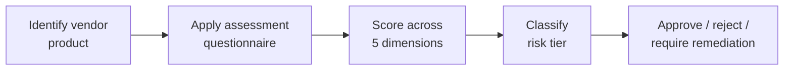

# Lab 8.4: Vendor Supply Chain Assessment

  Phase 1 ~5 min | Phase 2 ~15 min | Phase 3 ~10 min | Phase 4 ~5 min
  Intermediate
  Prerequisites: <a href="../8.1-slsa-deep-dive/">Lab 8.1</a>

  Overview
  ›
  <a href="understand/" class="phase-step upcoming">Understand</a>
  ›
  <a href="assess/" class="phase-step upcoming">Assess</a>
  ›
  <a href="plan/" class="phase-step upcoming">Plan</a>
  ›
  <a href="document/" class="phase-step upcoming">Document</a>

You have secured your own supply chain. Now flip the perspective: evaluate a third-party vendor's software before purchasing or integrating it. Does the vendor sign releases? Provide SBOMs? Patch known CVEs within a week?

### Attack Flow

