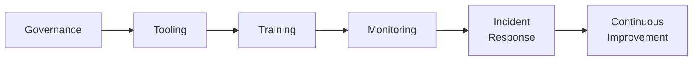

# Lab 8.5: Building a Supply Chain Security Program

<div class="lab-meta">
  <span>Phase 1 ~10 min | Phase 2 ~20 min | Phase 3 ~20 min | Phase 4 ~10 min</span>
  <span class="difficulty advanced">Advanced</span>
  <span>Prerequisites: <a href="8.1-slsa-deep-dive.md">Lab 8.1</a>, <a href="8.2-ssdf-nist.md">Lab 8.2</a>, <a href="../tier-7/7.3-ir-playbook.md">Lab 7.3</a></span>
</div>

You have the technical labs (Tiers 1-6), detection and response (Tier 7), and framework mapping (Tier 8). This capstone brings it all together into a cohesive program for a 500-person organization.

---

## Connect to the Workstation

```bash
./weaklink shell
```

---

### Attack Flow



---

???+ info "Phase 1: UNDERSTAND. What a Program Includes"

    **Goal:** Learn the six pillars and the target organization profile.

### The six pillars

| Pillar | WeakLink Labs Coverage |
|--------|----------------------|
| **Governance** | Labs 8.1-8.4 (SLSA, SSDF, EO 14028, vendor assessment) |
| **Tooling** | Labs 1.1-5.x, 7.4 (SCA, SBOM, signing, container security) |
| **Training** | All labs (developer awareness of attack vectors and defenses) |
| **Monitoring** | Labs 7.1, 7.5 (detection rules, threat modeling) |
| **Incident Response** | Labs 7.2, 7.3 (triage, playbooks) |
| **Continuous Improvement** | Labs 7.5, 8.5 (metrics, threat model updates) |

### Target organization

- **500 employees, 200 developers**
- Cloud-native (Kubernetes, microservices), Python/TypeScript/Go
- GitHub Actions, AWS, ghcr.io
- **Current state**: Dependabot on some repos. No SBOM, no signing, no detection rules, ad-hoc IR.

### Maturity model

| Level | Name | Description |
|:-----:|------|-------------|
| 0 | **Ad-hoc** | No formal supply chain security. Current state. |
| 1 | **Reactive** | Basic vuln scanning. Patches when alerted. |
| 2 | **Defined** | Documented policies. Standardized tooling. Detection rules. |
| 3 | **Managed** | Metrics tracked. Vendor assessments. SBOM/VEX. Tested playbooks. |
| 4 | **Optimizing** | Continuous improvement. Quarterly threat models. Industry-leading. |

---

???+ warning "Phase 2: DESIGN. Program Architecture"

    **Goal:** Design the complete program: governance, tooling, training, monitoring, IR.

### Governance structure

| Role | Responsibility |
|------|---------------|
| Supply Chain Security Lead | Program strategy, vendor assessments, framework compliance |
| AppSec Engineer (x2) | Tooling, CI/CD integration, detection rules |
| Security Champion (per team) | Dependency review, security training liaison |

**Policy documents:** Supply Chain Security Policy, Dependency Management Standard, Artifact Integrity Standard, SBOM Policy, Vendor Assessment Policy, IR Playbook: Supply Chain.

### Tooling architecture

```
Developer Workstation          CI/CD Pipeline              Post-Build
┌───────────────────┐   ┌────────────────────────┐   ┌──────────────────┐
│ pre-commit hooks  │   │ Dependency scanning    │   │ Container signing│
│ - detect secrets  │──>│ - pip-audit / npm audit │──>│ - cosign         │
│ - lockfile check  │   │ - Grype (vuln scan)    │   │ SBOM generation  │
│                   │   │ - Socket (behavioral)  │   │ - Syft/CycloneDX │
│                   │   │                        │   │ SLSA provenance  │
│                   │   │ Build integrity        │   │ - slsa-generator │
│                   │   │ - pinned Actions (SHA) │   └──────────────────┘
│                   │   │ - --require-hashes     │
│                   │   │ - Semgrep (SAST)       │
│                   │   └────────────────────────┘
```

### Monitoring and detection

| Detection | Source | Alert Destination |
|-----------|--------|-------------------|
| Dependency confusion | Proxy logs | PagerDuty (P1) |
| Typosquatting | CI logs | Slack #security-alerts |
| Lockfile injection | Git audit | PR comment (block merge) |
| Malicious install scripts | EDR | PagerDuty (P2) |
| Secret in commit | CI (Gitleaks) | Block push / PR |
| CVE >= High in dependency | CI (Grype) | Block merge (PR check) |

---

!!! success "Checkpoint"
    You should have governance structure, tooling architecture, and detection matrix defined. These three components form the operational backbone of the program.

---

???+ success "Phase 3: PLAN. Phase into Milestones"

    **Goal:** 30-day, 90-day, 6-month, and 1-year milestones.

### 30-Day: Foundation

**Theme:** Stop the bleeding. Minimum viable detection. Fix worst config gaps.

| # | Deliverable | Owner |
|:-:|------------|-------|
| 1 | Fix `--extra-index-url` to `--index-url` across all Python projects | Platform |
| 2 | Enable Dependabot on all repositories | Platform |
| 3 | Deploy pip-audit + npm audit in CI (all repos) | AppSec |
| 4 | Publish SECURITY.md in all public repos | Supply Chain Lead |
| 5 | Deploy 3 core SIEM detection rules | AppSec |
| 6 | Appoint Supply Chain Security Lead | CISO |

**Maturity at 30 days: Level 1 (Reactive)**

### 90-Day: Standardization

| # | Deliverable | Owner |
|:-:|------------|-------|
| 7 | Standardize CI template with Grype + Semgrep | Platform |
| 8 | Generate CycloneDX SBOMs for all releases | AppSec |
| 9 | Sign all container images with cosign | Platform |
| 10 | Publish Dependency Management Standard | AppSec |
| 11 | Complete IR playbook for supply chain incidents | IR + AppSec |
| 12 | Nominate security champions (1 per team) | Eng leads |
| 13 | Complete WeakLink Labs Tier 0-1 for all developers | AppSec |

**Maturity at 90 days: Level 2 (Defined)**

### 6-Month: Measurement

| # | Deliverable | Owner |
|:-:|------------|-------|
| 14 | Implement SLSA Level 2 provenance for top 10 services | AppSec + Platform |
| 15 | Deploy admission controller requiring image signatures | Platform |
| 16 | Conduct vendor assessments for top 5 critical vendors | Supply Chain Lead |
| 17 | Launch metrics dashboard | AppSec |
| 18 | Complete threat model for core platform | AppSec |
| 19 | Complete first SSDF self-assessment | Supply Chain Lead |

**Maturity at 6 months: Level 3 (Managed)**

### 1-Year: Optimization

| # | Deliverable | Owner |
|:-:|------------|-------|
| 20 | SLSA Level 3 for all production services | Platform |
| 21 | Integrate VEX document generation | AppSec |
| 22 | Vendor assessments for all critical+high-risk vendors | Supply Chain Lead |
| 23 | Quarterly threat model updates | AppSec |
| 24 | Complete EO 14028 compliance package (if selling to fed) | Supply Chain Lead |

**Maturity at 1 year: Level 4 (Optimizing)**

### Program metrics

| Metric | Target (90d) | Target (6mo) | Target (1yr) |
|--------|:------------:|:------------:|:------------:|
| % repos with SCA scanning | 100% | 100% | 100% |
| % releases with SBOM | 80% | 100% | 100% |
| % container images signed | 50% | 100% | 100% |
| Mean time to patch critical CVE | <14 days | <7 days | <3 days |
| SLSA level for production services | 0-1 | 2 | 3 |

---

??? tip "Phase 4: DOCUMENT. Executive Deliverables"

    **Goal:** One-page executive briefing and program charter.

### Executive briefing

```markdown
SUPPLY CHAIN SECURITY PROGRAM: EXECUTIVE BRIEFING
===================================================

THE PROBLEM
Software supply chain attacks increased 742% between 2019 and 2022 (Sonatype).
Our current posture: no SBOMs, no artifact signing, no detection rules, no
formal IR for supply chain events.

THE RISK
- 3,400+ open-source dependencies across 47 services
- 0% of artifacts signed or have build provenance
- No detection capability for dependency confusion or typosquatting
- Federal customers beginning to require SBOMs and SSDF attestation

THE PROGRAM
  30 days:  Fix critical config gaps, deploy basic detection
  90 days:  Standardize tooling, SBOMs, signing, train developers
  6 months: Metrics, vendor assessments, SLSA Level 2
  1 year:   Full maturity -- SLSA Level 3, VEX, quarterly threat modeling

INVESTMENT
- 1x Supply Chain Security Lead (new hire or internal)
- 2x AppSec Engineers (existing, partially reallocated)
- ~$30K/yr for Socket commercial license (all other tools OSS/free)
- ~2 hours per developer for initial training + 30 min/month ongoing

REQUEST
Approve the program charter, the Supply Chain Security Lead role, and
$30K annual tooling budget.
```

### Final verification

```bash
weaklink verify 8.5
```

---

## What You Learned

- A program is more than tools. Governance, training, monitoring, IR, and continuous improvement are equally important pillars.
- Phased implementation prevents paralysis. 30-day quick wins build credibility for larger investment.
- Metrics create accountability. Tracking SBOM coverage, patch time, and signing percentage makes progress visible to leadership.

## Further Reading

- [OpenSSF Supply Chain Security Guide](https://openssf.org/)
- [SLSA: Supply-chain Levels for Software Artifacts](https://slsa.dev/)
- [NIST SP 800-218: Secure Software Development Framework](https://csrc.nist.gov/publications/detail/sp/800-218/final)
