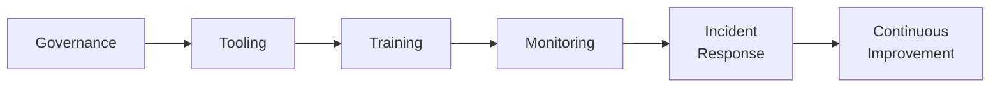

# Lab 8.5: Building a Supply Chain Security Program

  Understand: ~10 min | Assess: ~20 min | Plan: ~20 min | Document: ~10 min
  Advanced
  Prerequisites: <a href="../8.1-slsa-deep-dive/">Lab 8.1</a>, <a href="../8.2-ssdf-nist/">Lab 8.2</a>, <a href="../../tier-7/7.3-ir-playbook/">Lab 7.3</a>

  Overview
  ›
  <a href="understand/" class="phase-step upcoming">Understand</a>
  ›
  <a href="assess/" class="phase-step upcoming">Assess</a>
  ›
  <a href="plan/" class="phase-step upcoming">Plan</a>
  ›
  <a href="document/" class="phase-step upcoming">Document</a>

You have the technical labs (Tiers 1-6), detection and response (Tier 7), and framework mapping (Tier 8). This capstone brings it all together into a cohesive program for a 500-person organization.

### Attack Flow

