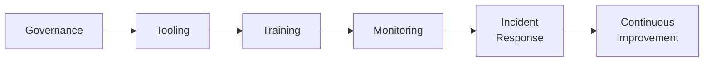

# Lab 8.5: Building a Supply Chain Security Program

  Phase 1 ~10 min | Phase 2 ~20 min | Phase 3 ~20 min | Phase 4 ~10 min
  Advanced
  Prerequisites: <a href="../8.1-slsa-deep-dive/">Lab 8.1</a>, <a href="../8.2-ssdf-nist/">Lab 8.2</a>, <a href="../../tier-7/7.3-ir-playbook/">Lab 7.3</a>

  Overview
  ›
  <a href="understand/" class="phase-step upcoming">Understand</a>
  ›
  <a href="assess/" class="phase-step upcoming">Assess</a>
  ›
  <a href="plan/" class="phase-step upcoming">Plan</a>
  ›
  <a href="document/" class="phase-step upcoming">Document</a>

You have the technical labs (Tiers 1-6), detection and response (Tier 7), and framework mapping (Tier 8). This capstone brings it all together into a cohesive program for a 500-person organization.

### Attack Flow

!!! tip "Related Labs"
    - **Prerequisite:** [8.1 SLSA Framework Deep Dive](../8.1-slsa-deep-dive/index.md) — SLSA framework is a core component of any program
    - **Prerequisite:** [8.2 SSDF / NIST SP 800-218 Mapping](../8.2-ssdf-nist/index.md) — SSDF provides the practice framework for your program
    - **See also:** [7.3 Incident Response Playbook](../../tier-7/7.3-ir-playbook/index.md) — IR playbooks are a critical program component
    - **See also:** [7.5 Threat Modeling for Supply Chains](../../tier-7/7.5-threat-modeling/index.md) — Threat modeling drives program priorities
