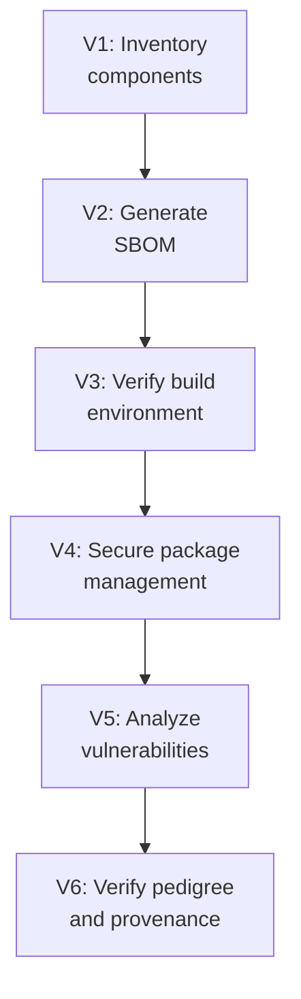

# Lab 8.6: OWASP SCVS Framework Assessment

<div class="lab-meta">
  <span>Phase 1 ~10 min | Phase 2 ~15 min | Phase 3 ~10 min | Phase 4 ~5 min</span>
  <span class="difficulty intermediate">Intermediate</span>
  <span>Prerequisites: <a href="8.1-slsa-deep-dive.md">Lab 8.1</a>, <a href="8.2-ssdf-nist.md">Lab 8.2</a></span>
</div>

SCVS provides a comprehensive, granular checklist covering everything from knowing what components you have to verifying where they came from. Unlike SLSA (build integrity focus) or SSDF (organizational secure development), SCVS covers the full component lifecycle.

**Reference:** [OWASP SCVS](https://owasp.org/www-project-software-component-verification-standard/)

---

## Connect to the Workstation

```bash
./weaklink shell
```

---

### Attack Flow



---

???+ info "Phase 1: UNDERSTAND. The SCVS Framework"

    **Goal:** Learn the SCVS categories, maturity levels, and how SCVS complements SLSA and SSDF.

### SCVS structure

| Category | What It Answers |
|:--------:|----------------|
| **V1** Inventory | Do you know what components your software contains? |
| **V2** SBOM | Can you produce a machine-readable, standards-compliant component list? |
| **V3** Build Environment | Is the build process secure and verifiable? |
| **V4** Package Management | Are dependencies acquired and verified securely? |
| **V5** Component Analysis | Are known vulnerabilities identified and remediated? |
| **V6** Pedigree & Provenance | Can you trace each component back to its origin? |

Each category has 3 maturity levels (Basic, Automated, Advanced).

### How SCVS differs from SLSA and SSDF

| Dimension | SCVS | SLSA | SSDF |
|-----------|------|------|------|
| **Scope** | All component verification | Build integrity only | Entire SDLC |
| **Focus** | Components you consume | Artifacts you produce | How you develop software |
| **Strongest domain** | Inventory, SBOM, package mgmt | Build provenance | Organizational governance |
| **Compliance driver** | Voluntary (OWASP) | Voluntary (OpenSSF) | Mandatory for US federal (EO 14028) |

These frameworks work best together. SCVS gives the technical checklist, SLSA the build maturity model, SSDF the organizational governance.

### SCVS maps to WeakLink Labs

| SCVS Category | WeakLink Tier | Key Labs |
|---------------|:------------:|----------|
| V1: Inventory | Tier 4 | 4.1 SBOM Contents |
| V2: SBOM | Tier 4 | 4.1, 4.2, 4.7 |
| V3: Build Environment | Tier 2 | 2.1-2.8 |
| V4: Package Management | Tier 1 | 1.1-1.6 |
| V5: Component Analysis | Tier 7 | 7.1, 7.4 |
| V6: Pedigree & Provenance | Tier 4 | 4.3-4.6 |

---

???+ warning "Phase 2: ASSESS. Evaluate Against SCVS"

    **Goal:** Evaluate all 6 categories, map gaps to specific labs.

### Assess V1 (Inventory) and V4 (Package Management)

```bash
ls /app/requirements.txt /app/package.json /app/package-lock.json 2>/dev/null
grep -E '==' /app/requirements.txt 2>/dev/null | head -5
grep -E '--hash' /app/requirements.txt 2>/dev/null | head -3
grep -E 'index-url|registry' /app/.npmrc /app/pip.conf 2>/dev/null
```

### Assess V2 (SBOM) and V3 (Build Environment)

```bash
grep -rE 'syft|cyclonedx|spdx|sbom' /app/.github/workflows/ 2>/dev/null
grep -rE 'slsa|provenance|cosign' /app/.github/workflows/ 2>/dev/null
grep -E '@[a-f0-9]{40}' /app/.github/workflows/*.yml 2>/dev/null
```

### Assess V5 (Component Analysis) and V6 (Provenance)

```bash
grep -rE 'grype|trivy|pip-audit|dependabot' /app/.github/workflows/ /app/.github/dependabot.yml 2>/dev/null
grep -rE 'cosign verify|slsa-verifier' /app/.github/workflows/ 2>/dev/null
```

### Map gaps to labs

| SCVS Category | Gap | WeakLink Lab |
|---------------|-----|-------------|
| V1 | No automated inventory beyond lockfile | [Lab 4.1](../tier-4/4.1-sbom-contents.md) |
| V2 | No SBOM generated | [Lab 4.1](../tier-4/4.1-sbom-contents.md) |
| V3 | No SLSA provenance, Actions not pinned to SHA | [Lab 4.4](../tier-4/4.4-attestation-slsa.md) |
| V4 | No hash verification, using `--extra-index-url` | [Lab 1.2](../tier-1/1.2-dependency-confusion.md) |
| V5 | No automated scanning, no remediation SLAs | [Lab 7.4](../tier-7/7.4-tool-evaluation.md) |
| V6 | No signature verification, no upstream health checks | [Lab 4.5](../tier-4/4.5-signature-bypass.md) |

---

!!! success "Checkpoint"
    You should have a per-category assessment (Met/Partial/Not Met for each maturity level) and a gap-to-lab mapping. This is the input to the remediation roadmap.

---

???+ success "Phase 3: PLAN. Remediation Roadmap"

    **Goal:** Prioritized roadmap with framework overlap analysis.

### Framework overlap analysis

Controls satisfying multiple frameworks give the highest compliance ROI:

| Action | SCVS | SLSA | SSDF | EO 14028 |
|--------|:----:|:----:|:----:|:--------:|
| Fix `--extra-index-url` to `--index-url` | V4 |. | PW.4.4 |. |
| Deploy Grype in CI | V5 |. | PW.7.2 | Required |
| Generate CycloneDX SBOMs | V1, V2 |. | RV.3.3 | Required |
| Add SLSA provenance | V3, V6 | L1-L3 | PS.3.1 |. |
| Sign artifacts with cosign | V3, V6 | L2 | PS.3.1 |. |
| Define vulnerability SLAs | V5 |. | RV.3.4 | Required |

### Phased roadmap

**Phase 1. Quick wins (Days 1-14):**

| # | Action | SCVS Controls | Also Satisfies |
|:-:|--------|--------------|----------------|
| 1 | Fix namespace separation (`--index-url`) | V4.1.4 | SSDF PW.4.4 |
| 2 | Add `--require-hashes` | V4.2.1 | SSDF PW.4.4 |
| 3 | Deploy Grype in CI | V5.1.2 | SSDF PW.7.2, EO 14028 |
| 4 | Enable Dependabot on all repos | V5.1.3 |. |

**Phase 2. Foundation (Days 14-60):**

| # | Action | SCVS Controls | Also Satisfies |
|:-:|--------|--------------|----------------|
| 5 | Generate CycloneDX SBOMs in CI | V1.2.4, V2.1.1+ | SSDF RV.3.3, EO 14028 |
| 6 | Sign container images with cosign | V3.2.2, V6.2.1 | SLSA L2, SSDF PS.3.1 |
| 7 | Pin GitHub Actions to commit SHAs | V3.2.3 | SLSA L3 prep |
| 8 | Publish vulnerability remediation SLAs | V5.2.2 | SSDF RV.3.4, EO 14028 |

**Phase 3. Maturity (Days 60-180):**

| # | Action | SCVS Controls | Also Satisfies |
|:-:|--------|--------------|----------------|
| 9 | Implement SLSA Level 2 provenance | V3.2.2, V6.2.2 | SLSA L2, SSDF PS.3.1 |
| 10 | Deploy admission controller for image signatures | V6.3.2 | SLSA verification |
| 11 | Integrate OpenSSF Scorecard for upstream health | V6.2.3 |. |

---

??? tip "Phase 4: DOCUMENT. Compliance Report"

    **Goal:** Produce a SCVS compliance report with overlap matrix.

### Report structure

1. **Executive summary** with overall maturity level per category
2. **Detailed findings** for each of the 6 SCVS categories with evidence
3. **Prioritized remediation roadmap** from Phase 3
4. **Framework overlap summary** showing multi-framework coverage

### Continuous compliance metrics

| Metric | SCVS Category | Target |
|--------|:------------:|:------:|
| % projects with component inventory | V1 | 100% |
| % releases with SBOM | V2 | 100% |
| SLSA level of production builds | V3 | Level 2+ |
| % dependencies with verified hashes | V4 | 100% |
| Mean time to remediate critical CVEs | V5 | < 48h |
| % artifacts with verified provenance | V6 | 100% |

### Final verification

```bash
weaklink verify 8.6
```

---

## What You Learned

- SCVS is the most comprehensive component-level checklist: 6 categories, ~65 controls covering inventory through provenance.
- Frameworks complement, they do not compete. Use SCVS for technical depth, SLSA for build maturity, SSDF for governance.
- Multi-framework controls (SBOM generation, artifact signing, vuln scanning) each satisfy 3+ frameworks simultaneously. Prioritize these.

## Further Reading

- [OWASP SCVS](https://owasp.org/www-project-software-component-verification-standard/)
- [OWASP CycloneDX](https://cyclonedx.org/)
- [OWASP Dependency-Track](https://dependencytrack.org/)
