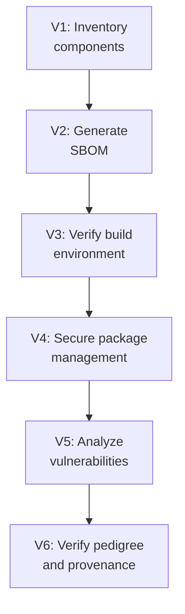

# Lab 8.6: OWASP SCVS Framework Assessment

  Phase 1 ~10 min | Phase 2 ~15 min | Phase 3 ~10 min | Phase 4 ~5 min
  Intermediate
  Prerequisites: <a href="../8.1-slsa-deep-dive/">Lab 8.1</a>, <a href="../8.2-ssdf-nist/">Lab 8.2</a>

  Overview
  ›
  <a href="understand/" class="phase-step upcoming">Understand</a>
  ›
  <a href="assess/" class="phase-step upcoming">Assess</a>
  ›
  <a href="plan/" class="phase-step upcoming">Plan</a>
  ›
  <a href="document/" class="phase-step upcoming">Document</a>

SCVS provides a comprehensive, granular checklist covering everything from knowing what components you have to verifying where they came from. Unlike SLSA (build integrity focus) or SSDF (organizational secure development), SCVS covers the full component lifecycle. OWASP developed SCVS in direct response to incidents like SolarWinds (2020) and Log4Shell (CVE-2021-44228), which exposed that most organizations had no systematic way to verify the components in their software.

**Reference:** [OWASP SCVS](https://owasp.org/www-project-software-component-verification-standard/)

### Attack Flow

!!! tip "Related Labs"
    - **Prerequisite:** [8.1 SLSA Framework Deep Dive](../8.1-slsa-deep-dive/index.md) — SLSA framework knowledge helps interpret SCVS controls
    - **Prerequisite:** [8.2 SSDF / NIST SP 800-218 Mapping](../8.2-ssdf-nist/index.md) — SSDF mapping provides context for SCVS assessment
    - **See also:** [8.5 Building a Supply Chain Security Program](../8.5-building-a-program/index.md) — SCVS assessment informs program building priorities
    - **See also:** [4.1 What SBOMs Actually Contain](../../tier-4/4.1-sbom-contents/index.md) — SBOM practices are heavily assessed in SCVS
