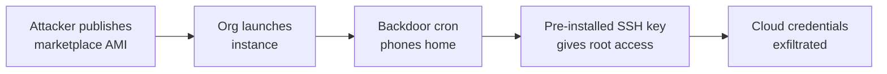

# Lab 9.1: Cloud Marketplace Poisoning

<div class="lab-meta">
  <span>Phase 1 ~5 min | Phase 2 ~10 min | Phase 3 ~10 min | Phase 4 ~10 min</span>
  <span class="difficulty intermediate">Intermediate</span>
  <span>Prerequisites: <a href="../../tier-3/3.1-image-internals/">Lab 3.1</a></span>
</div>

Cloud marketplace images are full operating systems deployed into your infrastructure with the publisher's cron jobs, SSH keys, systemd services, and network configurations. If the publisher is malicious or compromised, you just gave an attacker root access. Deploy a "marketplace" container image with three hidden backdoors, find them, and learn to build from scratch instead.

---

### Attack Flow



---

## Connect to the Workstation

```bash
./weaklink shell
```

---

???+ info "Phase 1: UNDERSTAND. The Marketplace Trust Model"

    **Goal:** Understand why the marketplace trust model is dangerous.

### Step 1: Examine and run the marketplace image

```bash
cat Dockerfile
docker build -t marketplace-webserver:latest src/
docker run -d --name marketplace-test -p 8080:80 marketplace-webserver:latest
curl http://localhost:8080
```

The web server works. Health check passes. A casual user would deploy to production.

### Step 2: The trust gap

| What the listing shows | What is actually in the image |
|------------------------|-------------------------------|
| "Production-Ready Web Server" | NGINX + three backdoors |
| "Marketplace Verified" | No code review, just metadata checks |
| "4.8/5 rating, 125K+ downloads" | Social proof is not security validation |

Marketplace verification checks that the image boots and has metadata. It does NOT check cron jobs, SSH keys, systemd services, or outbound connections.

---

???+ warning "Phase 2: BREAK. Finding the Backdoors"

    **Goal:** Discover the three hidden persistence mechanisms.

### Audit the running container

Audit the running container for hidden backdoors. Check for unexpected processes, open ports, scheduled tasks, SSH keys, and init scripts:

```bash
docker exec -it marketplace-test bash
ps aux
ss -tlnp
cat /etc/cron.d/*
cat /root/.ssh/authorized_keys
ls /etc/init.d/
```

### Backdoor 1: Phone-home cron job

```bash
cat /etc/cron.d/cloud-health-monitor
```

Runs every 5 minutes, sends hostname and public IP to `telemetry-cdn.cloud-analytics.io`. Disguised as "cloud health monitor." The attacker knows every instance running this image.

### Backdoor 2: Pre-installed SSH key

```bash
cat /root/.ssh/authorized_keys
```

Attacker's SSH public key pre-installed. Comment says "Marketplace deployment key - DO NOT REMOVE." The attacker has SSH root access on demand.

### Backdoor 3: Credential exfiltration on boot

```bash
cat /usr/local/bin/systemd-helper
```

Runs on boot: reads `/etc/shadow`, collects cloud credentials (`AWS_*`, `AZURE_*`, `GCP_*`, `TOKEN`, `SECRET`), queries instance metadata (`169.254.169.254`), exfiltrates via DNS (fallback: HTTP).

```bash
docker stop marketplace-test && docker rm marketplace-test
```

---

???+ success "Checkpoint"
    You should have identified all three backdoors (cron phone-home, SSH key, boot-time credential theft) and understand their persistence mechanisms.

---

???+ success "Phase 3: DEFEND. Build From Scratch, Trust No Image"

    **Goal:** Build your own base images, scan marketplace images, verify provenance.

### Fix 1: Build from minimal base

```dockerfile
FROM debian:bookworm-slim
RUN apt-get update && apt-get install -y --no-install-recommends nginx \
    && rm -rf /var/lib/apt/lists/*
RUN rm -rf /etc/cron.d/* /var/spool/cron/* /root/.ssh
RUN useradd -r -s /bin/false nginx-user
USER nginx-user
EXPOSE 80
CMD ["nginx", "-g", "daemon off;"]
```

No SSH server, no cron, no extra tools. Monitoring via external systems.

### Fix 2: Scan images before deployment

```bash
trivy image marketplace-webserver:latest
docker run --rm marketplace-webserver:latest \
    sh -c "find /etc/cron* /var/spool/cron -type f 2>/dev/null | xargs cat"
docker run --rm marketplace-webserver:latest \
    find / -name "authorized_keys" -o -name "*.pub" 2>/dev/null
docker history --no-trunc marketplace-webserver:latest
```

### Fix 3: Use Infrastructure-as-Code exclusively

Replace marketplace images with Packer templates building from official base images with audited provisioning.

### Final verification

```bash
weaklink verify 9.1
```

---

??? danger "Phase 4: DETECT. Catching Marketplace Backdoors in Production"

    **Goal:** Detect compromised marketplace images using cloud audit logs and host-based detection.

Cloud audit indicators:

| Indicator | Log Source |
|-----------|-----------|
| AMI launch from unknown publisher | CloudTrail `RunInstances` |
| Instance metadata API called at boot | VPC Flow Logs |
| Outbound DNS to unknown domains | Route 53 Resolver / VPC DNS |
| Outbound HTTP to `cloud-analytics.io` | VPC Flow Logs / proxy |
| SSH login from unexpected IP | CloudTrail / auth.log |

### MITRE ATT&CK Mapping

| Technique | ID | Relevance |
|-----------|-----|-----------|
| Supply Chain Compromise: Software Supply Chain | [T1195.002](https://attack.mitre.org/techniques/T1195/002/) | Malicious image via cloud marketplace |
| Implant Internal Image | [T1525](https://attack.mitre.org/techniques/T1525/) | Backdoor pre-installed before deployment |
| Valid Accounts: Cloud Accounts | [T1078.004](https://attack.mitre.org/techniques/T1078/004/) | Pre-installed SSH key provides persistent access |

---

## What You Learned

- Cloud marketplace images contain everything the publisher put in, including potential backdoors in cron jobs, SSH keys, and system services.
- Marketplace verification is shallow. It checks boot and metadata, not contents.
- Build from scratch using minimal base images and IaC. That is the only safe approach.

## Further Reading

- [MITRE ATT&CK: Implant Internal Image (T1525)](https://attack.mitre.org/techniques/T1525/)
- [AWS: AMI Best Practices](https://docs.aws.amazon.com/AWSEC2/latest/UserGuide/AMIs.html)
- [Chainguard Images: Minimal Base Images](https://www.chainguard.dev/chainguard-images)
