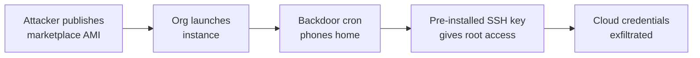

# Lab 9.1: Cloud Marketplace Poisoning

<div class="lab-meta">
  <span>~35 minutes</span>
  <span>Intermediate</span>
  <span>Prerequisites: <a href="../tier-3/3.1-image-internals.md">Lab 3.1</a></span>
</div>

Every major cloud provider has a marketplace: AWS AMI Marketplace, GCP VM Images, Azure Marketplace. Organizations deploy these pre-built images to get running quickly. a web server, a database, a monitoring stack. Click "Launch," and you have a production system in minutes.

But who built that image? When was it last updated? What is actually inside it? The marketplace trust model is fundamentally broken: you are deploying someone else's full operating system into your infrastructure, with their cron jobs, their SSH keys, their systemd services, and their network configurations. If the image publisher is malicious. or was compromised. you just gave an attacker root access to your cloud environment.

In this lab, you will deploy a "marketplace" container image that looks like a standard web server but contains three hidden backdoors. You will find them, understand how they persist, and learn how to build from scratch instead of trusting pre-built images.

---

### Attack Flow



---

## Connect to the Workstation

```bash
./weaklink shell
```

### Workstation Terminal

Use the embedded terminal below, or open a separate terminal and run `./cli/weaklink shell`.

<div class="terminal-embed">
  <iframe src="http://localhost:7681" title="WeakLink Workstation Terminal"></iframe>
</div>

---

???+ info "Phase 1: UNDERSTAND. The Marketplace Trust Model"

    **Goal:** Understand how cloud marketplace images work and why the trust model is dangerous.

### Step 1: Examine the marketplace image

The `src/` directory contains a Dockerfile that simulates a cloud marketplace image. It is published by "TrustedCloudImages Inc." with a 4.8-star rating and 125,000+ downloads.

```bash
# Look at the Dockerfile
cat src/Dockerfile
```

At first glance, it looks like a standard NGINX web server image. It installs nginx, curl, openssh-server, and some utilities. It has a health check. It has labels showing a legitimate publisher.

### Step 2: Build and run the marketplace image

```bash
# Build the "marketplace" image
docker build -t marketplace-webserver:latest src/

# Run it
docker run -d --name marketplace-test -p 8080:80 marketplace-webserver:latest

# Verify it works
curl http://localhost:8080
curl http://localhost:8080/health
```

The web server works perfectly. Health check passes. A casual user would deploy this to production and move on.

### Step 3: Understand the trust gap

| What the marketplace listing shows | What is actually in the image |
|-------------------------------------|-------------------------------|
| "Production-Ready Web Server" | NGINX + three backdoors |
| "Marketplace Verified" | No code review, just metadata checks |
| "4.8/5 rating, 125K+ downloads" | Social proof is not security validation |
| "By TrustedCloudImages Inc." | Publisher identity is not audited |
| Health check: passing | Health check only tests NGINX, not the cron job or SSH config |

Cloud marketplace verification typically checks:

- Image boots successfully
- Metadata is filled in
- No known CVEs in the package list (maybe)
- Publisher has a valid account

Cloud marketplace verification does NOT check:

- What cron jobs are installed
- What SSH keys are pre-loaded
- What systemd services run at boot
- Whether the image phones home to external servers

---

???+ warning "Phase 2: BREAK. Finding the Backdoors"

    **Goal:** Discover the three hidden persistence mechanisms in the marketplace image.

### Step 1: Audit the running container

```bash
# Exec into the running container
docker exec -it marketplace-test bash

# What processes are running?
ps aux

# What network connections are active?
ss -tlnp

# What cron jobs are scheduled?
crontab -l 2>/dev/null
cat /etc/cron.d/*

# What SSH keys are pre-installed?
cat /root/.ssh/authorized_keys

# What services are enabled?
ls /etc/init.d/
```

### Step 2: Backdoor 1. The phone-home cron job

```bash
# Examine the cron job
cat /etc/cron.d/cloud-health-monitor
```

This cron job runs every 5 minutes and sends the hostname and public IP to `telemetry-cdn.cloud-analytics.io`. It is disguised as a "cloud health monitor". a name that sounds legitimate in a cloud environment.

**Impact:** The attacker knows every instance running this image, its IP address, and its hostname. This is the reconnaissance phase of the attack.

### Step 3: Backdoor 2. Pre-installed SSH key

```bash
# Check SSH configuration
cat /root/.ssh/authorized_keys
cat /etc/ssh/sshd_config | grep -E '(PermitRootLogin|AuthorizedKeysFile|PasswordAuthentication)'
```

The image has an attacker's SSH public key pre-installed in root's `authorized_keys` file. The comment says "Marketplace deployment key - DO NOT REMOVE" to discourage removal.

**Impact:** The attacker has SSH root access to every instance running this image, on demand.

### Step 4: Backdoor 3. Rootkit disguised as systemd helper

```bash
# Examine the "systemd helper" script
cat /usr/local/bin/systemd-helper
```

This script runs on boot and:

1. Reads `/etc/shadow` (password hashes)
2. Collects environment variables containing cloud credentials (`AWS_*`, `AZURE_*`, `GCP_*`, `TOKEN`, `SECRET`)
3. Queries the cloud instance metadata endpoint (`169.254.169.254`)
4. Exfiltrates everything via DNS (harder to detect than HTTP)
5. Falls back to HTTP exfiltration if DNS fails

**Impact:** On first boot, the attacker gets password hashes, cloud credentials, and instance metadata for every deployed instance.

### Step 5: Review the full attack timeline

```
t=0     Organization finds "Production-Ready Web Server" in marketplace
t=1     Clicks "Launch" -- image deployed to production VPC
t=2     entrypoint.sh starts cron, SSH, and systemd-helper
t=3     systemd-helper exfiltrates /etc/shadow, env vars, instance metadata
t=5     Cron job phones home with hostname and IP
t=10    Attacker has full inventory of deployed instances
t=15    Attacker SSH'es in using pre-installed key
t=∞     Persistent root access -- survives reboots, updates, patches
```

```bash
# Clean up the compromised container
docker stop marketplace-test && docker rm marketplace-test
```

---

???+ success "Phase 3: DEFEND. Build From Scratch, Trust No Image"

    **Goal:** Build your own base images, scan marketplace images, and verify provenance.

### Fix 1: Build your own base image from scratch

```dockerfile
# Dockerfile.clean -- Build from minimal base, install only what you need
FROM debian:bookworm-slim

RUN apt-get update && apt-get install -y --no-install-recommends \
    nginx \
    && rm -rf /var/lib/apt/lists/*

# Explicit: no SSH server, no cron, no extra tools
# SSH keys are injected at deploy time via cloud-init or Instance Metadata

# No cron jobs -- monitoring is done by external systems (CloudWatch, Datadog)
RUN rm -rf /etc/cron.d/* /var/spool/cron/*

# No pre-installed SSH keys
RUN rm -rf /root/.ssh

# Run as non-root
RUN useradd -r -s /bin/false nginx-user
USER nginx-user

EXPOSE 80
CMD ["nginx", "-g", "daemon off;"]
```

```bash
# Build the clean image
cat > /tmp/Dockerfile.clean << 'EOF'
FROM debian:bookworm-slim
RUN apt-get update && apt-get install -y --no-install-recommends nginx \
    && rm -rf /var/lib/apt/lists/*
RUN rm -rf /etc/cron.d/* /var/spool/cron/* /root/.ssh
EXPOSE 80
CMD ["nginx", "-g", "daemon off;"]
EOF

docker build -t clean-webserver:latest -f /tmp/Dockerfile.clean /tmp/

# Verify: no cron, no SSH keys, no extra processes
docker run --rm clean-webserver:latest sh -c "ls /etc/cron.d/ 2>/dev/null; ls /root/.ssh/ 2>/dev/null; echo 'Clean.'"
```

### Fix 2: Scan images before deployment

```bash
# Scan with Trivy for vulnerabilities
trivy image marketplace-webserver:latest

# Check for unexpected cron jobs
docker run --rm marketplace-webserver:latest \
    sh -c "find /etc/cron* /var/spool/cron -type f 2>/dev/null | xargs cat"

# Check for pre-installed SSH keys
docker run --rm marketplace-webserver:latest \
    find / -name "authorized_keys" -o -name "*.pub" 2>/dev/null

# Check for unexpected network listeners
docker run --rm marketplace-webserver:latest \
    ss -tlnp 2>/dev/null || netstat -tlnp 2>/dev/null

# Check Docker history for suspicious layers
docker history --no-trunc marketplace-webserver:latest
```

### Fix 3: Verify image provenance

For real cloud marketplace images:

```bash
# AWS: Check AMI owner and creation date
aws ec2 describe-images --image-ids ami-0123456789 \
    --query "Images[0].{Owner:OwnerId,Created:CreationDate,Name:Name,Public:Public}"

# Verify the image is from a known publisher
# Cross-reference OwnerId with the marketplace listing

# Check image permissions
aws ec2 describe-image-attribute --image-id ami-0123456789 --attribute launchPermission
```

### Fix 4: Use Infrastructure-as-Code exclusively

Replace marketplace images with IaC that builds from scratch:

```hcl
# Packer template -- builds from official base, installs only what you audit
source "amazon-ebs" "webserver" {
  ami_name      = "company-webserver-{{timestamp}}"
  instance_type = "t3.micro"
  source_ami_filter {
    filters = {
      name                = "debian-12-amd64-*"
      root-device-type    = "ebs"
      virtualization-type = "hvm"
    }
    owners      = ["136693071363"]  # Official Debian account
    most_recent = true
  }
  ssh_username = "admin"
}

build {
  sources = ["source.amazon-ebs.webserver"]

  provisioner "shell" {
    inline = [
      "sudo apt-get update",
      "sudo apt-get install -y nginx",
      "sudo rm -rf /etc/cron.d/* /root/.ssh",
      "sudo systemctl disable ssh"
    ]
  }
}
```

### Final verification

```bash
weaklink verify 9.1
```

---

??? danger "Phase 4: DETECT. Catching Marketplace Backdoors in Production"

    **Goal:** Detect compromised marketplace images using cloud audit logs, network monitoring, and host-based detection.

### CloudTrail / Cloud Audit Indicators

| Indicator | Log Source | What It Means |
|-----------|-----------|---------------|
| AMI launch from unknown publisher | CloudTrail `RunInstances` | Marketplace image deployed without approval |
| Instance metadata API called at boot | VPC Flow Logs | `systemd-helper` script querying 169.254.169.254 |
| Outbound DNS to unknown domains | Route 53 Resolver / VPC DNS logs | DNS exfiltration from rootkit |
| Outbound HTTP to `cloud-analytics.io` | VPC Flow Logs / proxy | Phone-home cron job |
| SSH login from unexpected IP | CloudTrail / auth.log | Attacker using pre-installed SSH key |

### Host-Based Detection

Run these checks on every instance, especially those launched from marketplace images:

```bash
# Audit script for deployed instances
echo "=== Checking for unauthorized cron jobs ==="
find /etc/cron* /var/spool/cron -type f -exec md5sum {} \;

echo "=== Checking for unauthorized SSH keys ==="
find / -name "authorized_keys" -exec cat {} \;

echo "=== Checking for unexpected services ==="
systemctl list-unit-files --state=enabled --no-pager

echo "=== Checking for outbound connections ==="
ss -tnp | grep -v '127.0.0.1'

echo "=== Checking for suspicious scripts in PATH ==="
for dir in /usr/local/bin /usr/local/sbin /usr/bin /usr/sbin; do
    find "$dir" -newer /etc/os-release -type f
done
```

### MITRE ATT&CK Mapping

| Technique | ID | Relevance |
|-----------|-----|-----------|
| **Supply Chain Compromise: Software Supply Chain** | [T1195.002](https://attack.mitre.org/techniques/T1195/002/) | Malicious image distributed via cloud marketplace |
| **Implant Internal Image** | [T1525](https://attack.mitre.org/techniques/T1525/) | Backdoor pre-installed in the image before deployment |
| **Valid Accounts: Cloud Accounts** | [T1078.004](https://attack.mitre.org/techniques/T1078/004/) | Pre-installed SSH key provides persistent valid access |

---

??? tip "SOC Relevance"

    **Alerts you will see:**

    - "Instance launched from unapproved AMI/image" (CloudTrail/Azure Activity)
    - "Outbound connection to known-bad domain from new instance" (proxy/firewall)
    - "SSH login from unexpected source IP" (auth.log / GuardDuty)
    - "DNS exfiltration pattern detected" (Route 53 Resolver / DNS logs)

    **Why this matters to your SOC:** Cloud marketplace images are a blind spot in most organizations. Security teams audit code, container images, and dependencies. but pre-built VM images from marketplaces often bypass all of these controls. The image already passed the marketplace's (weak) verification, so it is trusted by default.

    **Triage workflow:**

    1. **Identify the image source**. is it from an approved publisher on your allow-list, or an unknown entity?
    2. **Check the launch context**. who launched it, when, and was a change request approved?
    3. **Audit the running instance**. check cron jobs, SSH keys, systemd services, and outbound connections.
    4. **Check other instances**. if this image is compromised, every instance launched from it is compromised.
    5. **Scope the blast radius**. what IAM roles does this instance have? What can it access?

    **False positive rate:** Low. Unapproved marketplace images in production should always be investigated. Legitimate use cases (developer testing) should use a separate, isolated account.

---

??? example "CI Integration"

    Block unapproved images from being deployed.

    **`.github/workflows/image-audit.yml`:**

    ```yaml
    name: Cloud Image Audit

    on:
      pull_request:
        paths:
          - "terraform/**"
          - "cloudformation/**"
          - "*.tf"

    jobs:
      audit-images:
        runs-on: ubuntu-latest
        steps:
          - uses: actions/checkout@v4

          - name: Check for marketplace AMI references
            run: |
              echo "--- Scanning IaC for unapproved image references ---"
              VIOLATIONS=0

              # Check Terraform
              for f in $(find . -name "*.tf" -type f); do
                if grep -n 'ami-' "$f" | grep -v '#.*approved'; then
                  echo "::error file=$f::Found AMI reference not marked as approved"
                  VIOLATIONS=$((VIOLATIONS + 1))
                fi
              done

              # Check CloudFormation
              for f in $(find . -name "*.yaml" -name "*.yml" -type f); do
                if grep -n 'ImageId:' "$f" | grep -v '#.*approved'; then
                  echo "::error file=$f::Found ImageId not marked as approved"
                  VIOLATIONS=$((VIOLATIONS + 1))
                fi
              done

              if [ "$VIOLATIONS" -gt 0 ]; then
                echo ""
                echo "Found $VIOLATIONS unapproved image references."
                echo "Add '# approved: TICKET-123' to mark images as reviewed."
                exit 1
              fi
              echo "PASS: All image references are approved."

          - name: Scan referenced images with Trivy
            run: |
              # Extract image references and scan each one
              for img in $(grep -roh 'ami-[a-z0-9]*' terraform/ 2>/dev/null | sort -u); do
                echo "Image $img would be scanned in a real pipeline"
              done
    ```

---

## What You Learned

1. **Cloud marketplace images are full operating systems**. they contain everything the publisher put in, including potential backdoors in cron jobs, SSH keys, and system services.
2. **Marketplace verification is shallow**. it checks that the image boots and has metadata, not that the contents are safe.
3. **Three common backdoor locations**. cron jobs for phone-home, SSH authorized_keys for persistent access, and systemd services for credential theft.
4. **Build from scratch is the only safe approach**. use minimal base images (Debian slim, distroless) and install only audited software via Infrastructure-as-Code.
5. **Detection requires host-level auditing**. cloud audit logs show image launches, but finding backdoors requires inspecting cron, SSH, services, and network connections on each instance.

## Further Reading

- [MITRE ATT&CK: Implant Internal Image (T1525)](https://attack.mitre.org/techniques/T1525/)
- [AWS: AMI Best Practices](https://docs.aws.amazon.com/AWSEC2/latest/UserGuide/AMIs.html)
- [CIS Benchmarks for Cloud Images](https://www.cisecurity.org/cis-benchmarks)
- [Packer: Building Machine Images](https://www.packer.io/docs)
- [Chainguard Images: Minimal Base Images](https://www.chainguard.dev/chainguard-images)
