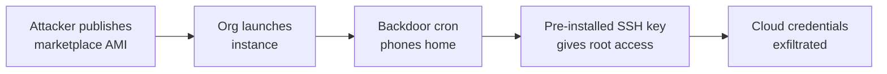

# Lab 9.1: Cloud Marketplace Poisoning

  Understand: ~5 min | Break: ~10 min | Defend: ~10 min | Detect: ~10 min
  Intermediate
  Prerequisites: <a href="../../tier-3/3.1-image-internals/">Lab 3.1</a>

  Overview
  ›
  <a href="understand/" class="phase-step upcoming">Understand</a>
  ›
  <a href="break/" class="phase-step upcoming">Break</a>
  ›
  <a href="defend/" class="phase-step upcoming">Defend</a>
  ›
  <a href="detect/" class="phase-step upcoming">Detect</a>

Cloud marketplace images are full operating systems deployed into your infrastructure with the publisher's cron jobs, SSH keys, systemd services, and network configurations. If the publisher is malicious or compromised, you just gave an attacker root access. Deploy a "marketplace" container image with three hidden backdoors, find them, and learn to build from scratch instead.

### Attack Flow

!!! tip "Related Labs"
    - **Prerequisite:** [3.1 Container Image Internals](../../tier-3/3.1-image-internals/index.md) — Container image internals apply to marketplace container offerings
    - **See also:** [3.4 Registry Confusion](../../tier-3/3.4-registry-confusion/index.md) — Registry confusion is the same concept applied to container registries
    - **See also:** [5.3 Terraform Module and Provider Attacks](../../tier-5/5.3-terraform-module-attacks/index.md) — Terraform module attacks target cloud IaC marketplace equivalents
    - **See also:** [1.2 Dependency Confusion](../../tier-1/1.2-dependency-confusion/index.md) — Dependency confusion applied to cloud marketplace namespaces
