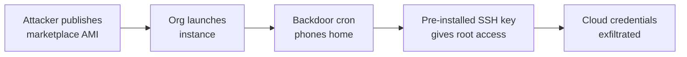

# Lab 9.1: Cloud Marketplace Poisoning

  Phase 1 ~5 min | Phase 2 ~10 min | Phase 3 ~10 min | Phase 4 ~10 min
  Intermediate
  Prerequisites: <a href="../../tier-3/3.1-image-internals.md">Lab 3.1</a>

  Overview
  ›
  <a href="understand/" class="phase-step upcoming">Understand</a>
  ›
  <a href="break/" class="phase-step upcoming">Break</a>
  ›
  <a href="defend/" class="phase-step upcoming">Defend</a>
  ›
  <a href="detect/" class="phase-step upcoming">Detect</a>

Cloud marketplace images are full operating systems deployed into your infrastructure with the publisher's cron jobs, SSH keys, systemd services, and network configurations. If the publisher is malicious or compromised, you just gave an attacker root access. Deploy a "marketplace" container image with three hidden backdoors, find them, and learn to build from scratch instead.

### Attack Flow

