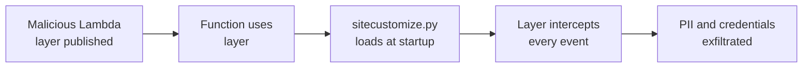

# Lab 9.2: Serverless Supply Chain

<div class="lab-meta">
  <span>Phase 1 ~10 min | Phase 2 ~10 min | Phase 3 ~10 min | Phase 4 ~10 min</span>
  <span class="difficulty advanced">Advanced</span>
  <span>Prerequisites: <a href="../tier-1/1.2-dependency-confusion.md">Lab 1.2</a></span>
</div>

Serverless functions depend on: their own code, bundled dependencies, shared Lambda Layers that inject code before your handler runs, the runtime, and the IAM role. Compromise any link, and every invocation is compromised. Two attacks: a malicious Lambda Layer that silently intercepts every invocation, and dependency confusion in a serverless deployment pipeline.

---

### Attack Flow



---

## Connect to the Workstation

```bash
./weaklink shell
```

---

???+ info "Phase 1: UNDERSTAND. The Serverless Attack Surface"

    **Goal:** Map the attack surface: code, dependencies, layers, runtime, IAM.

### Lambda Layers

Layers are ZIP archives extracted to `/opt/` BEFORE your function code. `/opt/python/sitecustomize.py` auto-loads on Python interpreter startup.

| Property | Implication |
|----------|-------------|
| Layers load before handler code | Attacker code runs first |
| `/opt/python/sitecustomize.py` auto-loads | No opt-in required |
| Layers referenced by ARN | Without version pin, latest version is used |
| Layer contents not inspected at deploy time | No scanning, no signature verification |

### Deployment pipeline

```bash
cat template.yaml
```

| Property | Vulnerable | Hardened |
|----------|-----------|---------|
| Layer reference | By name (no version pin) | By ARN with version number |
| IAM permissions | `dynamodb:*`, `s3:*`, `sns:*` | Specific actions on specific resources |
| Network access | Default (internet) | VPC-isolated (private subnet) |
| Secrets | Hardcoded in env vars | Parameter Store at runtime |

### Dependency configuration

`requirements.txt` references internal packages (`wl-order-utils`, `wl-notification-client`) but `sam build` runs `pip install` with default index. Public PyPI queried first.

---

???+ warning "Phase 2: BREAK. Malicious Layer and Dependency Confusion"

    **Goal:** Execute both attacks and understand their impact.

### Attack 1: Malicious Lambda Layer

```bash
cat malicious-layer/python/sitecustomize.py
```

The `sitecustomize.py` monkey-patches `__import__`, wraps the handler function, and exfiltrates every event to the attacker's C2 endpoint. The original handler runs normally. No errors, correct responses.

**What gets exfiltrated:** Every event (order IDs, API keys, customer PII, payment tokens) plus all environment variables on cold start.

### Attack 2: Dependency confusion in the build pipeline

`sam build` runs `pip install wl-order-utils>=1.0.0`. Public PyPI has version `99.0.0`. The attacker's malicious package wins resolution and gets bundled into the Lambda deployment package.

### Combined impact

1. Layer: Every invocation's event data exfiltrated
2. Dependency confusion: Build-time credentials stolen, malicious code in deployment package
3. Overprivileged IAM: `s3:*` and `dynamodb:*` give access to every bucket and table
4. No VPC isolation: Exfiltration is trivial over the internet

---

!!! success "Checkpoint"
    You should understand both attack vectors (layer interception and dependency confusion) and their combined blast radius. The layer attack is particularly dangerous because it is invisible: the function works correctly while exfiltrating every event.

---

???+ success "Phase 3: DEFEND. Hardening Serverless Functions"

    **Goal:** Pin layer versions, scope IAM, isolate networks, fix the dependency pipeline.

### Fix 1: Pin Lambda Layer versions by ARN

```yaml
# VULNERABLE:
Layers:
  - arn:aws:lambda:us-east-1:999888777666:layer:shared-utils

# HARDENED:
Layers:
  - arn:aws:lambda:us-east-1:123456789012:layer:shared-utils:7
```

### Fix 2: Least-privilege IAM

```json
{
  "Statement": [
    {"Effect": "Allow", "Action": ["dynamodb:GetItem", "dynamodb:Query"],
     "Resource": "arn:aws:dynamodb:us-east-1:123456789012:table/orders"},
    {"Effect": "Allow", "Action": ["sns:Publish"],
     "Resource": "arn:aws:sns:us-east-1:123456789012:order-notifications"}
  ]
}
```

Blast radius goes from "entire account" to "one DynamoDB table and one SNS topic."

### Fix 3: VPC isolation

```yaml
VpcConfig:
  SecurityGroupIds:
    - sg-0123456789abcdef0
  SubnetIds:
    - subnet-private-1a
    - subnet-private-1b
```

No internet access. DynamoDB and SNS accessed via VPC endpoints.

### Fix 4: Fix the dependency pipeline

```bash
--index-url https://internal.pypi.corp.com/simple/
--no-deps
wl-order-utils==1.2.3
wl-notification-client==2.1.0
```

### Fix 5: Build layers internally

Build and publish your own layers from verified dependencies instead of trusting third-party layers.

### Final verification

```bash
weaklink verify 9.2
```

---

??? danger "Phase 4: DETECT. Monitoring Serverless Functions"

    **Goal:** Detect compromised functions using CloudWatch and layer version auditing.

Compromised function behavioral changes:

| Metric | Baseline | Compromised |
|--------|----------|-------------|
| Duration P99 | 200ms | 350ms (+75% from exfil HTTP call) |
| Network bytes out | 2 KB/invocation | 5 KB/invocation |
| Cold start time | 800ms | 1200ms (sitecustomize.py overhead) |

### MITRE ATT&CK Mapping

| Technique | ID | Relevance |
|-----------|-----|-----------|
| Supply Chain Compromise: Software Supply Chain | [T1195.002](https://attack.mitre.org/techniques/T1195/002/) | Malicious Lambda Layer |
| Acquire Infrastructure: Serverless | [T1583.007](https://attack.mitre.org/techniques/T1583/007/) | Serverless C2/exfil |
| Command and Scripting Interpreter | [T1059](https://attack.mitre.org/techniques/T1059/) | Malicious sitecustomize.py |

---

## What You Learned

- Lambda Layers are a pre-execution attack surface. `sitecustomize.py` auto-loads without opt-in.
- Dependency confusion works in serverless pipelines. `sam build` defaults to public registries.
- VPC isolation prevents exfiltration. Without internet access, stolen data cannot leave your network.

## Further Reading

- [AWS: Lambda Layers](https://docs.aws.amazon.com/lambda/latest/dg/chapter-layers.html)
- [AWS: Lambda Security Best Practices](https://docs.aws.amazon.com/lambda/latest/dg/lambda-security.html)
- [Python: sitecustomize documentation](https://docs.python.org/3/library/site.html)
