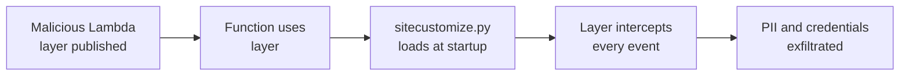

# Lab 9.2: Serverless Supply Chain

  Phase 1 ~10 min | Phase 2 ~10 min | Phase 3 ~10 min | Phase 4 ~10 min
  Advanced
  Prerequisites: <a href="../../tier-1/1.2-dependency-confusion/">Lab 1.2</a>

  Overview
  ›
  <a href="understand/" class="phase-step upcoming">Understand</a>
  ›
  <a href="break/" class="phase-step upcoming">Break</a>
  ›
  <a href="defend/" class="phase-step upcoming">Defend</a>
  ›
  <a href="detect/" class="phase-step upcoming">Detect</a>

Serverless functions depend on: their own code, bundled dependencies, shared Lambda Layers that inject code before your handler runs, the runtime, and the IAM role. Compromise any link, and every invocation is compromised. Two attacks: a malicious Lambda Layer that silently intercepts every invocation, and dependency confusion in a serverless deployment pipeline.

### Attack Flow

!!! tip "Related Labs"
    - **Prerequisite:** [1.2 Dependency Confusion](../../tier-1/1.2-dependency-confusion/index.md) — Dependency confusion applies to serverless function dependencies
    - **See also:** [2.4 Secret Exfiltration from CI](../../tier-2/2.4-secret-exfiltration/index.md) — Secret exfiltration from serverless execution environments
    - **See also:** [5.3 Terraform Module and Provider Attacks](../../tier-5/5.3-terraform-module-attacks/index.md) — IaC attacks often deploy malicious serverless functions
    - **See also:** [9.3 Cloud CI/CD Attacks](../9.3-cloud-cicd-attacks/index.md) — Cloud CI/CD can deploy compromised serverless functions
