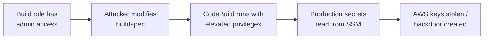

# Lab 9.3: Cloud CI/CD Attacks (Beyond GitHub Actions)

  Phase 1 ~10 min | Phase 2 ~15 min | Phase 3 ~10 min | Phase 4 ~5 min
  Advanced
  Prerequisites: <a href="../../tier-2/2.1-cicd-fundamentals/">Lab 2.1</a>

  Overview
  ›
  <a href="understand/" class="phase-step upcoming">Understand</a>
  ›
  <a href="break/" class="phase-step upcoming">Break</a>
  ›
  <a href="defend/" class="phase-step upcoming">Defend</a>
  ›
  <a href="detect/" class="phase-step upcoming">Detect</a>

Cloud-native CI/CD services (AWS CodeBuild, GCP Cloud Build, Azure DevOps) have deep IAM integration. A misconfigured build role does not just leak a GitHub token. It can give an attacker access to every resource in your cloud account. Three attack vectors: CodeBuild environment variable injection via SSM, Cloud Build substitution variable abuse, and privilege escalation through overprivileged build roles.

### Attack Flow

!!! tip "Related Labs"
    - **Prerequisite:** [2.1 CI/CD Fundamentals](../../tier-2/2.1-cicd-fundamentals/index.md) — CI/CD fundamentals before exploring cloud-native CI/CD attacks
    - **See also:** [2.2 Direct Poisoned Pipeline Execution](../../tier-2/2.2-direct-ppe/index.md) — Pipeline poisoning techniques adapt to cloud CI/CD platforms
    - **See also:** [2.8 Workflow Run & Cross-Workflow Attacks](../../tier-2/2.8-workflow-run-attacks/index.md) — Workflow run attacks have cloud-native equivalents
    - **See also:** [9.4 IAM Chain Abuse](../9.4-iam-chain-abuse/index.md) — IAM chain abuse often starts from compromised CI/CD
