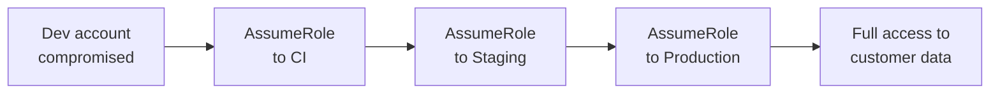

# Lab 9.4: IAM Chain Abuse

  Phase 1 ~10 min | Phase 2 ~15 min | Phase 3 ~15 min | Phase 4 ~5 min
  Advanced
  Prerequisites: <a href="../../tier-2/2.4-secret-exfiltration/">Lab 2.4</a>

  Overview
  ›
  <a href="understand/" class="phase-step upcoming">Understand</a>
  ›
  <a href="break/" class="phase-step upcoming">Break</a>
  ›
  <a href="defend/" class="phase-step upcoming">Defend</a>
  ›
  <a href="detect/" class="phase-step upcoming">Detect</a>

Cloud IAM is itself a supply chain. Dev trusts CI, CI trusts Staging, Staging trusts Production. Each link is an `AssumeRole` policy. No individual link is wrong, but the transitive chain creates an attack path: compromise one developer's credentials, traverse four trust boundaries, reach production. 8 minutes, no alerts.

### Attack Flow

